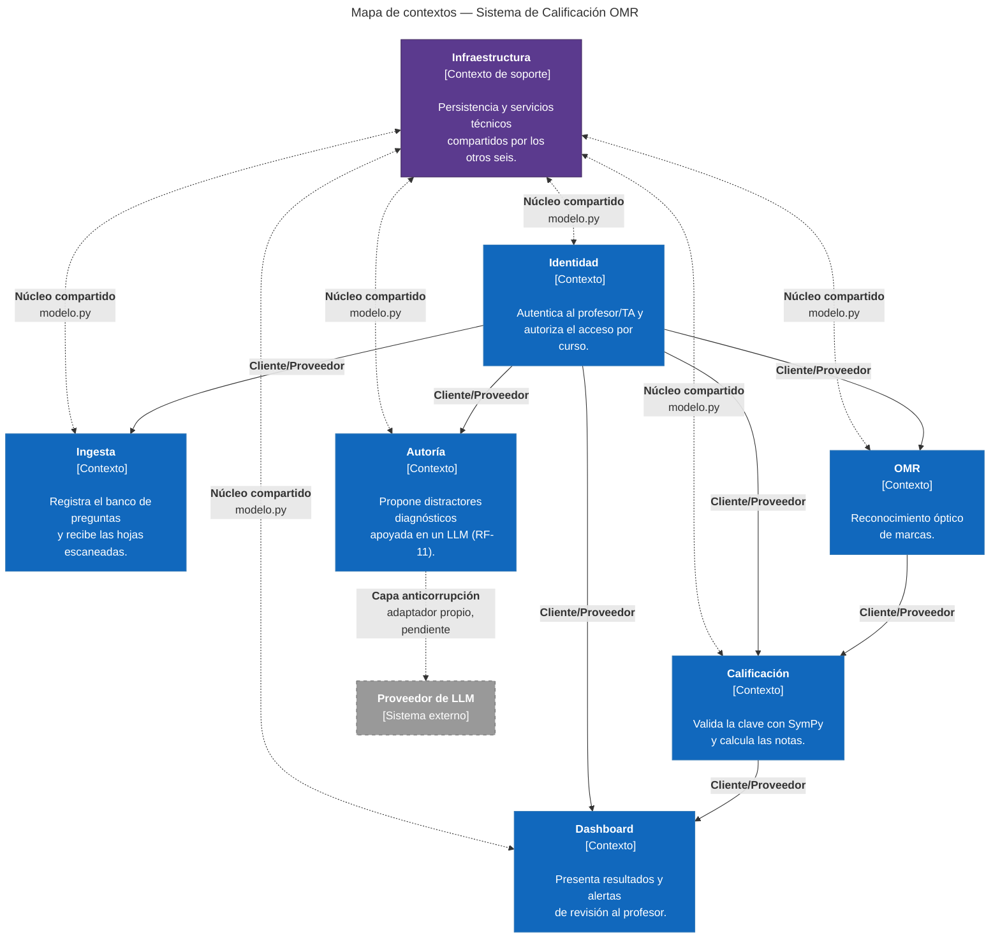

# 8. Conceptos transversales

## Acuerdos del equipo

> Estos dos puntos se acuerdan entre los cuatro **antes de escribir** el resto del documento
> (mapa, tabla de dueños, no conformidades). Una vez cerrados, nadie los cambia sin avisar al
> equipo — cambiar un nombre a mitad de camino descoordina las dos mitades de la entrega.

**Contextos del dominio (lista cerrada):** Identidad, Ingesta, OMR, Calificación, Autoría,
Dashboard, Infraestructura.

**Definición de «dueño»:** el dueño de una entidad es el módulo que la persiste; cualquier otro
módulo que necesite modificarla lo hace a través del dueño, nunca escribiéndola directamente.

*(Josue: valida estos dos puntos con María, Sebastián y Susana antes de que ellos empiecen a
escribir 08-propiedad-de-datos.md — la tabla de dueños depende de que los nombres de contexto ya
estén fijos.)*

## 8.1 Mapa de contextos

El sistema se organiza en siete contextos. Seis son contextos de dominio (Identidad, Ingesta,
OMR, Calificación, Autoría, Dashboard); el séptimo, Infraestructura, no modela un subdominio de
negocio propio sino que provee persistencia y servicios técnicos que los otros seis comparten.
Se incluye igual en el mapa porque la relación que tiene con el resto — núcleo compartido — es
justamente uno de los tres tipos que este criterio pide nombrar.

### Leyenda

| Símbolo | Significado |
|---|---|
| Caja azul | **Contexto de dominio.** Subdominio propio del sistema. |
| Caja morada | **Contexto de soporte.** No modela negocio; provee servicios técnicos a los demás. |
| Caja gris con borde punteado | **Sistema externo.** Fuera de nuestro control. |
| Flecha punteada bidireccional | **Núcleo compartido.** Ambos lados dependen del mismo modelo de datos. |
| Flecha continua | **Cliente/Proveedor.** Va del proveedor (upstream) al cliente (downstream). |
| Flecha punteada dirigida | **Capa anticorrupción.** El contexto de origen traduce/aísla lo que recibe del externo. |

### Elementos del mapa

| Contexto | Tipo | Responsabilidad |
|---|---|---|
| Identidad | Dominio | Autenticación y autorización de profesores/TAs por curso (RF-09). |
| Ingesta | Dominio | Registro del banco de preguntas y la clave; recepción de hojas escaneadas. |
| OMR | Dominio | Reconocimiento óptico de marcas sobre las hojas recibidas. |
| Calificación | Dominio | Validación de la clave con SymPy y cálculo de la nota. |
| Autoría | Dominio | Apoyo al profesor para generar distractores diagnósticos (RF-11). |
| Dashboard | Dominio | Presentación de notas, estadísticas y alertas de revisión manual. |
| Infraestructura | Soporte | Persistencia y servicios técnicos compartidos por los seis contextos de dominio. |
| Proveedor de LLM | Externo | Modelo de lenguaje de terceros usado solo desde Autoría, opcional (ADR-0005). |

### Relaciones y su tipo

| # | Contextos | Tipo | Evidencia |
|---|---|---|---|
| 1 | Infraestructura ↔ {Identidad, Ingesta, OMR, Calificación, Autoría, Dashboard} | Núcleo compartido | `modelo.py`, cuyo docstring dice «modelo de datos compartido por los siete módulos» |
| 2 | Identidad → {Ingesta, OMR, Calificación, Autoría, Dashboard} | Cliente/Proveedor | Líneas `Importa:` de los `__init__.py` de los cinco módulos de dominio, todas apuntando a `identidad` |
| 3 | OMR → Calificación | Cliente/Proveedor | `Importa:` de `calificacion/__init__.py` hacia `omr` |
| 4 | Calificación → Dashboard | Cliente/Proveedor | `Importa:` de `dashboard/__init__.py` hacia `calificacion` |
| 5 | Autoría → Proveedor de LLM | Capa anticorrupción | Adaptador propio (pendiente, RF-11) que aísla al dominio del modelo externo; ver ADR-0005 |

*(Falta completar la columna Evidencia con ruta y número de línea exactos — quien tenga el
código abierto localmente puede correr `git grep -n "Importa:"` sobre los siete `__init__.py` y
pegar aquí las líneas reales antes de commitear. Sin esa cita literal, el revisor puede marcar
la fila como no verificada, igual que pasó con los grep vacíos del hallazgo principal.)*

### Notas de modelado

**Por qué Infraestructura es núcleo compartido y no solo un proveedor más.** A diferencia de
Identidad (que los demás *consumen* como servicio), Infraestructura expone directamente
`modelo.py`, y los siete módulos —incluida ella misma— importan las mismas clases de datos. Eso
es la definición de núcleo compartido: cambiar el modelo obliga a los siete a recompilar/ajustar
a la vez, no solo al que lo consume.

**Por qué Identidad es cliente/proveedor y no núcleo compartido.** Los cinco módulos de dominio
dependen de lo que Identidad *decide* (si el profesor está autenticado y autorizado sobre el
curso), no de una estructura de datos que compartan literalmente con ella. Es una dependencia de
servicio, no de modelo: por eso es cliente/proveedor.

**Por qué la relación con el LLM es capa anticorrupción y no cliente/proveedor simple.** El
proveedor de LLM es un sistema externo que el equipo no controla y cuyo contrato puede cambiar
sin aviso. Autoría necesita su propio adaptador que traduzca la respuesta del modelo externo a
los tipos internos del dominio, para que un cambio en el proveedor no se propague directo al
resto del sistema. Es el caso canónico de ACL: aislar al dominio de un modelo externo (ver
ADR-0005, que ya lo trata como capacidad opcional y no como dependencia obligatoria).

**Qué falta y quién lo cierra.** Los puertos `AlmacenDeImagenes` y `BitacoraDeRecepcion`
(mencionados en el recorrido del código) probablemente sean también una capa anticorrupción,
pero interna — entre el dominio e Infraestructura, no entre el dominio y algo externo. Sebastián
y Susana están mejor posicionados para confirmar esto con ruta y línea en
`08-propiedad-de-datos.md`; si se confirma, se agrega como fila 6 de la tabla de relaciones de
arriba, citando ambos documentos entre sí.

