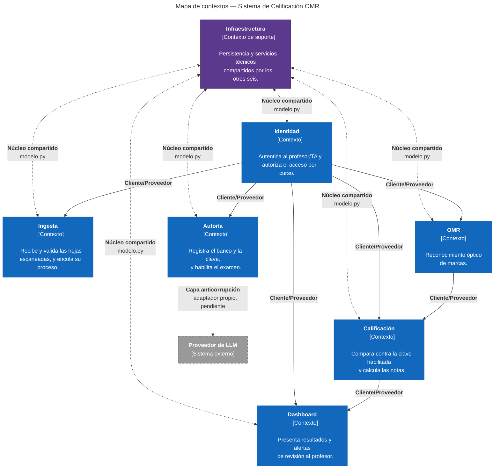

# **About arc42**

arc42, la plantilla para documentar arquitecturas de software y de sistemas.

Versión de plantilla 9.0. Creada y mantenida por Dr. Peter Hruschka, Dr. Gernot Starke
y colaboradores. Ver [https://arc42.org](https://arc42.org).

**Estado de este documento:** semana 4 del curso. Las secciones 1 a 6, 9, 10, 11 y 12 están
escritas; las secciones 7 y 8 se completan más adelante, y cada una indica explícitamente
cuándo se llena y por qué todavía no se puede.

Las secciones 5 y 6 describen **el estado real del código**, no el diseño previsto. Eso las
obliga a envejecer con cada avance: conviene revisarlas (y con ellas la sección 11) en el mismo
*pull request* que añade código, igual que se actualiza el docstring de un módulo cuando cambia
su frontera.

**Convenciones de identificadores usadas en todo el repositorio:**

| Prefijo | Significado | Dónde se define |
|---|---|---|
| `RF-nn` | Requisito funcional | Sección 1.1 de este documento |
| `RNF-nn` | Restricción (técnica, organizativa o legal) | Sección 2 de este documento |
| `QG-n` | Objetivo de calidad | Sección 1.2 de este documento |
| `EC-nn` | Escenario de calidad | Secciones 10.2 y 10.3 de este documento |
| `R-nn` | Riesgo o deuda técnica | Sección 11 de este documento |
| `A-nn` | Aspecto (corte vertical) | [`../aspectos.md`](../aspectos.md) |
| `T-n` | Tensión de calidad | [`../aspectos.md`](../aspectos.md) |
| `ADR-nnnn` | Decisión de arquitectura | [`../adr/`](../adr/) |

---

# 1. Introduction and Goals

## 1.1 Requirements Overview

El **Sistema de Calificación OMR** automatiza la evaluación y calificación de exámenes de
opción múltiple para la asignatura de **Cálculo Diferencial** en facultades de ingeniería,
ciencias exactas y economía. El profesor carga su banco de preguntas y su clave de respuestas,
aplica el examen en papel, y el sistema lee las hojas escaneadas mediante **Reconocimiento
Óptico de Marcas (OMR)**, califica contra esa clave y publica los resultados. Un **modelo de
lenguaje (LLM)** está disponible como apoyo opcional durante la preparación del examen, para
proponer distractores diagnósticos (ver [ADR-0005](../adr/0005-acotar-el-llm-a-la-generacion-de-distractores-diagnosticos.md)).

El sistema opera en **dos fases temporalmente separadas**, distinción que condiciona toda la
arquitectura:

- **Fase de autoría (antes del examen):** el profesor registra su banco de preguntas y su
  clave de respuestas, opcionalmente pide al sistema que le proponga distractores
  diagnósticos, y habilita el examen. Es una fase sin presión de tiempo real, y es la única en
  la que puede intervenir el modelo de lenguaje.
- **Fase de calificación (después del examen):** el sistema ingesta escaneos, detecta marcas
  y produce notas. Es la fase con exigencias de latencia y de volumen.

### Funcionalidades principales

| ID | Requisito funcional | Fase |
|---|---|---|
| **RF-01** | El sistema debe permitir a un docente autenticado cargar exámenes escaneados (JPG, PNG o PDF), individualmente o en lote, y confirmar su recepción. | Calificación |
| **RF-02** | El sistema debe detectar, para cada pregunta de una hoja escaneada, la casilla marcada, junto con un nivel de confianza asociado a esa detección. | Calificación |
| **RF-03** | El sistema debe marcar como *requiere revisión manual* toda detección cuya confianza no supere el umbral configurado, en lugar de asignar una respuesta arbitraria. | Calificación |
| **RF-04** | El sistema debe comparar las respuestas detectadas contra la clave validada del examen y calcular la calificación resultante. | Calificación |
| **RF-05** | El sistema debe presentar los resultados en un dashboard interactivo con notas por curso, estadísticas por examen y por pregunta, y alertas de revisión manual. Las estadísticas por pregunta informan la distribución de respuestas por opción; cuando una opción tiene registrada la etiqueta del error que representa (ver RF-11), la muestra junto a la distribución. | Calificación |
| **RF-06** | El sistema debe permitir a un docente registrar su banco de preguntas de cálculo diferencial (límites, derivadas y simplificaciones algebraicas) junto con la clave de respuestas del examen. | Autoría |
| **RF-07** | El sistema debe presentar al profesor el examen completo (enunciados, opción correcta y distractores) y no debe habilitarlo para calificación hasta que el profesor lo habilite explícitamente, registrando quién lo hizo y cuándo. | Autoría |
| **RF-08** | El sistema debe permitir a un docente resolver manualmente las preguntas marcadas como ambiguas y recalcular la nota afectada. | Calificación |
| **RF-09** | El sistema debe restringir el acceso a usuarios registrados y limitar cada docente a los cursos que tiene autorizados. | Transversal |
| **RF-10** | El sistema debe registrar quién modificó una calificación y cuándo, de forma consultable. | Transversal |
| **RF-11** *(opcional)* | El sistema debe permitir al profesor solicitar, para una pregunta dada, la generación de **distractores diagnósticos** con apoyo de un modelo de lenguaje: opciones incorrectas que corresponden a un error de procedimiento identificable, cada una con la etiqueta del error que representa. El profesor decide cuáles acepta. El sistema opera completo sin invocar nunca esta función (ver [ADR-0005](../adr/0005-acotar-el-llm-a-la-generacion-de-distractores-diagnosticos.md)). | Autoría |

## 1.2 Quality Goals

Los cuatro objetivos de calidad primarios que guían la arquitectura. Son objetivos de negocio,
no funcionalidades, y cada uno se hace verificable a través de los escenarios de la sección 10.

| # | Objetivo de calidad | A quién le importa | Por qué es prioritario | Escenarios que lo verifican |
|---|---|---|---|---|
| **QG-1** | **Precisión y validez matemática.** Lectura OMR confiable y clave de respuestas libre de ambigüedades algebraicas antes de la aplicación. | Comité Académico, profesores, estudiantes | Una nota mal calculada tiene consecuencias académicas directas y erosiona la confianza en el sistema de forma irreversible. | [EC-01](#ec-01), [EC-05](#ec-05) |
| **QG-2** | **Rendimiento y eficiencia de procesamiento.** Calificar exámenes individuales en segundos y lotes masivos en minutos. | Profesores, TAs | Si calificar con el sistema no es más rápido que calificar a mano, el sistema no tiene razón de existir. | [EC-03](#ec-03), [EC-04](#ec-04) |
| **QG-3** | **Manejabilidad de casos borde (degradación controlada).** Ninguna marca dudosa se convierte en una calificación silenciosamente errónea. | Estudiantes, profesores | Es la contraparte necesaria de QG-1: la precisión perfecta no existe, así que el sistema debe *saber* cuándo no sabe. | [EC-02](#ec-02) |
| **QG-4** | **Seguridad y aislamiento por rol.** Cada docente accede únicamente a los datos y calificaciones de sus cursos autorizados. | Comité Académico, Administradores de TI | Las calificaciones son datos académicos sensibles y su manipulación indebida es un riesgo institucional y legal, no solo técnico. | [EC-06](#ec-06) |

> **Nota sobre disponibilidad y mantenibilidad.** El árbol de utilidad (sección 10.1) las
> incluye como atributos relevantes, pero no se elevan a objetivo primario: en un sistema de
> uso interno y por lotes, una indisponibilidad breve se absorbe reintentando la carga,
> mientras que un error de precisión no se absorbe. Se documentan y se miden, pero no dominan
> las decisiones de diseño.

## 1.3 Stakeholders

| Stakeholder | Rol frente al sistema | Contacto | Expectativas |
|---|---|---|---|
| **Profesores de Cálculo / Cátedra** | Usuario principal | docentes.calculo@utb.edu | Reducir drásticamente el tiempo de calificación de exámenes masivos. Garantizar que las claves no contengan ambigüedades matemáticas. Disponer de un dashboard con métricas por curso y por pregunta. |
| **Asistentes de Cátedra (TAs)** | Usuario operativo | tas.ingenieria@utb.edu | Ingesta ágil en lote de imágenes escaneadas. Interfaz clara para resolver manualmente las preguntas clasificadas como ambiguas. |
| **Comité Académico / Dirección de Programa** | Patrocinador y auditor | direccion.sistemas@utb.edu | Alta precisión y confiabilidad de las calificaciones. Seguridad, confidencialidad y auditabilidad del almacenamiento de notas. |
| **Administradores de TI / Sistema** | Operador | admin.sys@utb.edu | Sistema modular, mantenible y desacoplado, con bajo consumo de CPU/memoria. Disponibilidad ≥95% en periodos críticos. |
| **Estudiantes** | Afectado, **no usuario** | — | Que su respuesta sea leída como la marcó y que una marca dudosa no se convierta en un error en su contra. Que sus datos personales se traten conforme a la ley y que pueda ejercer su derecho de revisión de la nota. No interactúan con el sistema (RNF-05); se listan porque son los titulares de los datos y quienes soportan las consecuencias de un fallo de QG-1 y QG-3. |
| **Equipo de desarrollo** | Constructor | Josué Ortega, María Restrepo, Sebastián Cañas, Susana Rosales | Un repositorio que arranque de forma reproducible y una estructura que permita trabajar en la lógica de negocio sin pelear con el montaje. |

---

# 2. Architecture Constraints

Las restricciones fijan los límites del diseño: son condiciones dadas, no decisiones del
equipo. Se clasifican en las tres categorías del curso (**técnicas**, **organizativas** y
**legales**) y cada una indica **de dónde viene**.

Ninguna de estas restricciones es un requisito funcional disfrazado: los requisitos
funcionales están en la sección 1.1 y describen lo que el sistema *hace*; las restricciones
describen el espacio dentro del cual se puede diseñar.

## 2.1 Restricciones técnicas

| ID | Restricción | Origen | Justificación e impacto en el diseño |
|---|---|---|---|
| **RNF-01** | **Stack obligatorio: OMR. El LLM es una capacidad de apoyo, no un paso del flujo.** | Enunciado del problema, ajustado dos veces: por retroalimentación del profesor ([ADR-0004](../adr/0004-quitar-validacion-simbolica-obligatoria-de-la-clave.md)) y por precisión del equipo sobre el flujo real ([ADR-0005](../adr/0005-acotar-el-llm-a-la-generacion-de-distractores-diagnosticos.md)) | La calificación se realiza mediante OMR: es el único componente sin el cual el sistema no funciona, y obliga a que exista un módulo separado para visión por computador. El LLM queda disponible como capacidad de apoyo en la fase de autoría (RF-11), a solicitud del profesor, y **no participa en ningún paso de la calificación** —lo que además es condición para cumplir EC-03 y EC-04, porque una llamada a un modelo externo dentro del procesamiento de cada hoja rompería el techo de cinco segundos. La versión original incluía también SymPy para validar la clave automáticamente; el profesor confirmó que esa automatización no es necesaria (ADR-0004). Sigue sin ser una decisión libre del equipo, y sigue condicionando la elección de lenguaje por el lado de OpenCV (ver ADR-0003). |
| **RNF-02** | **Entrada: hoja de respuestas estructurada con casillas en posiciones fijas.** | Enunciado del problema | El examen se resuelve en una hoja física de formato estandarizado, no en papel de escritura libre. Obliga a que el layout sea conocido de antemano para que el OMR pueda localizar las marcas por posición, y a incluir marcas de registro que permitan corregir inclinación del escaneo. |
| **RNF-03** | **Solo preguntas evaluables como opción múltiple.** | Consecuencia de RNF-01 y RNF-02 | Al procesar marcas y no expresiones escritas, el sistema solo puede evaluar preguntas con una única respuesta final identificable entre varias opciones. Las preguntas de desarrollo o demostración quedan fuera de alcance. Define directamente cómo se construye el banco de preguntas. |
| **RNF-04** | **Salida obligatoria en dashboard interactivo.** | Enunciado del problema | Los resultados se presentan en un dashboard, no como archivo aislado ni reporte por correo. Fija que la arquitectura incluya una capa de visualización, y que la estructura de datos esté pensada para agregación (por curso, examen y pregunta), no solo para almacenamiento. |

## 2.2 Restricciones organizativas

| ID | Restricción | Origen | Justificación e impacto en el diseño |
|---|---|---|---|
| **RNF-05** | **Usuarios objetivo: profesores y TAs, no estudiantes.** | Enunciado del problema (alcance definido por el cliente) | El sistema está dirigido a docentes y asistentes de cátedra. El estudiante es la fuente de las marcas en la hoja, pero no es usuario ni interactúa con el sistema. Condiciona el diseño de roles y permisos: no existe interfaz ni cuenta de estudiante, y todo el flujo se diseña para el rol docente. |
| **RNF-06** | **Dominio acotado a cálculo diferencial.** | Alcance acordado con el cliente | El alcance temático se limita a límites, derivadas y simplificaciones algebraicas. Acota lo que el LLM debe generar y lo que el profesor debe revisar al aprobar la clave, y evita sobredimensionar el sistema para integrales, ecuaciones diferenciales o álgebra lineal. |
| **RNF-07** | **Arranque reproducible con un solo comando.** | Condición de entrega del curso (`CONTRATO.md`) | El repositorio debe levantarse con un único comando y presentar un esqueleto ejecutable con una prueba automatizada en verde. Es la restricción con más peso en [ADR-0002](../adr/0002-procesar-calificacion-de-forma-asincrona.md), porque penaliza cualquier topología que exija orquestar varios despliegues. |
| **RNF-08** | **Stack de implementación limitado a las opciones del curso:** backend en NestJS o FastAPI; frontend en Flutter o Next.js. | Impuesta por la asignatura | El equipo no puede elegir libremente el lenguaje ni el framework. Combinada con RNF-01, condiciona fuertemente la elección de backend, porque el ecosistema de visión por computador (OpenCV) solo existe con madurez en Python. En el frontend, lo determinante es la experiencia previa del equipo bajo el cronograma de RNF-09. Resuelta en [ADR-0003](../adr/0003-usar-fastapi-y-flutter.md); [ADR-0004](../adr/0004-quitar-validacion-simbolica-obligatoria-de-la-clave.md) deja constancia de que la elección se sostiene sin cambios aunque SymPy deje de ser obligatorio. |
| **RNF-09** | **Equipo de cuatro estudiantes con dedicación parcial y cronograma fijado por el curso** (cortes en las semanas 5 y 10, entrega final en la 16). | Contexto académico | Limita la complejidad operacional asumible: no hay capacidad para operar infraestructura distribuida ni para sostener varios despliegues. Es uno de los argumentos que sostiene la elección de monolito modular frente a microservicios en ADR-0002. |
| **RNF-10** | **Todos los integrantes deben contribuir al historial del repositorio**, con código y documentación repartidos a lo largo del semestre. | `CONTRATO.md` §10 del curso | Criterio calificado. Obliga a repartir el trabajo por módulos y a usar ramas y *pull requests* en lugar de commits directos de una sola persona, lo que a su vez favorece una descomposición con fronteras claras que puedan asignarse por separado. |
| **RNF-11** | **Repositorio público, en la organización `ISCOUTB` y con la convención de nombres del curso.** | `CONTRATO.md` del curso | Ninguna parte del sistema puede depender de artefactos privados ni de secretos versionados. Cualquier credencial (por ejemplo, la clave del proveedor de LLM) debe leerse de variables de entorno y nunca del repositorio. |

## 2.3 Restricciones legales

| ID | Restricción | Origen | Justificación e impacto en el diseño |
|---|---|---|---|
| **RNF-12** | **Tratamiento de datos personales conforme al régimen colombiano de protección de datos** (Ley Estatutaria 1581 de 2012 y normas que la desarrollan). | Marco legal colombiano | Las hojas escaneadas y las calificaciones son datos personales de estudiantes identificables. Obliga a declarar la finalidad del tratamiento, a limitar el acceso a quien tenga una razón legítima (lo que refuerza QG-4) y a aplicar medidas de seguridad sobre el almacenamiento. *Verificar la referencia vigente con la coordinación del programa: hay un proyecto de reforma en trámite.* |
| **RNF-13** | **Ningún dato personal de estudiantes sale hacia el proveedor de LLM.** | Consecuencia de RNF-12 | El LLM solo participa en la fase de autoría, generando enunciados y distractores matemáticos. Ninguna hoja escaneada, nombre ni calificación se envía a un servicio de terceros. Esta restricción es la que hace aceptable usar un proveedor externo, y debe preservarse en cualquier evolución del sistema. |
| **RNF-14** | **Política explícita de retención y eliminación de las imágenes escaneadas.** | Principio de finalidad de RNF-12 | Los escaneos no pueden conservarse indefinidamente «por si acaso»: una vez cerrado el periodo de reclamación, deben eliminarse o anonimizarse. Obliga a que el almacén de imágenes tenga un ciclo de vida definido, no solo una operación de guardado. |
| **RNF-15** | **Trazabilidad de las calificaciones para el derecho de revisión del estudiante.** | Reglamento estudiantil de la institución | El estudiante puede reclamar su nota, y la institución debe poder responder con evidencia. Obliga a conservar la imagen de la hoja durante el periodo de reclamación, a registrar quién modificó una calificación y cuándo (RF-10), y a que una nota corregida manualmente sea distinguible de una calculada automáticamente. |

---

# 3. Context and Scope

## 3.1 Business Context

El sistema recibe insumos físicos digitalizados (hojas de respuestas escaneadas) y los
convierte en calificaciones y métricas analíticas para los usuarios docentes.

| Socio de comunicación | Entradas al sistema | Salidas desde el sistema |
|---|---|---|
| **Profesor / TA** | Creación y edición de bancos de preguntas; claves de respuesta; parámetros de evaluación; archivos escaneados (imágenes o PDF); resolución manual de casos ambiguos. | Vistas del dashboard interactivo; reportes consolidados por curso; analítica de ítems por pregunta; alertas de casos dudosos y de claves inválidas. |
| **Proveedor de LLM** *(sistema externo, pendiente de decisión — ver R-02)* | Especificación del tipo de pregunta a generar. **Nunca datos personales** (RNF-13). | Enunciados y distractores candidatos, que **siempre** pasan después por la revisión y aprobación manual del profesor antes de aceptarse (ver [ADR-0004](../adr/0004-quitar-validacion-simbolica-obligatoria-de-la-clave.md)). |

> **Nota de modelado.** La *hoja de respuestas física* no se representa como socio de
> comunicación. Un documento en papel no es un actor ni un sistema: es el **artefacto de
> entrada** que el docente digitaliza y carga. Quien se comunica con el sistema es el docente;
> la hoja es el contenido de esa comunicación. El escáner tampoco aparece: es una herramienta
> ofimática ajena al sistema, cuya salida el docente sube manualmente.

Los actores y sistemas externos de esta sección se corresponden **uno a uno** con los del
diagrama C4 de contexto en [`../c4/doc-c4.md`](../c4/doc-c4.md).

## 3.2 Technical Context

| Canal / Interfaz | Entrada | Salida | Protocolo / Formato | Socio de 3.1 |
|---|---|---|---|---|
| **Interfaz Web (Dashboard)** | Autenticación, gestión de cursos y bancos de preguntas, carga de escaneos, resolución de marcas ambiguas | Notas, gráficos, alertas de ambigüedad y de clave inválida | HTTPS · HTML5 / CSS / JSON | Profesor / TA |
| **Canal de ingesta OMR** | Lote de imágenes o PDF de hojas escaneadas | Matriz de respuestas detectadas con nivel de confianza (%) por pregunta | Carga HTTP multipart; procesamiento con OpenCV sobre PNG, JPG o PDF a 300 DPI | Profesor / TA |
| **Proveedor de LLM** *(pendiente y opcional)* | Especificación de la pregunta para la que se piden distractores | Distractores candidatos, cada uno con la etiqueta del error de procedimiento que representa, sujetos a la decisión del profesor (RF-11) | **Pendiente de decidir.** Si se usa una API alojada, es HTTPS/JSON contra un sistema externo; si se usa un modelo local, es in-process. Ver R-02. | Proveedor de LLM |

## 3.3 Fuera de alcance

- Integración con el sistema académico institucional (publicación automática de notas).
- Interfaz o cuenta para estudiantes (RNF-05).
- Evaluación de preguntas abiertas o de desarrollo (RNF-03).
- Impresión o distribución física de los exámenes generados.
- Verificación automática por computación simbólica de la equivalencia entre opciones de la
  clave de respuestas (ver [ADR-0004](../adr/0004-quitar-validacion-simbolica-obligatoria-de-la-clave.md)): esa verificación la hace el profesor manualmente.

---

# 4. Solution Strategy

## 4.1 Matriz comparativa de los tres estilos frente al árbol de utilidad

Antes de elegir estilo se compararon los tres candidatos **contra los escenarios de calidad de
este proyecto**, no en abstracto. La pregunta en cada celda es: *¿este estilo hace más
alcanzable o menos alcanzable este escenario concreto?*

| Escenario / atributo | Capas (Layered) | Hexagonal completa | Monolito modular + asíncrono |
|---|---|---|---|
| **[EC-01](#ec-01)** · Exactitud OMR ≥98% | **Neutro con reserva.** La exactitud depende del algoritmo, no del estilo. Pero el código de detección queda mezclado en una única capa de negocio con la calificación y la autoría, lo que dificulta iterar sobre él de forma aislada. | **Mejora.** El dominio de detección se prueba sin base de datos ni web, lo que permite ciclos de ajuste rápidos sobre el algoritmo. | **Mejora.** El módulo `omr` tiene frontera propia: se puede optimizar y medir sin arrastrar el resto del sistema. |
| **[EC-02](#ec-02)** · Marcas ambiguas ≥99% | **Empeora.** La política de umbral y el manejo de la incertidumbre se dispersan entre la capa de negocio y la de presentación. | **Mejora.** La política de confianza vive en el dominio, aislada de cómo se muestre o se persista. | **Mejora.** Contenida en `omr`, junto a la detección que la produce. |
| **[EC-03](#ec-03)** · ≤5 s por hoja (p95) | **Neutro.** Nada en el estilo ayuda ni estorba a la latencia de una hoja suelta. | **Neutro.** Las capas de indirección añaden un coste despreciable frente al de procesar una imagen. | **Neutro.** |
| **[EC-04](#ec-04)** · 200 hojas en ≤10 min | **Empeora, y es determinante.** El estilo no dice nada sobre concurrencia: el flujo ocurre dentro de la petición, de forma secuencial, y 200 × 5 s = 16,6 min incumple el escenario. | **Neutro.** Es ortogonal al problema: aísla el dominio, pero no resuelve el caudal. | **Mejora, y es determinante.** Es el único de los tres que incorpora cola y workers, que es lo que hace el escenario alcanzable. |
| **[EC-05](#ec-05)** · Validez de la clave 100% | **Empeora.** El flujo de aprobación de la clave y el consumo del LLM quedan acoplados a la infraestructura, y la salida no determinista del LLM se vuelve difícil de aislar para probar. | **Mejora.** Aislar el proveedor de LLM tras un puerto es exactamente lo que permite probar el flujo de aprobación sin depender del servicio externo. | **Mejora.** Se obtiene el mismo beneficio aplicando el aislamiento **solo** en `autoria`, donde compensa, en lugar de en los siete módulos. |
| **[EC-06](#ec-06)** · Aislamiento por curso | **Empeora.** La autorización se reparte entre los controladores de la capa de presentación, sin un lugar único donde auditarla. | **Mejora.** | **Mejora.** El módulo `identidad` concentra la autorización con frontera declarada. |
| **[EC-07](#ec-07)** · Recepción sin pérdida | **Empeora.** Sin cola persistente no hay durabilidad: una caída a mitad del lote pierde el trabajo en curso. | **Neutro.** No aporta durabilidad por sí mismo. | **Mejora.** La cola persistente da la garantía de que nada se pierde entre la carga y el procesamiento. |
| **Mantenibilidad** *(atributo del árbol)* | **Empeora.** Las capas cortan en horizontal, pero el cambio en este sistema llega en vertical: tocar el OMR no debería tocar el dashboard, y en capas ambos viven en la misma capa de negocio. | **Mejora mucho.** | **Mejora.** Los módulos coinciden con las fronteras funcionales reales y con los aspectos del ADD. |
| **Coste de montaje** *(RNF-07, RNF-09)* | **El más bajo.** Es lo que se monta más rápido con un equipo sin experiencia. | **El más alto.** Puertos y adaptadores en los siete módulos, con curva de aprendizaje, compitiendo con el tiempo de entrega. | **Intermedio.** Siete paquetes con frontera, más el coste de modelar los estados del trabajo asíncrono. |

**Lectura de la matriz.** Capas es el más barato de montar pero empeora cinco de los siete
escenarios, incluidos los dos de mayor impacto. Hexagonal mejora casi todo, pero su coste se
paga por igual en los siete módulos, y en los más delgados (`dashboard`, `identidad`) produce
indirección sin contenido; además no resuelve EC-04, que es el escenario que más aprieta. El
monolito modular con procesamiento asíncrono mejora seis de siete y es el único que hace
alcanzable EC-04, a un coste de montaje intermedio.

De ahí sale la decisión registrada en
[ADR-0002](../adr/0002-procesar-calificacion-de-forma-asincrona.md), incluido el matiz de
adoptar el aislamiento hexagonal **de forma selectiva** en los dos puntos donde la matriz
muestra que compensa (el proveedor de LLM y el almacenamiento de imágenes) en lugar de como
política global.

## 4.2 Tácticas frente a los escenarios priorizados

| Decisión | Motivación | Objetivo de calidad | Registro |
|---|---|---|---|
| **Monolito modular** con siete módulos de fronteras explícitas (`autoria`, `ingesta`, `omr`, `calificacion`, `dashboard`, `identidad`, `infraestructura`). | Un único despliegue satisface RNF-07 sin renunciar a fronteras internas claras, que además permiten repartir el trabajo entre los cuatro integrantes (RNF-10). | Mantenibilidad | [ADR-0002](../adr/0002-procesar-calificacion-de-forma-asincrona.md) |
| **Procesamiento asíncrono con cola de trabajos y workers**; la respuesta HTTP confirma la recepción, no la calificación. | Es la única forma de cumplir EC-04 (200 hojas en ≤10 min) sin romper EC-03 (≤5 s por hoja). Además da la persistencia del trabajo pendiente que exige la recuperación ante fallos. | QG-2 | [ADR-0002](../adr/0002-procesar-calificacion-de-forma-asincrona.md) |
| **Umbral de confianza explícito** en la detección OMR, con desvío a revisión manual en vez de decisión automática. | El OMR es intrínsecamente probabilístico. Convertir la incertidumbre en un estado visible del sistema es preferible a ocultarla tras una respuesta inventada. | QG-1, QG-3 | ADR previsto, semana 4 |
| **Aprobación manual obligatoria antes de habilitar un examen**: ninguna pregunta generada por LLM se acepta sin que el profesor la revise y apruebe explícitamente. | El LLM genera texto plausible, no necesariamente matemáticas correctas. La aprobación del profesor actúa como el único filtro determinista antes de una salida no determinista. | QG-1 | [ADR-0004](../adr/0004-quitar-validacion-simbolica-obligatoria-de-la-clave.md) |
| **Separación temporal entre fase de autoría y fase de calificación.** | Aísla la dependencia del LLM (lenta, externa, potencialmente costosa) de la ruta crítica de calificación. Es además lo que hace cumplible RNF-13: ningún dato personal circula por el proveedor externo. | QG-2, RNF-13 | Implícita en ADR-0002 |
| **Registro de auditoría sobre las calificaciones** (quién modificó qué y cuándo). | Exigido por RNF-15 para poder responder a una reclamación de nota con evidencia. | QG-4 | ADR previsto, semana 6 |

---

# 5. Building Block View

> **Estado.** El C4 de Nivel 1 y el de Nivel 2 están cerrados
> ([`../c4/doc-c4.md`](../c4/doc-c4.md)); el Nivel 3 sigue pendiente. El código ya materializa
> parcialmente esos contenedores: el aspecto **A-01 (carga de examen para calificación)** está
> en estado *Construido* según [`../aspectos.md`](../aspectos.md#a-01), con recepción,
> almacenamiento y encolado funcionando de punta a punta. Los otros cuatro aspectos (A-02 a
> A-05) siguen *Declarados*, sin código.
>
> **Nota de nombre.** El `doc-c4.md` actualizado identifica el sistema como **QuantIA** en su
> tabla de metadatos y en el Nivel 2, mientras el resto del arc42 sigue usando «Sistema de
> Calificación OMR». Esta sección sigue la nomenclatura del C4 tal como está hoy; la
> unificación del nombre en todo el documento queda pendiente de que el equipo la resuelva.

## 5.1 Whitebox Overall System

La tabla recorre los elementos del Nivel 2 y su estado de implementación. La correspondencia
con lo que `docker compose up` levanta **no es uno a uno**, y conviene tenerlo presente al leer
los dos documentos juntos:

- La **«Aplicación web»** del C4 se despliega hoy como **dos servicios**: `api`, que atiende la
  API HTTP, y `frontend`, que sirve la interfaz Flutter ya compilada. El C4 los trata como una
  unidad lógica; el `docker-compose.yml` los levanta y reinicia por separado.
- El **«Almacén de imágenes»** no es un servicio sino un **volumen** de Docker, montado en `api`
  y en `worker` para que ambos vean el mismo archivo.
- El **proveedor de LLM** aparece en la tabla porque el Nivel 2 lo dibuja, pero es externo: no se
  despliega con el sistema.

| Contenedor | Responsabilidad (C4 Nivel 2) | Tecnología | Estado de implementación |
|---|---|---|---|
| **Aplicación web** *(lado servidor)* | Autenticación, cursos, preguntas, exámenes, carga de escaneos y consulta de resultados; inicia los trabajos de procesamiento. | FastAPI (`backend/api/main.py`), Uvicorn (servicio `api`). | Expone `GET /health` y `POST /examenes/{examen_id}/hojas` (RF-01, aspecto A-01). El resto de responsabilidades del contenedor (cursos, preguntas, resultados) siguen sin ruta. |
| **Interfaz web** *(parte de «Aplicación web» en el C4)* | Presenta al docente el dashboard, la carga de escaneos y la resolución de marcas ambiguas. | Flutter compilado a web, servido por nginx (servicio `frontend`). | Construida la pantalla de carga del aspecto A-01 (`pantalla_carga.dart`, `servicio_carga.dart`, `selector_archivos.dart`) y la de inicio con el estado de conexión. El dashboard de RNF-04 y la resolución de marcas ambiguas siguen sin construir. |
| **Worker de procesamiento** | Ejecuta el OMR, calcula calificaciones y genera alertas de revisión. | Proceso Python (`backend/worker/main.py`), misma imagen que la aplicación web. | Consume la cola y confirma que la hoja encolada por `ingesta` le llegó, registrando en log su identificador, examen, archivo y referencia. **No ejecuta todavía** el pipeline `omr → calificacion`: ese es el aspecto A-02, aún declarado. |
| **Cola de trabajos** | Desacopla la aplicación web del procesamiento OMR. | Redis 7, adaptador FIFO en `infraestructura/cola.py` (RPUSH/BLPOP). | Implementado y probado contra un Redis real (`backend/tests/test_encolado.py`); sigue siendo, según su propio docstring, «el germen» de lo que EC-07 exige, no una cola de producción con reintentos o acuses de recibo. |
| **Base de datos** | Almacena usuarios, cursos, preguntas, claves, exámenes y resultados. | PostgreSQL 16, volumen `datos_postgres`. | Declarada en `docker-compose.yml` y `.env.example`; **ningún módulo la usa todavía** — sin esquema ni migraciones. |
| **Almacén de imágenes** | Conserva las hojas escaneadas, la bitácora de recepción y archivos asociados. | Volumen Docker `almacen_imagenes`, montado en `api` y `worker`. | **Implementado como dos puertos con adaptadores provisionales**: `infraestructura/almacen.py` define el puerto `AlmacenDeImagenes` y el adaptador `AlmacenEnDisco`, que escribe en el volumen con nombres saneados (`nombre_seguro`) para evitar escapes de directorio; `infraestructura/bitacora.py` define `BitacoraDeRecepcion` y `BitacoraEnDisco`, de solo agregado y con `fsync` por línea ([ADR-0006](../adr/0006-registrar-la-recepcion-en-una-bitacora-antes-de-encolar.md)). Los dos son deliberadamente provisionales: el riesgo R-06 (decisión de persistencia) sigue abierto, y cuando se resuelva solo cambian los adaptadores, no los puertos ni quien los consume. La política de retención de RNF-14 aterrizará aquí y hoy no está implementada. |
| **Proveedor de LLM** *(externo, opcional y pendiente)* | Propone distractores diagnósticos durante la autoría. | Por decidir (riesgo R-02). | Sin código; se conecta solo desde la aplicación web, nunca desde el worker (RNF-13). |

## 5.2 Level 2

Dentro de **Aplicación web** y **Worker de procesamiento** viven los siete módulos fijados en
[ADR-0002](../adr/0002-procesar-calificacion-de-forma-asincrona.md), con la frontera de
importación que declara el docstring de cada `__init__.py` y que hace cumplir
`backend/tests/test_fronteras.py` en CI:

| Módulo | Responsabilidad | Requisitos | Importa (declarado) | Estado de implementación |
|---|---|---|---|---|
| **ingesta** | Recepción y validación de archivos escaneados (individual o en lote) y encolado del procesamiento. | RF-01 | `infraestructura`, `identidad` | **Implementado** (`recepcion.py`): valida extensión *y* firma de bytes por archivo, no aborta el lote ante un archivo inválido ni ante un fallo de la cola (ADR-0006), y por cada hoja almacena, acuña el trabajo, registra en la bitácora y solo entonces publica. Expone `recibir_lote`, `motivo_de_rechazo` y `EXTENSIONES_ACEPTADAS` como interfaz pública vía `__all__`. Aún no verifica el `examen_id` contra nada (hueco conocido: depende de `autoria`, A-04) ni la autorización del docente (depende de `identidad`, A-05). |
| **infraestructura** | Persistencia, almacenamiento de imágenes, bitácora de recepción y adaptador de la cola de trabajos. | Transversal | ninguno | **Parcialmente implementado.** `cola.py` (acuñar, publicar y desencolar sobre Redis, con `ColaNoDisponible` como traducción de los errores de redis-py al dominio), `almacen.py` (puerto `AlmacenDeImagenes` + adaptador `AlmacenEnDisco`), `bitacora.py` (puerto `BitacoraDeRecepcion` + adaptadores `BitacoraEnDisco` y `BitacoraEnMemoria`, ADR-0006) y `modelo.py` (el modelo de datos compartido: `ArchivoCargado`, `HojaAceptada`, `ArchivoRechazado`, `ResultadoRecepcion`, `EntradaDeBitacora`) ya tienen código. Sigue sin persistencia estructurada (Postgres sin esquema) y sin política de retención (R-06, RNF-14 abiertos). |
| **autoria** | Bancos de preguntas y clave de respuestas, generación opcional de distractores diagnósticos con LLM, y habilitación del examen. | RF-06, RF-07, RF-11 | `infraestructura`, `identidad` | Paquete vacío (aspecto A-04, declarado). |
| **omr** | Detección de marcas y cálculo del nivel de confianza; clasificación de ambigüedad. | RF-02, RF-03 | `infraestructura`, `identidad` | Paquete vacío (aspecto A-02, declarado). |
| **calificacion** | Comparación contra la clave habilitada por el profesor y cálculo de notas; recálculo tras revisión manual. | RF-04, RF-08 | `infraestructura`, `identidad`, `omr` | Paquete vacío (aspecto A-03, declarado). |
| **dashboard** | Presentación de resultados y agregaciones por curso, examen y pregunta. | RF-05 | `infraestructura`, `identidad`, `calificacion` | Paquete vacío (aspecto A-03, declarado). |
| **identidad** | Autenticación, roles y aislamiento de datos por curso. | RF-09, RF-10 | `infraestructura` | Paquete vacío (aspecto A-05, declarado). |

`api/main.py` es la traducción entre HTTP y dominio: construye sus dependencias (almacén,
cliente de cola) por petición vía `Depends`, precisamente para que arrancar la aplicación (y
probarla) no exija que el volumen o Redis existan. `worker/main.py` comparte esa misma base de
dominio. Los bordes de importación que existen hoy son tres, todos dentro de lo declarado:
`api/main.py` importa `ingesta` e `infraestructura`, `ingesta/recepcion.py` importa
`infraestructura`, y `worker/main.py` importa `infraestructura.cola`.

## 5.3 Level 3

Solo el aspecto **A-01** tiene estructura interna suficiente para bajar a Nivel 3; el resto
sigue vacío (ver 5.2).

**Dentro de `ingesta` (aspecto A-01):**

| Componente | Responsabilidad |
|---|---|
| `recibir_lote()` | Orquesta el lote completo: por cada archivo, valida, y si es válido, almacena y encola; siempre devuelve un `ResultadoRecepcion` con aceptadas y rechazados. |
| `motivo_de_rechazo()` | Valida extensión declarada (RF-01: JPG, PNG, PDF) y la firma real de los primeros bytes del archivo, para que renombrar un archivo no lo haga pasar. |

**Dentro de `infraestructura` (soporte de A-01):**

| Componente | Responsabilidad |
|---|---|
| `AlmacenDeImagenes` (puerto) | Contrato que `ingesta` conoce: `guardar(examen_id, nombre_archivo, contenido) -> referencia`. |
| `AlmacenEnDisco` (adaptador provisional) | Escribe en el volumen compartido, con nombre único por UUID y saneado (`nombre_seguro`) para que un nombre hostil no escape del directorio del examen. |
| `cola.py` (`encolar`/`desencolar`) | Adaptador FIFO sobre Redis, ya descrito en 5.1. |
| `modelo.py` | Dataclasses inmutables compartidas por los siete módulos (`ArchivoCargado`, `HojaAceptada`, `ArchivoRechazado`, `ResultadoRecepcion`), sin dependencias fuera de la librería estándar. |

Los aspectos A-02 a A-05 se documentan a Nivel 3 cuando dejen de estar vacíos (semanas 4 y 6),
según [`../aspectos.md`](../aspectos.md).

---

# 6. Runtime View

> **Estado.** El único escenario de negocio con código real es la carga de un examen (RF-01,
> aspecto A-01, [EC-07](#ec-07)). Los otros dos escenarios previstos (calificación de un lote y
> resolución manual de una marca ambigua) siguen bloqueados porque dependen de módulos vacíos
> (`omr`, `calificacion`, `identidad`); se documentan en 6.3 con lo que falta para
> desbloquearlos.

## 6.1 Arranque y verificación de salud

Verifica RNF-07. Sin cambios respecto al esqueleto original.

1. `docker compose up` levanta `redis`, `postgres`, `api`, `worker` y `frontend`.
2. `api` instancia la aplicación FastAPI (`backend/api/main.py`), configurando CORS con el
   origen leído de `ALLOWED_ORIGIN`.
3. Un cliente hace `GET /health` y recibe `200 {"status": "ok"}` sin tocar Redis, Postgres ni
   ningún módulo de dominio.

**Prueba que lo verifica:** `backend/tests/test_arranque.py`.

## 6.2 Carga de una hoja escaneada (RF-01 · aspecto A-01 · EC-07)

Es el primer recorrido de extremo a extremo del sistema: una hoja sale del disco del docente y
llega, ya registrada, hasta el log del worker en otro contenedor.

1. El profesor (o TA) sube uno o varios archivos a
   `POST /examenes/{examen_id}/hojas` desde la aplicación web.
2. `api/main.py` lee cada archivo (`UploadFile`) y arma la lista de `ArchivoCargado`
   (nombre + bytes); construye por dependencia el almacén (`AlmacenEnDisco`) y el cliente de
   cola, sin tocarlos al importar el módulo.
3. Llama a `ingesta.recibir_lote(examen_id, archivos, almacen, cliente_cola, nombre_cola,
   bitacora)`, que procesa el lote **archivo por archivo, sin abortar ante uno inválido ni ante
   un fallo de la cola**:
   - `motivo_de_rechazo()` revisa la extensión declarada y la firma de los primeros bytes. Si
     falla cualquiera de las dos, el archivo se reporta como *rechazado con motivo* y el lote
     sigue con el siguiente.
   - Si el archivo es válido son cuatro pasos y el orden es deliberado ([ADR-0006](../adr/0006-registrar-la-recepcion-en-una-bitacora-antes-de-encolar.md)):
     `almacen.guardar()` lo escribe en el volumen bajo un directorio por examen, con nombre
     saneado y único (UUID); `cola.preparar_trabajo()` acuña el trabajo y su identificador **sin
     tocar la cola**; `bitacora.registrar()` deja constancia en disco de que esa hoja está
     adentro; y solo entonces `cola.publicar()` hace `RPUSH`, seguido de
     `bitacora.confirmar_encolada()`. Almacenar antes de encolar evita que un trabajo apunte a
     una imagen que todavía no existe; registrar antes de publicar evita lo contrario, que la
     imagen exista y nadie sepa que está ahí.
   - **Si la cola no responde**, `publicar()` levanta `ColaNoDisponible` y la hoja se reporta
     como *aceptada* con estado `pendiente_de_encolar`, no como rechazada: está almacenada y
     registrada, y su reintento no debería costarle al docente volver a subir el archivo.
4. El endpoint responde **siempre 200** (una petición sin archivos es la excepción: 422),
   con el reporte completo: cuántos archivos se procesaron, cuáles quedaron aceptados (con su
   `referencia` y `trabajo_id`) y cuáles rechazados (con el motivo). Un lote mixto no es un
   error — devolver un error obligaría al docente a reenviar el lote entero, justo lo que
   EC-07 quiere evitar.
5. En paralelo, `worker/main.py` sigue en su ciclo `desencolar()` sobre la cola que nombra
   `NOMBRE_COLA` (`BLPOP`, timeout 5 s), la misma variable de entorno que lee `api/settings.py`. Al recibir el trabajo, registra en log su `id`,
   el `examen_id`, el `nombre_archivo` y la `referencia` — y ahí se detiene: el siguiente paso
   (detección de marcas, aspecto A-02) todavía no existe.
6. Si Redis falla de forma transitoria, el worker captura `redis.exceptions.RedisError`,
   espera 5 segundos y reintenta el ciclo sin caerse.

**Lo que este recorrido demuestra y lo que no.** Está verificado que ningún archivo del lote
desaparece sin dejar traza y que el identificador de trabajo que ve el docente en pantalla es el
mismo que aparece en el log del worker, en otro contenedor — evidencia de que el recorrido cruza
de verdad la cola. **Las dos cifras de EC-07 ya están medidas**, con el procedimiento y sus
límites en [`../evidencia/medicion-ec07.md`](../evidencia/medicion-ec07.md): 1,744 s de
confirmación para un lote de 200 hojas contra un umbral de 10 s, y 0 % de pérdida silenciosa
contra un umbral de 0 %. La segunda cifra valía 100 % antes de ADR-0006, y esa medición es la
que motivó la decisión.

**Lo que sigue sin demostrarse, y conviene no confundirlo con lo anterior:** la durabilidad ante
la caída del sistema operativo, que `fsync` defiende pero que solo se comprobaría cortándole la
corriente a la máquina; el reintento automático de las hojas pendientes, que es trabajo del
aspecto A-02; y el tiempo con un Redis real, ya que la medición usa una cola sustituta y por eso
su cifra de latencia es una cota inferior.

**Pruebas que lo verifican:** `backend/tests/test_recepcion.py` (la regla de negocio, sin
Redis ni servidor) y `backend/tests/test_carga_hojas.py` (el endpoint visto desde fuera, con
`dependency_overrides` sustituyendo almacén y cola). En el frontend, `widget_test.dart` cubre
que la pantalla de carga no ofrece subir si el backend no responde, y que el reporte distingue
una falla de red de un rechazo.

## 6.3 Escenarios pendientes

| Escenario | Recorre | Verifica | Bloqueado por |
|---|---|---|---|
| Detección de marcas sobre la hoja ya recibida | RF-02, RF-03 | EC-01, EC-02 | `omr` vacío (aspecto A-02); depende del dataset de 300 hojas (R-01) y del umbral de confianza (R-04) |
| Calificación de un lote de exámenes | RF-04 → RF-05, RF-08 | EC-03, EC-04 | `calificacion`, `dashboard` vacíos (aspecto A-03); depende de A-02 |
| Resolución manual de una marca ambigua | RF-08, RF-10 | EC-02 | `calificacion`, `identidad` vacíos |
| Generación y aprobación de un examen | RF-06 → RF-07 | EC-05 | `autoria` vacío (aspecto A-04); proveedor de LLM sin decidir (R-02) |
---

# 7. Deployment View

> **Pendiente.** No se documenta todavía porque el equipo no ha decidido el entorno de
> despliegue. Esa decisión depende de si el LLM se consume como API externa o se aloja
> localmente (R-02) y del mecanismo de persistencia, todavía abierto (R-06). La elección de
> stack de RNF-08 ya no la condiciona: quedó resuelta en
> [ADR-0003](../adr/0003-usar-fastapi-y-flutter.md).
>
> Lo que sí existe y servirá de base son el Nivel 2 del C4, que fija qué contenedores componen
> el sistema, y el `docker-compose.yml`, que los levanta hoy en una sola máquina. Falta decidir
> dónde corre eso y con qué topología, que es lo que ninguno de los dos dice.

---

# 8. Cross-cutting Concepts

Esta sección fija los conceptos que atraviesan más de un módulo. Dos están desarrollados aquí
(el mapa de contextos y el lenguaje ubicuo) y un tercero, la propiedad de datos, vive en
[`08-propiedad-de-datos.md`](08-propiedad-de-datos.md) por su extensión.

Antes de los tres, dos acuerdos que el resto de la sección da por sentados. Una vez fijados, no se
cambian sin avisar al equipo: renombrar un contexto a mitad de camino descoordina los documentos
que se apoyan en él.

**Contextos del dominio (lista cerrada):** Identidad, Ingesta, OMR, Calificación, Autoría,
Dashboard, Infraestructura.

**Definición de «dueño»:** el dueño de una entidad es el módulo que **decide el contenido de sus
campos de negocio**, es decir, el único autorizado a construir una instancia con valores nuevos o
a modificar los que ya tiene. Los demás pueden importar el tipo, recibirlo como parámetro o (si
son adaptadores de persistencia) reconstituirlo fielmente a partir de lo que el dueño ya escribió,
pero no pueden decidir por su cuenta qué significa un campo ni qué valor le corresponde. Propiedad
no es lo mismo que ubicación: dónde está declarada una clase y quién decide su contenido pueden
ser módulos distintos. La aplicación de esta regla, entidad por entidad, está en
[`08-propiedad-de-datos.md`](08-propiedad-de-datos.md).

## 8.1 Mapa de contextos

El sistema se organiza en siete contextos. Seis son contextos de dominio (Identidad, Ingesta,
OMR, Calificación, Autoría, Dashboard); el séptimo, Infraestructura, no modela un subdominio de
negocio propio sino que provee persistencia y servicios técnicos que los otros seis comparten.
Se incluye igual en el mapa porque la relación que tiene con el resto (úcleo compartid) es
justamente uno de los tres tipos que este criterio pide nombrar.

### Leyenda

| Símbolo | Significado |
|---|---|
| Caja azul | **Contexto de dominio.** Subdominio propio del sistema. |
| Caja morada | **Contexto de soporte.** No modela negocio; provee servicios técnicos a los demás. |
| Caja gris con borde punteado | **Sistema externo.** Fuera de nuestro control. |
| Flecha punteada bidireccional | **Núcleo compartido.** Ambos lados dependen del mismo modelo de datos. |
| Flecha continua | **Cliente/Proveedor.** Va del proveedor (upstream) al cliente (downstream). |
| Flecha punteada dirigida | **Capa anticorrupción.** El contexto de origen traduce/aísla lo que recibe del externo. |

### Elementos del mapa

| Contexto | Tipo | Responsabilidad |
|---|---|---|
| Identidad | Dominio | Autenticación y autorización de profesores/TAs por curso (RF-09). |
| Ingesta | Dominio | Recepción y validación de las hojas escaneadas, individuales o en lote, y encolado de su procesamiento (RF-01). |
| OMR | Dominio | Reconocimiento óptico de marcas sobre las hojas recibidas. |
| Calificación | Dominio | Comparación de las respuestas detectadas contra la clave habilitada y cálculo de la nota; recálculo tras revisión manual (RF-04, RF-08). |
| Autoría | Dominio | Registro del banco de preguntas y de la clave, y habilitación explícita del examen (RF-06, RF-07). Opcionalmente propone distractores diagnósticos con apoyo de un LLM (RF-11). |
| Dashboard | Dominio | Presentación de notas, estadísticas y alertas de revisión manual. |
| Infraestructura | Soporte | Persistencia y servicios técnicos compartidos por los seis contextos de dominio. |
| Proveedor de LLM | Externo | Modelo de lenguaje de terceros usado solo desde Autoría, opcional (ADR-0005). |

### Relaciones y su tipo

| # | Contextos | Tipo | Evidencia |
|---|---|---|---|
| 1 | Infraestructura ↔ {Identidad, Ingesta, OMR, Calificación, Autoría, Dashboard} | Núcleo compartido | [`backend/infraestructura/modelo.py`](../../backend/infraestructura/modelo.py), cuyo docstring de la línea 1 dice «Modelo de datos compartido por los siete módulos del dominio» |
| 2 | Identidad → {Ingesta, OMR, Calificación, Autoría, Dashboard} | Cliente/Proveedor | Línea 4 de los cinco `__init__.py`, todas con `identidad` en su `Importa:`: [`ingesta`](../../backend/ingesta/__init__.py), [`omr`](../../backend/omr/__init__.py), [`calificacion`](../../backend/calificacion/__init__.py), [`autoria`](../../backend/autoria/__init__.py), [`dashboard`](../../backend/dashboard/__init__.py) |
| 3 | OMR → Calificación | Cliente/Proveedor | [`backend/calificacion/__init__.py`](../../backend/calificacion/__init__.py) línea 4: `Importa: infraestructura, identidad, omr` |
| 4 | Calificación → Dashboard | Cliente/Proveedor | [`backend/dashboard/__init__.py`](../../backend/dashboard/__init__.py) línea 4: `Importa: infraestructura, identidad, calificacion` |
| 5 | Autoría → Proveedor de LLM | Capa anticorrupción | Adaptador propio, todavía sin construir (RF-11), que aislará al dominio del modelo externo. El nodo sigue punteado en el C4 por dos razones: el proveedor no está decidido (R-02) y su uso es opcional ([ADR-0005](../adr/0005-acotar-el-llm-a-la-generacion-de-distractores-diagnosticos.md)) |
| 6 | {Ingesta} → Infraestructura, vía puertos | Capa anticorrupción interna | `AlmacenDeImagenes` en [`almacen.py`](../../backend/infraestructura/almacen.py) línea 47 y `BitacoraDeRecepcion` en [`bitacora.py`](../../backend/infraestructura/bitacora.py) línea 39, los dos declarados como `Protocol`: `ingesta` conoce el contrato, no el disco ni Redis |

La fila 6 es una capa anticorrupción **interna**: no aísla al dominio de un sistema externo sino
de una decisión de infraestructura todavía abierta (R-06). El arc42 §4.1 la justifica como
aislamiento hexagonal selectivo, aplicado en dos puntos y no en los siete módulos.

### Notas de modelado

**Por qué Infraestructura es núcleo compartido y no solo un proveedor más.** A diferencia de
Identidad (que los demás *consumen* como servicio), Infraestructura expone directamente
`modelo.py`, y los siete módulos (incluida ella misma) importan las mismas clases de datos. Eso
es la definición de núcleo compartido: cambiar el modelo obliga a los siete a recompilar/ajustar
a la vez, no solo al que lo consume.

**Por qué Identidad es cliente/proveedor y no núcleo compartido.** Los cinco módulos de dominio
dependen de lo que Identidad *decide* (si el profesor está autenticado y autorizado sobre el
curso), no de una estructura de datos que compartan literalmente con ella. Es una dependencia de
servicio, no de modelo: por eso es cliente/proveedor.

**Por qué la relación con el LLM es capa anticorrupción y no cliente/proveedor simple.** El
proveedor de LLM es un sistema externo que el equipo no controla y cuyo contrato puede cambiar
sin aviso. Autoría necesita su propio adaptador que traduzca la respuesta del modelo externo a
los tipos internos del dominio, para que un cambio en el proveedor no se propague directo al
resto del sistema. Es el caso canónico de ACL: aislar al dominio de un modelo externo (ver
ADR-0005, que ya lo trata como capacidad opcional y no como dependencia obligatoria).

**Por qué los puertos hacia Infraestructura son una capa anticorrupción y no solo un núcleo
compartido más.** La relación entre los contextos de dominio e Infraestructura es de dos clases a
la vez, y conviene no confundirlas. Por el lado del **modelo de datos** es núcleo compartido: los
siete importan las mismas dataclasses de `modelo.py`. Por el lado de la **persistencia** es capa
anticorrupción: `ingesta` no conoce el disco ni Redis, solo los `Protocol` `AlmacenDeImagenes` y
`BitacoraDeRecepcion`, y el día que el ADR de persistencia (R-06) cambie el medio, lo que se
reemplaza es el adaptador. Las dos relaciones aparecen por separado en la tabla, como filas 1 y 6.

---

## 8.2 Lenguaje ubicuo

El mapa de arriba nombra los contextos; esta sección fija **cómo se llaman las cosas dentro de
ellos**. La regla es que el mismo término signifique lo mismo en la conversación con el profesor,
en los documentos y en el código, y que cuando no coincidan quede dicho por qué.

El [glosario de la sección 12](arc42-template-ES.md#12-glossary) define los dieciséis términos del
dominio. Lo que esta sección agrega es dónde vive cada uno en el código y qué contexto es el dueño
de su significado, que es lo que convierte un glosario en lenguaje ubicuo.

| Término del dominio | Contexto dueño | Cómo aparece en el código |
|---|---|---|
| **Hoja de respuestas** | Ingesta | `ArchivoCargado` mientras es solo nombre y bytes; `HojaAceptada` una vez validada y almacenada |
| **Lote** | Ingesta | El parámetro `archivos` de `recibir_lote`, y `ResultadoRecepcion` como su respuesta |
| **Rechazo con motivo** | Ingesta | `ArchivoRechazado`, cuyo campo `motivo` es obligatorio |
| **Trabajo** | Infraestructura | `Trabajo` en `cola.py`, acuñado por `preparar_trabajo` antes de tocar la cola |
| **Registro de recepción** | Infraestructura | `EntradaDeBitacora`, y el puerto `BitacoraDeRecepcion` que lo persiste |
| **Marca** | OMR | Sin código todavía (A-02) |
| **Nivel de confianza** | OMR | Sin código todavía (A-02) |
| **Umbral de confianza** | OMR | Sin código todavía; su valor se fija con evidencia (R-04) |
| **Clave de respuestas** | Autoría | Sin código todavía (A-04) |
| **Distractor diagnóstico** | Autoría | Sin código todavía (RF-11, opcional) |
| **Habilitación del examen** | Autoría | Sin código todavía; su invariante es que ningún examen se califica sin ella (RF-07) |
| **Nota** | Calificación | Sin código todavía (A-03) |
| **Curso** | Identidad | Sin código todavía (A-05) |
| **Docente / TA** | Identidad | Hoy implícito: el `examen_id` de la ruta HTTP no se verifica contra nadie |

### Tres decisiones de vocabulario que conviene poder defender

**«Distractores», no «distracciones».** Un distractor es una opción incorrecta plausible de una
pregunta de opción múltiple. El término apareció mal escrito en versiones anteriores de la
documentación y se corrigió; se deja anotado para que no vuelva.

**«Reconocimiento de marcas», no «OCR».** El sistema detecta si una casilla está rellenada, no
qué está escrito. El glosario incluye OCR precisamente para decir que **no** se usa, porque
documentación anterior lo mencionaba por error. La diferencia no es de matiz: OCR implicaría
poder leer respuestas manuscritas, que RNF-02 y RNF-03 dejan fuera de alcance.

**«Confirmación de recepción», no «calificación».** Lo que el sistema promete al docente cuando
sube un lote es que todo archivo quedó *aceptado* o *rechazado con motivo*, no que ya esté
calificado. La calificación ocurre después y de forma asíncrona
([ADR-0002](../adr/0002-procesar-calificacion-de-forma-asincrona.md)). EC-07 mide lo primero, y
EC-03 y EC-04 lo segundo. Confundirlos fue lo que llevó a medir el escenario equivocado en su
momento.

### Dónde el código todavía no habla el lenguaje

Dos desajustes conocidos, que se anotan en vez de esconderse:

- **El estudiante no tiene nombre en el código.** Es el titular de los datos (RNF-12) y el
  afectado por un error de lectura, pero no es usuario del sistema (RNF-05), así que no aparece
  como entidad. Cuando A-05 llegue habrá que decidir si merece una, o si sigue siendo solo el
  contenido de una hoja.
- **«Examen» se usa hoy como un identificador opaco.** `examen_id` viaja en la ruta HTTP y en el
  almacén, pero no existe ninguna entidad Examen: la creará `autoria` en A-04. Hasta entonces el
  término está en el lenguaje pero no en el modelo, y `recepcion.py` lo dice explícitamente.

---

## 8.3 Propiedad de datos

El tercer concepto transversal, la **propiedad de datos**, se desarrolla en
[`08-propiedad-de-datos.md`](08-propiedad-de-datos.md), en esta misma carpeta. Contiene la
aplicación de la regla de dueño único enunciada arriba: la tabla módulo a dato con la ruta y la
línea de cada entidad existente, las entidades previstas para los aspectos que faltan, el
recorrido con el que se auditó el código, las no conformidades detectadas y el plan de corrección
de cada una.

Se separó en un archivo propio porque es el único de los tres que se audita contra el código y
crece con cada aspecto que se construya, mientras que el mapa y el lenguaje ubicuo describen
fronteras y vocabulario que cambian mucho menos.

## Conceptos transversales todavía sin desarrollar

Un concepto transversal se documenta cuando ya atraviesa más de un módulo del código, y hoy seis
de los siete módulos están vacíos. Escribir los demás ahora produciría intenciones, no conceptos,
que es exactamente lo que el equipo pagó caro en las secciones 5 y 6 antes de tener que
reescribirlas contra el código. Cada uno queda con la condición que debe cumplirse para redactarlo:

- **Manejo de la incertidumbre del OMR:** el nivel de confianza como dato de primera clase que
  acompaña a toda respuesta detectada a lo largo del pipeline. Se escribe cuando A-02 exista y el
  umbral esté medido contra el dataset de R-01.
- **Seguridad y autorización por curso:** cómo se aplica el aislamiento de RNF-05 y QG-4 de forma
  uniforme en todos los módulos. Depende de A-05, que hoy es un paquete vacío.
- **Auditoría de calificaciones y de aprobaciones de clave:** registro de quién modificó una nota
  y cuándo (RF-10, RNF-15), extendido a quién aprobó una clave de respuestas y cuándo (RF-07,
  [ADR-0004](../adr/0004-quitar-validacion-simbolica-obligatoria-de-la-clave.md)).
- **Ciclo de vida de los datos personales:** retención y eliminación de escaneos conforme a
  RNF-14. Hoy nada borra lo que se guarda; lo cierra el ADR de persistencia que resuelve R-06.
- **Manejo de errores del proveedor de LLM:** política de reintento y degradación cuando la
  generación falla, sin bloquear la fase de calificación. Depende de decidir el proveedor (R-02).

**El registro de recepción** que [ADR-0006](../adr/0006-registrar-la-recepcion-en-una-bitacora-antes-de-encolar.md)
introdujo, y que hoy vive en `infraestructura`, es el siguiente candidato a subir a esta lista:
cuando A-02 lo consuma para reintentar las hojas pendientes, pasará a atravesar dos módulos.

---

# 9. Architecture Decisions

Las decisiones se registran una por archivo en [`../adr/`](../adr/), siguiendo la convención
del curso `NNNN-titulo-en-kebab-case.md`. Un ADR aceptado no se edita ni se borra: si la
decisión cambia, se escribe uno nuevo y el anterior pasa a estado *reemplazado por*.

| ADR | Título | Estado | Fecha | Escenarios relacionados |
|---|---|---|---|---|
| [0001](../adr/0001-usar-monolito-modular.md) | Arquitectura de Monolito Modular | reemplazado por 0002 | 2026-08-22 | ninguno declarado |
| [0002](../adr/0002-procesar-calificacion-de-forma-asincrona.md) | Procesar la calificación de forma asíncrona sobre el monolito modular | **aceptado** | 2026-08-23 | [EC-03](#ec-03), [EC-04](#ec-04) |
| [0003](../adr/0003-usar-fastapi-y-flutter.md) | Usar FastAPI en el backend y Flutter en el frontend | **aceptado** | 2026-08-23 | [EC-01](#ec-01), [EC-05](#ec-05) |
| [0004](../adr/0004-quitar-validacion-simbolica-obligatoria-de-la-clave.md) | Quitar la validación simbólica obligatoria de la clave de respuestas | **aceptado** | 2026-08-24 | [EC-05](#ec-05) |
| [0005](../adr/0005-acotar-el-llm-a-la-generacion-de-distractores-diagnosticos.md) | Acotar el LLM a la generación de distractores diagnósticos | **aceptado** | 2026-08-29 | [EC-05](#ec-05) |
| [0006](../adr/0006-registrar-la-recepcion-en-una-bitacora-antes-de-encolar.md) | Registrar la recepción en una bitácora antes de encolar | **aceptado** | 2026-09-06 | [EC-07](#ec-07) |

**Por qué 0002 reemplaza a 0001.** La revisión de coherencia previa al corte 1 encontró que
EC-03 y EC-04 no se pueden cumplir a la vez con procesamiento síncrono(200 hojas × 5 s son
16,6 minutos frente a un techo de 10), lo que obliga a una decisión estructural que 0001 no
tomó: trataba las colas como una optimización futura. La revisión encontró además que el
contexto de 0001 se apoyaba en tres premisas que el proyecto contradice (sistema monousuario,
ausencia de LLM y de equivalencia matemática) y que su descomposición en cuatro módulos dejaba
sin ubicación los requisitos RF-06, RF-07 y RF-09. La elección de fondo (monolito modular
frente a capas o microservicios) se confirma sin cambios en 0002.

**Por qué 0004 no reemplaza a 0002 ni a 0003.** 0004 retira la obligatoriedad de SymPy
(RNF-01), lo que toca a los dos ADR anteriores sin invalidar la decisión de ninguno:

- **0003** apoyaba la elección de FastAPI en dos argumentos duros, SymPy y OpenCV. Se retira el
  primero, pero la decisión no cambia porque el segundo (OpenCV solo existe con madurez en
  Python) ya bastaba por sí mismo.
- **0002** describe en su tabla de módulos la responsabilidad de `autoria` incluyendo la
  «validación simbólica con SymPy». Esa descripción queda superada por 0004, pero su decisión
  de fondo (siete módulos y procesamiento asíncrono) se mantiene intacta, y `autoria` conserva
  los mismos requisitos y las mismas fronteras de importación.

En ambos casos el texto original se conserva sin editar, como exige la convención del curso: es
0004 el que los deja sin efecto en ese punto concreto, y lo hace explícito en su trazabilidad.

**Por qué 0005 no reemplaza a 0004.** Las dos decisiones acotan RNF-01, pero por razones y
fuentes distintas, y ninguna anula a la otra. 0004 nace de la retroalimentación del profesor y
retira SymPy del stack obligatorio. 0005 nace de una revisión interna del equipo, que encontró
que la documentación seguía describiendo la generación con LLM como el camino principal de la
autoría cuando el flujo real es otro: el profesor llega con sus preguntas escritas. 0005 no
reintroduce SymPy ni contradice nada de 0004; precisa dónde queda el LLM. Se registran por
separado porque tuvieron disparadores distintos y en momentos distintos, y esa secuencia es
parte de lo que el historial de decisiones debe conservar.

**Por qué 0006 no reemplaza a 0002.** 0002 estableció el procesamiento asíncrono y la cola de
trabajos, y esa decisión sigue intacta: 0006 no la contradice en ningún punto. Lo que hace es
responder una pregunta que 0002 no se planteó, y que solo apareció cuando el aspecto A-01 se
construyó y se midió: qué ocurre con una hoja ya almacenada cuando la cola no responde. La
respuesta (registrarla antes de encolar, para que sea recuperable) precisa a 0002 sin anularlo,
y por eso conviven. Es el mismo criterio con el que 0005 convive con 0004: la pregunta es si la
decisión nueva *contradice* a la anterior o la *precisa*.

**Qué distingue a 0006 de los cinco anteriores.** Es el primero que nace de una **medición** y
no de una revisión de coherencia o de la retroalimentación del docente. Su contexto abre con la
cifra que lo motiva (100 % de pérdida silenciosa contra un umbral de 0 %) obtenida sobre el
commit anterior con la herramienta que queda versionada en el repositorio, de modo que cualquiera
puede repetirla. Ver [`../evidencia/medicion-ec07.md`](../evidencia/medicion-ec07.md).

**Decisiones previstas (aún no tomadas):**

- Proveedor de LLM y su modo de consumo, externo o local — ver R-02. (La elección de stack de
  RNF-08 quedó resuelta en ADR-0003.)
- Mecanismo de persistencia y almacenamiento de las imágenes, con su política de retención
  (RNF-14). **Sigue abierta después de ADR-0006**, que cubrió solo el registro de la recepción y
  dejó el medio definitivo sin elegir, detrás del mismo puerto que ya aislaba el almacén.
- Estrategia de calibración del umbral de confianza del OMR.
- Si EC-05 necesita una medida de tiempo de revisión, y con qué valor — ver ADR-0004.
- Si la calificación de riesgo técnico de EC-05 en el árbol de utilidad (hoy *Alto*) debe
  bajar, ahora que el riesgo dejó de ser de cómputo simbólico y pasó a ser de criterio humano.
  Se dejó sin cambiar a propósito: es una decisión del equipo sobre el árbol, no una
  consecuencia automática de ADR-0004.

---

# 10. Quality Requirements

## 10.1 Quality Requirements Overview

El árbol de utilidad organiza los atributos de calidad priorizados por impacto de negocio y
riesgo técnico. Las hojas marcadas con `EC-nn` están formalizadas como escenarios.

**Precisión** *(→ QG-1, QG-3)*

- **[EC-01](#ec-01) · Reconocimiento OMR:** identificación correcta de la opción marcada con
  ≥98% de exactitud sobre un dataset de 300 hojas. *(Impacto: Alto | Riesgo técnico: Alto)*
- **[EC-02](#ec-02) · Manejo de marcas ambiguas:** ≥99% de las marcas bajo umbral se envían a
  revisión manual. *(Impacto: Alto | Riesgo técnico: Alto)*
- **[EC-05](#ec-05) · Validez de la clave de respuestas:** aprobación manual del profesor
  registrada en el 100% de los exámenes habilitados. *(Impacto: Alto | Riesgo técnico: Alto)*
  **La naturaleza del riesgo cambió con [ADR-0004](../adr/0004-quitar-validacion-simbolica-obligatoria-de-la-clave.md)**:
  ya no es el de que el cómputo simbólico falle, sino el de que el profesor no advierta una
  equivalencia algebraica al revisar (riesgo R-11 de la sección 11). La
  calificación *Alto* se conserva sin cambios porque bajarla es una decisión del equipo sobre
  el árbol de utilidad, no una consecuencia automática de ADR-0004; queda pendiente en la
  sección 9.

**Rendimiento** *(→ QG-2)*

- **[EC-03](#ec-03) · Tiempo de respuesta individual:** ≤5 segundos end-to-end por hoja (p95).
  *(Impacto: Medio | Riesgo técnico: Medio)*
- **[EC-04](#ec-04) · Escalabilidad ante carga masiva:** lote de 200 hojas en ≤10 minutos con
  CPU y memoria por debajo del 85%. *(Impacto: Alto | Riesgo técnico: Alto)*

**Seguridad** *(→ QG-4)*

- **[EC-06](#ec-06) · Aislamiento por curso y por rol:** ningún acceso cruzado entre cursos.
  *(Impacto: Alto | Riesgo técnico: Medio)*
- Autenticación: solo acceden usuarios registrados. *(Impacto: Alto | Riesgo técnico: Medio)*

**Escalabilidad** *(atributo secundario)*

- Crecimiento de datos: el crecimiento del almacenamiento de imágenes no debe degradar
  significativamente el tiempo de respuesta. *(Impacto: Medio | Riesgo técnico: Alto)*
- Usuarios concurrentes: al menos 10 sin errores ni degradación significativa.
  *(Impacto: Medio | Riesgo técnico: Bajo)*

**Disponibilidad** *(atributo secundario)*

- Recuperación ante fallos: los exámenes ya cargados se conservan y reanudan su procesamiento
  sin volver a cargarlos, lo que se verifica en **[EC-07](#ec-07)**.
  *(Impacto: Alto | Riesgo técnico: Alto)*
- Disponibilidad del servicio ≥95% durante los periodos de evaluación.
  *(Impacto: Alto | Riesgo técnico: Medio)*

**Mantenibilidad** *(atributo secundario, dirige ADR-0002)*

- Un cambio en un módulo no debe requerir modificaciones en los demás.
  *(Impacto: Medio | Riesgo técnico: Alto)*
- Una corrección de errores debe poder implementarse sin interrumpir el resto del sistema.
  *(Impacto: Medio | Riesgo técnico: Alto)*

## 10.2 Escenarios de calidad priorizados

Los **cinco escenarios priorizados** del árbol de utilidad, uno por cada hoja de impacto y
riesgo más altos. Cada uno tiene las seis partes y una medida con cifra, unidad y condición
de carga.

### EC-01 · Exactitud de detección de marcas OMR

| Atributo | Detalle |
|---|---|
| **Fuente** | Profesor |
| **Estímulo** | Sube una hoja de respuestas escaneada con casillas marcadas por el estudiante. |
| **Artefacto** | Módulo `omr` (detección de marcas). |
| **Entorno** | Operación normal, carga individual. |
| **Respuesta** | El sistema identifica correctamente la opción marcada en cada pregunta. |
| **Medida de respuesta** | **≥98% de exactitud** en la detección de la marca correcta, sobre un dataset de prueba de 300 hojas escaneadas con etiquetado manual de referencia. |
| **Relacionado** | QG-1 · RF-02 · [ADR-0003](../adr/0003-usar-fastapi-y-flutter.md) · Aspecto [A-02](../aspectos.md#a-02) |

### EC-02 · Manejo de marcas ambiguas (degradación controlada)

| Atributo | Detalle |
|---|---|
| **Fuente** | El propio módulo OMR, al detectar ambigüedad en la hoja. |
| **Estímulo** | El estudiante dejó doble marca, marca tenue o marca borrada parcialmente en una pregunta. |
| **Artefacto** | Módulo `omr`. |
| **Entorno** | Operación normal. |
| **Respuesta** | El sistema no asigna una respuesta arbitraria: marca la pregunta como **requiere revisión manual** en el dashboard. |
| **Medida de respuesta** | El sistema clasifica correctamente como ambigua **≥99% de las marcas** cuyo contraste de llenado no supera el umbral de confianza definido (valor inicial 70%, sujeto a calibración), evitando calificaciones erróneas silenciosas. |
| **Relacionado** | QG-3 · RF-03 · Aspecto [A-02](../aspectos.md#a-02) |

### EC-03 · Tiempo de respuesta en calificación individual

| Atributo | Detalle |
|---|---|
| **Fuente** | Profesor |
| **Estímulo** | Solicita la calificación de una hoja ya escaneada. |
| **Artefacto** | Pipeline de calificación completo (`ingesta` → `omr` → `calificacion` → `dashboard`). |
| **Entorno** | Operación normal, carga típica del servidor, sin lote masivo en curso. |
| **Respuesta** | El sistema procesa la hoja y el resultado queda visible en el dashboard. |
| **Medida de respuesta** | **Tiempo end-to-end ≤5 segundos** por examen (percentil 95), medido desde la confirmación de carga hasta la disponibilidad del resultado. |
| **Relacionado** | QG-2 · RF-01, RF-04, RF-05 · [ADR-0002](../adr/0002-procesar-calificacion-de-forma-asincrona.md) · Aspecto [A-03](../aspectos.md#a-03) |

### EC-04 · Escalabilidad ante carga masiva

| Atributo | Detalle |
|---|---|
| **Fuente** | Profesor o TA de un curso masivo. |
| **Estímulo** | Sube en lote 200 hojas de respuestas escaneadas. |
| **Artefacto** | Cola de trabajos y pool de workers de procesamiento. |
| **Entorno** | Pico de carga (fin de periodo de examen). |
| **Respuesta** | El sistema confirma la recepción del lote de inmediato, lo encola y lo procesa completo sin caídas ni pérdida de datos, mostrando el avance en el dashboard. |
| **Medida de respuesta** | **100% de las hojas procesadas correctamente en ≤10 minutos** desde la confirmación de recepción, con uso de CPU y memoria del servidor por debajo del 85% durante todo el proceso. |
| **Relacionado** | QG-2 · RF-01 · [ADR-0002](../adr/0002-procesar-calificacion-de-forma-asincrona.md) · Aspecto [A-03](../aspectos.md#a-03) |

> **Nota de coherencia entre EC-03 y EC-04.** 200 hojas × 5 s = 16,6 min de trabajo
> secuencial, por encima del límite de 10 minutos. Los dos escenarios solo son satisfacibles a
> la vez si el procesamiento del lote es paralelo: con 4 workers concurrentes el lote baja a
> ~4,2 min. Por eso el procesamiento asíncrono no es una optimización futura sino parte de la
> decisión estructural registrada en [ADR-0002](../adr/0002-procesar-calificacion-de-forma-asincrona.md).
> El número de workers es el parámetro que se
> ajusta si la medición real se desvía.

### EC-05 · Validez de la clave de respuestas (habilitación explícita)

| Atributo | Detalle |
|---|---|
| **Fuente** | Profesor, al preparar un examen. |
| **Estímulo** | El profesor registra su banco de preguntas y su clave de respuestas. Los distractores pueden ser suyos o haber sido propuestos por el modelo de lenguaje (RF-11). |
| **Artefacto** | Módulo `autoria` (registro del banco y flujo de habilitación del examen). |
| **Entorno** | **Fase de autoría**, antes de aplicar el examen. Fuera de la ruta crítica de calificación. |
| **Respuesta** | El sistema presenta el examen completo al profesor y no lo habilita para calificación hasta que él lo habilite explícitamente. |
| **Medida de respuesta** | **100% de los exámenes habilitados tienen una habilitación registrada**, con la identidad de quien la hizo y la fecha. *(Medida de tiempo de revisión: pendiente de que el equipo decida si aplica — ver [ADR-0004](../adr/0004-quitar-validacion-simbolica-obligatoria-de-la-clave.md).)* |
| **Relacionado** | QG-1 · RF-06, RF-07 · [ADR-0004](../adr/0004-quitar-validacion-simbolica-obligatoria-de-la-clave.md) · [ADR-0005](../adr/0005-acotar-el-llm-a-la-generacion-de-distractores-diagnosticos.md) · Aspecto [A-04](../aspectos.md#a-04) |

> **Nota.** Esta versión del escenario reemplaza a la anterior, que medía una validación
> simbólica automática con SymPy, incluido un tiempo objetivo de «≤5 segundos por pregunta»
> pensado para una operación de cómputo. La retroalimentación del profesor confirmó que esa
> automatización no es necesaria; el detalle de la decisión y sus alternativas están en
> [ADR-0004](../adr/0004-quitar-validacion-simbolica-obligatoria-de-la-clave.md).

## 10.3 Escenarios complementarios

Escenarios formalizados posteriormente para cubrir dos atributos que el árbol de utilidad
recoge pero que los cinco priorizados no medían: la seguridad (QG-4) y la recuperación ante
fallos. Se documentan aparte para no alterar la priorización original.

### EC-06 · Aislamiento de datos por curso y por rol

| Atributo | Detalle |
|---|---|
| **Fuente** | Docente autenticado. |
| **Estímulo** | Intenta acceder a las calificaciones o al banco de preguntas de un curso que no tiene asignado, o intenta modificar una nota sin el permiso correspondiente. |
| **Artefacto** | Módulo `identidad` (autenticación y autorización). |
| **Entorno** | Operación normal. |
| **Respuesta** | El sistema deniega la operación, no revela la existencia ni el contenido del recurso, y registra el intento. |
| **Medida de respuesta** | **100% de los intentos de acceso cruzado son denegados** en la batería de pruebas de autorización, que cubre todas las rutas que exponen datos de curso. |
| **Relacionado** | QG-4 · RF-09 · RNF-05, RNF-12 · Aspecto [A-05](../aspectos.md#a-05) |

### EC-07 · Confirmación fiable de recepción del lote

| Atributo | Detalle |
|---|---|
| **Fuente** | Docente autenticado (profesor o TA). |
| **Estímulo** | Sube un lote de hasta 200 hojas de respuesta escaneadas. |
| **Artefacto** | Módulo `ingesta` (recepción, validación de formato y encolado). |
| **Entorno** | Operación normal, curso masivo al cierre de un periodo de evaluación. |
| **Respuesta** | El sistema valida el formato de cada archivo, almacena los válidos, encola su procesamiento, rechaza los inválidos indicando el motivo y confirma al docente qué se recibió y qué no. |
| **Medida de respuesta** | **Confirmación de recepción del lote en ≤10 segundos**, con **0% de pérdida silenciosa**: todo archivo cargado queda registrado como *aceptado* o *rechazado con motivo*. |
| **Relacionado** | QG-2, QG-3 · RF-01 · Aspecto [A-01](../aspectos.md#a-01) |

> **Nota.** EC-07 mide la *recepción*, no la calificación. La separación es consecuencia de
> [ADR-0002](../adr/0002-procesar-calificacion-de-forma-asincrona.md): al procesar de forma asíncrona, la carga
> promete que nada se pierde, mientras que
> la promesa de calificar en tiempo la sostienen EC-03 y EC-04.

---

# 11. Risks and Technical Debts

| ID | Riesgo / deuda | Impacto | Qué lo dispara | Mitigación prevista |
|---|---|---|---|---|
| **R-01** | **No existe todavía el dataset de 300 hojas escaneadas** que EC-01 usa como medida. Sin él, el objetivo de calidad más importante no es verificable. | Alto | Llegar a la semana de medición sin hojas etiquetadas. | Producir el dataset temprano: imprimir plantillas, llenarlas con marcas variadas (incluyendo casos borde deliberados) y etiquetarlas manualmente. Es trabajo de laboratorio, no de programación, y puede repartirse entre los cuatro integrantes (RNF-10). |
| **R-02** | **Decisión pendiente sobre el proveedor de LLM y su modo de consumo.** Bloquea la vista de despliegue (sección 7), porque cambia si hay o no un sistema externo. *(La elección de stack de RNF-08 quedó resuelta en [ADR-0003](../adr/0003-usar-fastapi-y-flutter.md), y los niveles 1 y 2 del C4 están dibujados.)* | **Bajo**, desde [ADR-0005](../adr/0005-acotar-el-llm-a-la-generacion-de-distractores-diagnosticos.md) | Necesitar construir RF-11, que es opcional. | Decidir en un ADR propio cuando alguien tome RF-11 (ver R-12). Ya no urge: el LLM quedó fuera del camino de calificación, así que el sistema califica completo sin proveedor. La opción de referencia es una API alojada con nivel gratuito, porque un modelo local añade requisitos de hardware que el proyecto no puede asumir. |
| **R-03** | **Dependencia de un servicio externo no controlado** si el LLM es una API alojada: cuotas, latencia variable, cambios de modelo, indisponibilidad. | Medio | Superar la cuota gratuita durante una sesión de generación intensiva. | La separación de fases ya mitiga lo esencial: el LLM solo participa en la autoría, así que una caída del proveedor no impide calificar. Añadir reintentos, aislar el consumo tras una interfaz propia de `autoria` y permitir el ingreso manual de preguntas. |
| **R-04** | **El umbral de confianza del 70% es un valor supuesto, no medido.** Mal calibrado dispara falsos positivos (todo va a revisión manual y el sistema deja de ahorrar tiempo) o falsos negativos (errores silenciosos, se rompe QG-3). | Alto | Fijar el umbral sin evidencia y descubrirlo en producción. | Calibrar sobre el dataset de R-01 y documentar la curva de precisión frente a umbral en un ADR. |
| **R-05** | **El equipo no tiene experiencia previa medible con OpenCV / OMR**, que es la parte de mayor riesgo técnico del sistema. | Alto | Dejar el módulo `omr` para el final del cronograma. | Construir un prototipo desechable de detección de marcas antes de la semana 4, aunque sea sobre una sola hoja, para convertir la incertidumbre en información. |
| **R-06** | **Deuda: no hay decisión de persistencia ni de almacenamiento de imágenes**, ni política de retención (RNF-14). **Dejó de bloquear la construcción** y **dejó de bloquear la medición**: A-01 se construyó con el almacenamiento detrás del puerto `AlmacenDeImagenes` y un adaptador en disco declarado provisional (ver 5.1 y 5.3), y [ADR-0006](../adr/0006-registrar-la-recepcion-en-una-bitacora-antes-de-encolar.md) cubrió la parte de recepción que impedía medir [EC-07](#ec-07), con el mismo mecanismo de puerto y adaptador provisional. Las dos cifras del escenario ya están medidas ([evidencia](../evidencia/medicion-ec07.md)). Lo que sigue abierto es el medio definitivo, la persistencia estructurada y la retención, y ninguno de los tres se tomó por omisión. | **Medio** (bajó de *Alto*: ya no bloquea ni la construcción ni la medición) | Llegar al despliegue sin política de retención, o escalar la API a más de una instancia, que es el día en que `BitacoraEnDisco` deja de ser correcto. | ADR propio, que debe cubrir el ciclo de vida de los escaneos y de la bitácora, no solo el guardado. Cuando exista, lo que cambia son los adaptadores: `ingesta`, el modelo de datos y las pruebas del aspecto no se tocan. |
| **R-07** | **Deuda: EC-04 supone paralelismo pero no está fijado el número de workers** ni medido el consumo de CPU por hoja. | Medio | Que el límite de 85% de CPU se incumpla con la concurrencia elegida. | Medir el costo de una hoja en el prototipo de R-05 y derivar el número de workers de ese dato. |
| **R-08** | **Riesgo de erosión de los límites entre módulos** («big ball of mud»), inherente al monolito modular. **Mitigado en lo esencial.** | Bajo | Cambiar la línea `Importa:` de un docstring para acomodar un import, en lugar de corregir el import. | Ya en marcha, no prevista: `backend/tests/test_fronteras.py` corre en cada push y compara los imports reales de cada módulo, leídos con `ast`, contra la línea `Importa:` de su docstring. **Queda un flanco:** verifica el módulo importado, no el símbolo. Cerrarlo exige un `__all__` por módulo (hoy solo lo declara `ingesta`) y extender la prueba para comprobarlo. |
| **R-09** | **Deuda organizativa: la contribución al repositorio está concentrada en pocas cuentas**, lo que incumple RNF-10. | Alto | Que el reparto por módulos no se traduzca en commits de las cuatro personas. | Asignar módulos por integrante desde la semana 4 y trabajar con ramas y *pull requests* revisados, de modo que la contribución individual sea verificable en el historial. |
| **R-10** | **Deuda legal: no está redactada la finalidad del tratamiento de datos ni la política de retención** que exigen RNF-12 y RNF-14. | Medio | Llegar al despliegue con datos reales de estudiantes sin política declarada. | Redactar ambas antes de procesar la primera hoja con datos reales, y consultar la referencia normativa vigente con la coordinación del programa. |
| **R-11** | **La aprobación manual de la clave puede pasar por alto una equivalencia algebraica no evidente** entre un distractor y la respuesta correcta, ahora que no hay verificación simbólica automática ([ADR-0004](../adr/0004-quitar-validacion-simbolica-obligatoria-de-la-clave.md)). | Alto | Revisar el examen bajo presión de tiempo, sea la clave propia o con distractores propuestos por el modelo, sin apoyo visual para comparar expresiones. | Diseñar la pantalla de aprobación para mostrar las expresiones simplificadas o graficadas una junto a otra, facilitando la comparación visual sin exigir cómputo simbólico obligatorio. Si la tasa de error resulta alta en la práctica, reevaluar con un ADR nuevo. |
| **R-12** | **RF-11 queda declarado pero nunca se construye**, y el LLM termina siendo una presencia nominal en el stack. | Medio | Que el equipo priorice OMR y calificación hasta el final del semestre y nadie tome RF-11 por ser opcional. | Asignar RF-11 a un integrante desde el reparto por aspectos, con semana de construcción, en lugar de dejarlo sin dueño. Ver [ADR-0005](../adr/0005-acotar-el-llm-a-la-generacion-de-distractores-diagnosticos.md). |

---

# 12. Glossary

| Término | Definición |
|---|---|
| **ADR** | *Architecture Decision Record.* Registro de una decisión arquitectónica: contexto, alternativas evaluadas, lo decidido y sus consecuencias. |
| **Aspecto** | Corte vertical del sistema con valor propio, recorrible completo desde la necesidad hasta la evidencia. No es una capa ni un módulo. Ver [`../aspectos.md`](../aspectos.md). |
| **Clave de respuestas** | Conjunto de opciones correctas de un examen, contra el cual se comparan las marcas detectadas. |
| **Cola de trabajos** | Lista persistente de tareas pendientes de procesar. Al vivir en disco y no en memoria, sobrevive al reinicio del sistema. |
| **Distractor** | Opción incorrecta de una pregunta de opción múltiple, diseñada para ser plausible. Un distractor equivalente a la respuesta correcta invalida la pregunta. |
| **Escenario de calidad (EC)** | Especificación medible de un atributo de calidad en seis partes: fuente, estímulo, artefacto, entorno, respuesta y medida de respuesta. |
| **Habeas data** | Derecho de toda persona a conocer, actualizar y rectificar los datos personales que sobre ella se hayan recogido. Base de RNF-12. |
| **Distractor diagnóstico** | Distractor que corresponde a un error de procedimiento identificable: la respuesta que se obtiene al cometer esa equivocación concreta. Permite que la estadística por pregunta informe *qué* error cometió el curso, no solo cuántos fallaron. |
| **LLM** | *Large Language Model.* Modelo de lenguaje disponible como apoyo **opcional** en la fase de autoría, para proponer distractores diagnósticos a solicitud del profesor (RF-11). No participa en la calificación (ver [ADR-0005](../adr/0005-acotar-el-llm-a-la-generacion-de-distractores-diagnosticos.md)). |
| **OCR** | *Optical Character Recognition.* Reconocimiento de caracteres escritos. **No se usa en este sistema**; se aclara porque versiones anteriores de la documentación lo mencionaban por error. |
| **OMR** | *Optical Mark Recognition.* Reconocimiento de marcas en posiciones conocidas de una hoja estructurada. Detecta *si una casilla está rellenada*, no *qué está escrito*. |
| **Percentil 95 (p95)** | Valor por debajo del cual queda el 95% de las mediciones. Se usa en EC-03 para que un caso lento aislado no invalide el escenario. |
| **SymPy** | Librería de Python para matemática simbólica. **Ya no es obligatoria en este sistema**: se consideró para verificar automáticamente la equivalencia algebraica de la clave de respuestas, pero el profesor confirmó que no es necesaria y esa verificación pasó a ser una aprobación manual del profesor (ver [ADR-0004](../adr/0004-quitar-validacion-simbolica-obligatoria-de-la-clave.md)). |
| **TA** | *Teaching Assistant.* Asistente de cátedra; usuario operativo del sistema. |
| **Umbral de confianza** | Valor mínimo de certeza de la detección OMR por debajo del cual una respuesta se envía a revisión manual en lugar de calificarse. |
| **Worker** | Proceso que consume trabajos de la cola y los ejecuta en segundo plano, independiente del proceso que atiende las peticiones web. |
