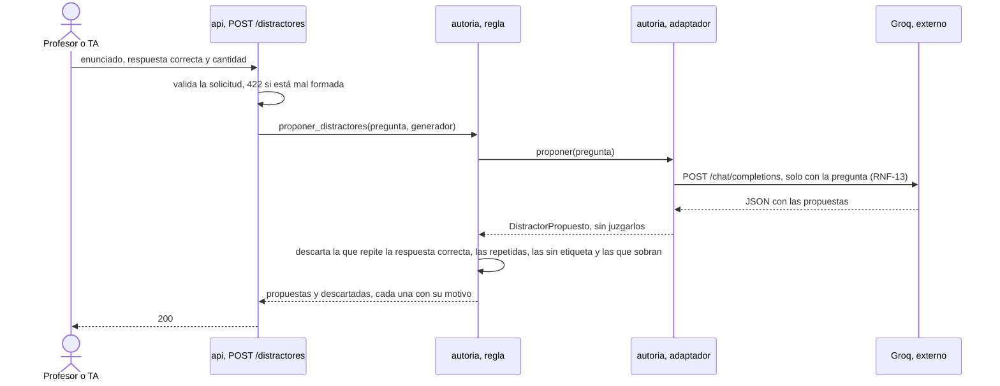
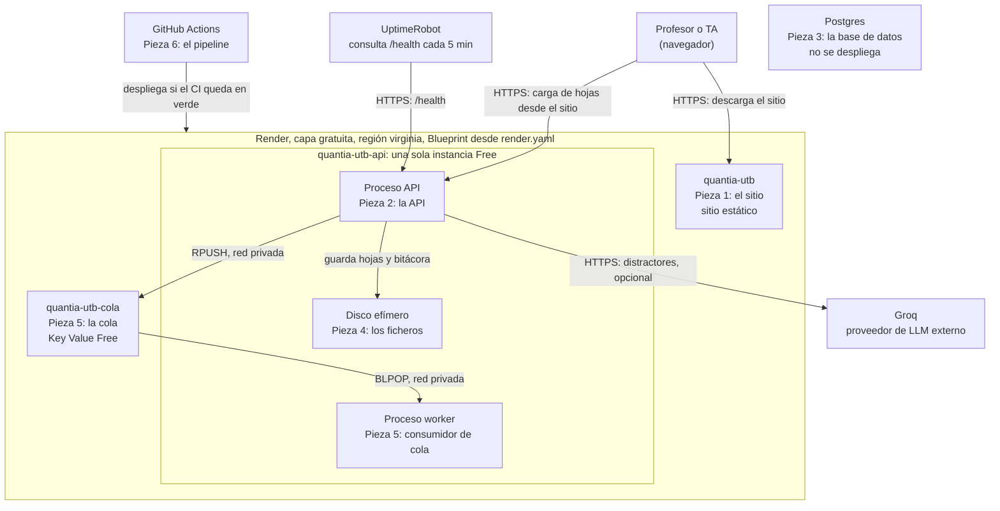
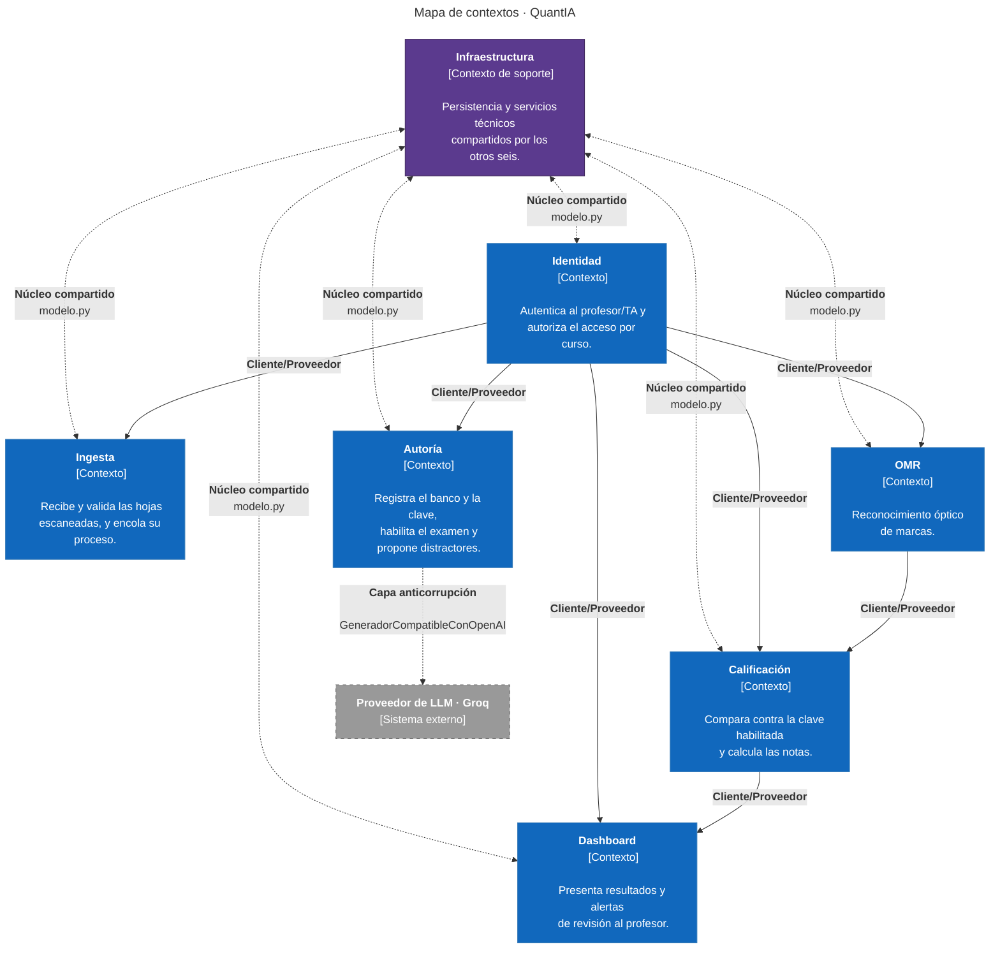

# **About arc42**

arc42, la plantilla para documentar arquitecturas de software y de sistemas.

Versión de plantilla 9.0. Creada y mantenida por Dr. Peter Hruschka, Dr. Gernot Starke
y colaboradores. Ver [https://arc42.org](https://arc42.org).

**Estado de este documento:** las doce secciones están escritas, incluida la 7 (*Deployment
View*), escrita el 27 de septiembre de 2026 con el despliegue en Render (ADR-0009 a ADR-0012).

Las secciones 5 y 6 describen **el estado real del código**, no el diseño previsto. Eso las
obliga a envejecer con cada avance: conviene revisarlas (y con ellas la sección 11) en el mismo
*pull request* que añade código, igual que se actualiza el docstring de un módulo cuando cambia
su frontera.

## Contenido

- [1. Introduction and Goals](#1-introduction-and-goals)
  - [1.1 Requirements Overview](#11-requirements-overview)
  - [1.2 Quality Goals](#12-quality-goals)
  - [1.3 Stakeholders](#13-stakeholders)
- [2. Architecture Constraints](#2-architecture-constraints)
  - [2.1 Restricciones técnicas](#21-restricciones-técnicas)
  - [2.2 Restricciones organizativas](#22-restricciones-organizativas)
  - [2.3 Restricciones legales](#23-restricciones-legales)
- [3. Context and Scope](#3-context-and-scope)
  - [3.1 Business Context](#31-business-context)
  - [3.2 Technical Context](#32-technical-context)
  - [3.3 Fuera de alcance](#33-fuera-de-alcance)
- [4. Solution Strategy](#4-solution-strategy)
  - [4.1 Matriz comparativa de los tres estilos frente al árbol de utilidad](#41-matriz-comparativa-de-los-tres-estilos-frente-al-árbol-de-utilidad)
  - [4.2 Tácticas frente a los escenarios priorizados](#42-tácticas-frente-a-los-escenarios-priorizados)
- [5. Building Block View](#5-building-block-view)
  - [5.1 Whitebox Overall System](#51-whitebox-overall-system)
  - [5.2 Level 2](#52-level-2)
  - [5.3 Level 3](#53-level-3)
- [6. Runtime View](#6-runtime-view)
  - [6.1 Arranque y verificación de salud](#61-arranque-y-verificación-de-salud)
  - [6.2 Carga de una hoja escaneada (RF-01 · aspecto A-01 · EC-07)](#62-carga-de-una-hoja-escaneada-rf-01--aspecto-a-01--ec-07)
  - [6.3 Escenarios pendientes](#63-escenarios-pendientes)
  - [6.4 Solicitud de distractores (RF-11 · aspecto A-06 · EC-08)](#64-solicitud-de-distractores-rf-11--aspecto-a-06--ec-08)
- [7. Deployment View](#7-deployment-view)
  - [7.1 Las seis piezas del despliegue](#71-las-seis-piezas-del-despliegue)
  - [7.2 Entorno local](#72-entorno-local)
  - [7.3 Lo que no se despliega](#73-lo-que-no-se-despliega)
  - [7.4 Limitaciones de este entorno](#74-limitaciones-de-este-entorno)
- [8. Cross-cutting Concepts](#8-cross-cutting-concepts)
  - [8.1 Mapa de contextos](#81-mapa-de-contextos)
  - [8.2 Lenguaje ubicuo](#82-lenguaje-ubicuo)
  - [8.3 Propiedad de datos](#83-propiedad-de-datos)
  - [Conceptos transversales todavía sin desarrollar](#conceptos-transversales-todavía-sin-desarrollar)
- [9. Architecture Decisions](#9-architecture-decisions)
- [10. Quality Requirements](#10-quality-requirements)
  - [10.1 Quality Requirements Overview](#101-quality-requirements-overview)
  - [10.2 Escenarios de calidad priorizados](#102-escenarios-de-calidad-priorizados)
  - [10.3 Escenarios complementarios](#103-escenarios-complementarios)
- [11. Risks and Technical Debts](#11-risks-and-technical-debts)
- [12. Glossary](#12-glossary)

---
**Convenciones de identificadores usadas en todo el repositorio:**

| Prefijo | Significado | Dónde se define |
|---|---|---|
| `RF-nn` | Requisito funcional | Sección 1.1 de este documento |
| `RNF-nn` | Restricción (técnica, organizativa o legal) | Sección 2 de este documento |
| `QG-n` | Objetivo de calidad | Sección 1.2 de este documento |
| `EC-nn` | Escenario de calidad | Secciones 10.2 y 10.3 de este documento |
| `R-nn` | Riesgo o deuda técnica | Sección 11 de este documento |
| `A-nn` | Aspecto (corte vertical) | [`../aspectos.md`](../aspectos.md) |
| `T-n` | Tensión de calidad | [`../aspectos.md`](../aspectos.md) |
| `ADR-nnnn` | Decisión de arquitectura | [`../adr/`](../adr/) |

# 1. Introduction and Goals

## 1.1 Requirements Overview

**QuantIA** ([ADR-0008](../adr/0008-renombrar-el-sistema-a-quantia.md)) automatiza la evaluación y calificación de exámenes de
opción múltiple para la asignatura de **Cálculo Diferencial** en facultades de ingeniería,
ciencias exactas y economía. El profesor carga su banco de preguntas y su clave de respuestas,
aplica el examen en papel, y el sistema lee las hojas escaneadas mediante **Reconocimiento
Óptico de Marcas (OMR)**, califica contra esa clave y publica los resultados. Un **modelo de
lenguaje (LLM)** está disponible como apoyo opcional durante la preparación del examen, para
proponer distractores diagnósticos (ver [ADR-0005](../adr/0005-acotar-el-llm-a-la-generacion-de-distractores-diagnosticos.md)).

El sistema opera en **dos fases temporalmente separadas**, distinción que condiciona toda la
arquitectura:

- **Fase de autoría (antes del examen):** el profesor registra su banco de preguntas y su
  clave de respuestas, opcionalmente pide al sistema que le proponga distractores
  diagnósticos, y habilita el examen. Es una fase sin presión de tiempo real, y es la única en
  la que puede intervenir el modelo de lenguaje.
- **Fase de calificación (después del examen):** el sistema ingesta escaneos, detecta marcas
  y produce notas. Es la fase con exigencias de latencia y de volumen.

### Funcionalidades principales

| ID | Requisito funcional | Fase |
|---|---|---|
| **RF-01** | El sistema debe permitir a un docente autenticado cargar exámenes escaneados (JPG, PNG o PDF), individualmente o en lote, y confirmar su recepción. | Calificación |
| **RF-02** | El sistema debe detectar, para cada pregunta de una hoja escaneada, la casilla marcada, junto con un nivel de confianza asociado a esa detección. | Calificación |
| **RF-03** | El sistema debe marcar como *requiere revisión manual* toda detección cuya confianza no supere el umbral configurado, en lugar de asignar una respuesta arbitraria. | Calificación |
| **RF-04** | El sistema debe comparar las respuestas detectadas contra la clave habilitada del examen y calcular la calificación resultante. | Calificación |
| **RF-05** | El sistema debe presentar los resultados en un dashboard interactivo con notas por curso, estadísticas por examen y por pregunta, y alertas de revisión manual. Las estadísticas por pregunta informan la distribución de respuestas por opción; cuando una opción tiene registrada la etiqueta del error que representa (ver RF-11), la muestra junto a la distribución. | Calificación |
| **RF-06** | El sistema debe permitir a un docente registrar su banco de preguntas de cálculo diferencial (límites, derivadas y simplificaciones algebraicas) junto con la clave de respuestas del examen. | Autoría |
| **RF-07** | El sistema debe presentar al profesor el examen completo (enunciados, opción correcta y distractores) y no debe habilitarlo para calificación hasta que el profesor lo habilite explícitamente, registrando quién lo hizo y cuándo. | Autoría |
| **RF-08** | El sistema debe permitir a un docente resolver manualmente las preguntas marcadas como ambiguas y recalcular la nota afectada. | Calificación |
| **RF-09** | El sistema debe restringir el acceso a usuarios registrados y limitar cada docente a los cursos que tiene autorizados. | Transversal |
| **RF-10** | El sistema debe registrar quién modificó una calificación y cuándo, de forma consultable. | Transversal |
| **RF-11** *(opcional)* | El sistema debe permitir al profesor solicitar, para una pregunta dada, la generación de **distractores diagnósticos** con apoyo de un modelo de lenguaje: opciones incorrectas que corresponden a un error de procedimiento identificable, cada una con la etiqueta del error que representa. El profesor decide cuáles acepta. El sistema opera completo sin invocar nunca esta función (ver [ADR-0005](../adr/0005-acotar-el-llm-a-la-generacion-de-distractores-diagnosticos.md)). | Autoría |

## 1.2 Quality Goals

Los cuatro objetivos de calidad primarios que guían la arquitectura. Son objetivos de negocio,
no funcionalidades, y cada uno se hace verificable a través de los escenarios de la sección 10.

| # | Objetivo de calidad | A quién le importa | Por qué es prioritario | Escenarios que lo verifican |
|---|---|---|---|---|
| **QG-1** | **Precisión y validez matemática.** Lectura OMR confiable, y ningún examen calificado con una clave que el profesor no haya revisado y habilitado explícitamente. | Comité Académico, profesores, estudiantes | Una nota mal calculada tiene consecuencias académicas directas y erosiona la confianza en el sistema de forma irreversible. | [EC-01](#ec-01), [EC-05](#ec-05), [EC-08](#ec-08) |
| **QG-2** | **Rendimiento y eficiencia de procesamiento.** Calificar exámenes individuales en segundos y lotes masivos en minutos. | Profesores, TAs | Si calificar con el sistema no es más rápido que calificar a mano, el sistema no tiene razón de existir. | [EC-03](#ec-03), [EC-04](#ec-04) |
| **QG-3** | **Manejabilidad de casos borde (degradación controlada).** Ninguna marca dudosa se convierte en una calificación silenciosamente errónea. | Estudiantes, profesores | Es la contraparte necesaria de QG-1: la precisión perfecta no existe, así que el sistema debe *saber* cuándo no sabe. | [EC-02](#ec-02) |
| **QG-4** | **Seguridad y aislamiento por rol.** Cada docente accede únicamente a los datos y calificaciones de sus cursos autorizados. | Comité Académico, Administradores de TI | Las calificaciones son datos académicos sensibles y su manipulación indebida es un riesgo institucional y legal, no solo técnico. | [EC-06](#ec-06) |

> **Nota sobre disponibilidad y mantenibilidad.** El árbol de utilidad (sección 10.1) las
> incluye como atributos relevantes, pero no se elevan a objetivo primario: en un sistema de
> uso interno y por lotes, una indisponibilidad breve se absorbe reintentando la carga,
> mientras que un error de precisión no se absorbe. Se documentan y se miden, pero no dominan
> las decisiones de diseño.

## 1.3 Stakeholders

| Stakeholder | Rol frente al sistema | Contacto | Expectativas |
|---|---|---|---|
| **Profesores de Cálculo / Cátedra** | Usuario principal | docentes.calculo@utb.edu | Reducir drásticamente el tiempo de calificación de exámenes masivos. Revisar el examen completo antes de habilitarlo, para detectar ambigüedades matemáticas en la clave. Disponer de un dashboard con métricas por curso y por pregunta. |
| **Asistentes de Cátedra (TAs)** | Usuario operativo | tas.ingenieria@utb.edu | Ingesta ágil en lote de imágenes escaneadas. Interfaz clara para resolver manualmente las preguntas clasificadas como ambiguas. |
| **Comité Académico / Dirección de Programa** | Patrocinador y auditor | direccion.sistemas@utb.edu | Alta precisión y confiabilidad de las calificaciones. Seguridad, confidencialidad y auditabilidad del almacenamiento de notas. |
| **Administradores de TI / Sistema** | Operador | admin.sys@utb.edu | Sistema modular, mantenible y desacoplado, con bajo consumo de CPU/memoria. Disponibilidad ≥95% en periodos críticos. |
| **Estudiantes** | Afectado, **no usuario** | — | Que su respuesta sea leída como la marcó y que una marca dudosa no se convierta en un error en su contra. Que sus datos personales se traten conforme a la ley y que pueda ejercer su derecho de revisión de la nota. No interactúan con el sistema (RNF-05); se listan porque son los titulares de los datos y quienes soportan las consecuencias de un fallo de QG-1 y QG-3. |
| **Equipo de desarrollo** | Constructor | Josué Ortega, María Restrepo, Sebastián Cañas, Susana Rosales | Un repositorio que arranque de forma reproducible y una estructura que permita trabajar en la lógica de negocio sin pelear con el montaje. |

---

# 2. Architecture Constraints

Las restricciones fijan los límites del diseño: son condiciones dadas, no decisiones del
equipo. Se clasifican en las tres categorías del curso (**técnicas**, **organizativas** y
**legales**) y cada una indica **de dónde viene**.

Ninguna de estas restricciones es un requisito funcional disfrazado: los requisitos
funcionales están en la sección 1.1 y describen lo que el sistema *hace*; las restricciones
describen el espacio dentro del cual se puede diseñar.

## 2.1 Restricciones técnicas

| ID | Restricción | Origen | Justificación e impacto en el diseño |
|---|---|---|---|
| **RNF-01** | **Stack obligatorio: OMR. El LLM es una capacidad de apoyo, no un paso del flujo.** | Enunciado del problema, ajustado dos veces: por retroalimentación del profesor ([ADR-0004](../adr/0004-quitar-validacion-simbolica-obligatoria-de-la-clave.md)) y por precisión del equipo sobre el flujo real ([ADR-0005](../adr/0005-acotar-el-llm-a-la-generacion-de-distractores-diagnosticos.md)) | La calificación se realiza mediante OMR: es el único componente sin el cual el sistema no funciona, y obliga a que exista un módulo separado para visión por computador. El LLM queda disponible como capacidad de apoyo en la fase de autoría (RF-11), a solicitud del profesor, y **no participa en ningún paso de la calificación** —lo que además es condición para cumplir EC-03 y EC-04, porque una llamada a un modelo externo dentro del procesamiento de cada hoja rompería el techo de cinco segundos. La versión original incluía también SymPy para validar la clave automáticamente; el profesor confirmó que esa automatización no es necesaria (ADR-0004). Sigue sin ser una decisión libre del equipo, y sigue condicionando la elección de lenguaje por el lado de OpenCV (ver ADR-0003). |
| **RNF-02** | **Entrada: hoja de respuestas estructurada con casillas en posiciones fijas.** | Enunciado del problema | El examen se resuelve en una hoja física de formato estandarizado, no en papel de escritura libre. Obliga a que el layout sea conocido de antemano para que el OMR pueda localizar las marcas por posición, y a incluir marcas de registro que permitan corregir inclinación del escaneo. |
| **RNF-03** | **Solo preguntas evaluables como opción múltiple.** | Consecuencia de RNF-01 y RNF-02 | Al procesar marcas y no expresiones escritas, el sistema solo puede evaluar preguntas con una única respuesta final identificable entre varias opciones. Las preguntas de desarrollo o demostración quedan fuera de alcance. Define directamente cómo se construye el banco de preguntas. |
| **RNF-04** | **Salida obligatoria en dashboard interactivo.** | Enunciado del problema | Los resultados se presentan en un dashboard, no como archivo aislado ni reporte por correo. Fija que la arquitectura incluya una capa de visualización, y que la estructura de datos esté pensada para agregación (por curso, examen y pregunta), no solo para almacenamiento. |

## 2.2 Restricciones organizativas

| ID | Restricción | Origen | Justificación e impacto en el diseño |
|---|---|---|---|
| **RNF-05** | **Usuarios objetivo: profesores y TAs, no estudiantes.** | Enunciado del problema (alcance definido por el cliente) | El sistema está dirigido a docentes y asistentes de cátedra. El estudiante es la fuente de las marcas en la hoja, pero no es usuario ni interactúa con el sistema. Condiciona el diseño de roles y permisos: no existe interfaz ni cuenta de estudiante, y todo el flujo se diseña para el rol docente. |
| **RNF-06** | **Dominio acotado a cálculo diferencial.** | Alcance acordado con el cliente | El alcance temático se limita a límites, derivadas y simplificaciones algebraicas. Acota lo que el LLM debe generar y lo que el profesor debe revisar al aprobar la clave, y evita sobredimensionar el sistema para integrales, ecuaciones diferenciales o álgebra lineal. |
| **RNF-07** | **Arranque reproducible con un solo comando.** | Condición de entrega del curso (`CONTRATO.md`) | El repositorio debe levantarse con un único comando y presentar un esqueleto ejecutable con una prueba automatizada en verde. Es la restricción con más peso en [ADR-0002](../adr/0002-procesar-calificacion-de-forma-asincrona.md), porque penaliza cualquier topología que exija orquestar varios despliegues. |
| **RNF-08** | **Stack de implementación limitado a las opciones del curso:** backend en NestJS o FastAPI; frontend en Flutter o Next.js. | Impuesta por la asignatura | El equipo no puede elegir libremente el lenguaje ni el framework. Combinada con RNF-01, condiciona fuertemente la elección de backend, porque el ecosistema de visión por computador (OpenCV) solo existe con madurez en Python. En el frontend, lo determinante es la experiencia previa del equipo bajo el cronograma de RNF-09. Resuelta en [ADR-0003](../adr/0003-usar-fastapi-y-flutter.md); [ADR-0004](../adr/0004-quitar-validacion-simbolica-obligatoria-de-la-clave.md) deja constancia de que la elección se sostiene sin cambios aunque SymPy deje de ser obligatorio. |
| **RNF-09** | **Equipo de cuatro estudiantes con dedicación parcial y cronograma fijado por el curso** (cortes en las semanas 5 y 10, entrega final en la 16). | Contexto académico | Limita la complejidad operacional asumible: no hay capacidad para operar infraestructura distribuida ni para sostener varios despliegues. Es uno de los argumentos que sostiene la elección de monolito modular frente a microservicios en ADR-0002. |
| **RNF-10** | **Todos los integrantes deben contribuir al historial del repositorio**, con código y documentación repartidos a lo largo del semestre. | `CONTRATO.md` §10 del curso | Criterio calificado. Obliga a repartir el trabajo por módulos y a usar ramas y *pull requests* en lugar de commits directos de una sola persona, lo que a su vez favorece una descomposición con fronteras claras que puedan asignarse por separado. |
| **RNF-11** | **Repositorio público, en la organización `ISCOUTB` y con la convención de nombres del curso.** | `CONTRATO.md` del curso | Ninguna parte del sistema puede depender de artefactos privados ni de secretos versionados. Cualquier credencial (por ejemplo, la clave del proveedor de LLM) debe leerse de variables de entorno y nunca del repositorio. |
| **RNF-16** | **Costo mensual de US$0 y ninguna cuenta con tarjeta vinculada.** | Política de costos de la «Guía de despliegue y costos» del curso: «Ninguna cuenta personal de pago es obligatoria en este curso.» | Obliga a que toda pieza desplegada quepa en capas gratuitas sin tarjeta (Render Hobby): servicio web Free, Key Value Free y sitio estático. Descarta cualquier instancia de pago (Starter US$7, disco persistente US$0,25/GB) y condiciona la elección de Render sobre alternativas que sí piden tarjeta, o que todavía no verifican si la piden (ver [ADR-0011](../adr/0011-consumir-la-cola-desde-la-instancia-de-la-api-con-el-key-value-gratuito.md) y [ADR-0012](../adr/0012-mantener-el-almacen-en-el-disco-efimero-de-la-instancia-hasta-cerrar-r-06.md)). |

## 2.3 Restricciones legales

| ID | Restricción | Origen | Justificación e impacto en el diseño |
|---|---|---|---|
| **RNF-12** | **Tratamiento de datos personales conforme al régimen colombiano de protección de datos** (Ley Estatutaria 1581 de 2012 y normas que la desarrollan). | Marco legal colombiano | Las hojas escaneadas y las calificaciones son datos personales de estudiantes identificables. Obliga a declarar la finalidad del tratamiento, a limitar el acceso a quien tenga una razón legítima (lo que refuerza QG-4) y a aplicar medidas de seguridad sobre el almacenamiento. |
| **RNF-13** | **Ningún dato personal de estudiantes sale hacia el proveedor de LLM.** | Consecuencia de RNF-12 | El LLM solo participa en la fase de autoría, proponiendo distractores diagnósticos cuando el profesor los pide (RF-11). Ninguna hoja escaneada, nombre ni calificación se envía a un servicio de terceros. Esta restricción es la que hace aceptable usar un proveedor externo, y debe preservarse en cualquier evolución del sistema. |
| **RNF-14** | **Política explícita de retención y eliminación de las imágenes escaneadas.** | Principio de finalidad de RNF-12 | Los escaneos no pueden conservarse indefinidamente «por si acaso»: una vez cerrado el periodo de reclamación, deben eliminarse o anonimizarse. Obliga a que el almacén de imágenes tenga un ciclo de vida definido, no solo una operación de guardado. |
| **RNF-15** | **Trazabilidad de las calificaciones para el derecho de revisión del estudiante.** | Reglamento estudiantil de la institución | El estudiante puede reclamar su nota, y la institución debe poder responder con evidencia. Obliga a conservar la imagen de la hoja durante el periodo de reclamación, a registrar quién modificó una calificación y cuándo (RF-10), y a que una nota corregida manualmente sea distinguible de una calculada automáticamente. |

---

# 3. Context and Scope

## 3.1 Business Context

El sistema recibe insumos físicos digitalizados (hojas de respuestas escaneadas) y los
convierte en calificaciones y métricas analíticas para los usuarios docentes.

| Socio de comunicación | Entradas al sistema | Salidas desde el sistema |
|---|---|---|
| **Profesor / TA** | Creación y edición de bancos de preguntas; claves de respuesta; parámetros de evaluación; archivos escaneados (imágenes o PDF); resolución manual de casos ambiguos. | Vistas del dashboard interactivo; reportes consolidados por curso; analítica de ítems por pregunta; alertas de casos dudosos, y la estadística por pregunta, que deja ver un distractor que compite con la respuesta correcta (ver la [ficha del problema](../ficha-problema.md)). |
| **Proveedor de LLM** *(sistema externo: Groq, [ADR-0013](../adr/0013-consumir-groq-detras-de-un-puerto-y-degradar-sin-bloquear-la-autoria.md))* | La pregunta para la que el profesor pide distractores. **Nunca datos personales** (RNF-13). | Distractores diagnósticos candidatos, cada uno con la etiqueta del error que representa. El profesor decide cuáles acepta, y ninguno entra a un examen sin su habilitación (RF-07, [ADR-0005](../adr/0005-acotar-el-llm-a-la-generacion-de-distractores-diagnosticos.md)). |

> **Nota de modelado.** La *hoja de respuestas física* no se representa como socio de
> comunicación. Un documento en papel no es un actor ni un sistema: es el **artefacto de
> entrada** que el docente digitaliza y carga. Quien se comunica con el sistema es el docente;
> la hoja es el contenido de esa comunicación. El escáner tampoco aparece: es una herramienta
> ofimática ajena al sistema, cuya salida el docente sube manualmente.

Los actores y sistemas externos de esta sección se corresponden **uno a uno** con los del
diagrama C4 de contexto en [`../c4/doc-c4.md`](../c4/doc-c4.md).

## 3.2 Technical Context

| Canal / Interfaz | Entrada | Salida | Protocolo / Formato | Socio de 3.1 |
|---|---|---|---|---|
| **Interfaz Web (Dashboard)** | Autenticación, gestión de cursos y bancos de preguntas, carga de escaneos, resolución de marcas ambiguas | Notas, gráficos, alertas de ambigüedad y estadística por pregunta | HTTPS · JSON en las respuestas; multipart/form-data en la carga de escaneos. Frontend en Flutter compilado a web. Interfaz descrita campo por campo en [../contrato/openapi.json](../contrato/openapi.json) | Profesor / TA |
| **Canal de ingesta OMR** | Lote de imágenes o PDF de hojas escaneadas | Matriz de respuestas detectadas con nivel de confianza (%) por pregunta | Carga HTTP multipart. Procesamiento previsto con OpenCV sobre PNG, JPG o PDF a 300 DPI; **aún no está implementado** (ver A-02) | Profesor / TA |
| **Proveedor de LLM** *(opcional)* | Especificación de la pregunta para la que se piden distractores | Distractores candidatos, cada uno con la etiqueta del error de procedimiento que representa, sujetos a la decisión del profesor (RF-11) | HTTPS · JSON, `POST /chat/completions` compatible con OpenAI, contra Groq; clave en la variable `LLM_API_KEY`; 20 s de espera, sin reintentos ([ADR-0013](../adr/0013-consumir-groq-detras-de-un-puerto-y-degradar-sin-bloquear-la-autoria.md)) | Proveedor de LLM |

## 3.3 Fuera de alcance

- Integración con el sistema académico institucional (publicación automática de notas).
- Interfaz o cuenta para estudiantes (RNF-05).
- Evaluación de preguntas abiertas o de desarrollo (RNF-03).
- Impresión o distribución física de los exámenes generados.
- Verificación automática por computación simbólica de la equivalencia entre opciones de la
  clave de respuestas (ver [ADR-0004](../adr/0004-quitar-validacion-simbolica-obligatoria-de-la-clave.md)): esa verificación la hace el profesor manualmente.

---

# 4. Solution Strategy

## 4.1 Matriz comparativa de los tres estilos frente al árbol de utilidad

Antes de elegir estilo se compararon los tres candidatos **contra los escenarios de calidad de
este proyecto**, no en abstracto. La pregunta en cada celda es: *¿este estilo hace más
alcanzable o menos alcanzable este escenario concreto?*

| Escenario / atributo | Capas (Layered) | Hexagonal completa | Monolito modular + asíncrono |
|---|---|---|---|
| **[EC-01](#ec-01)** · Exactitud OMR ≥98% | **Neutro con reserva.** La exactitud depende del algoritmo, no del estilo. Pero el código de detección queda mezclado en una única capa de negocio con la calificación y la autoría, lo que dificulta iterar sobre él de forma aislada. | **Mejora.** El dominio de detección se prueba sin base de datos ni web, lo que permite ciclos de ajuste rápidos sobre el algoritmo. | **Mejora.** El módulo `omr` tiene frontera propia: se puede optimizar y medir sin arrastrar el resto del sistema. |
| **[EC-02](#ec-02)** · Marcas ambiguas ≥99% | **Empeora.** La política de umbral y el manejo de la incertidumbre se dispersan entre la capa de negocio y la de presentación. | **Mejora.** La política de confianza vive en el dominio, aislada de cómo se muestre o se persista. | **Mejora.** Contenida en `omr`, junto a la detección que la produce. |
| **[EC-03](#ec-03)** · ≤5 s por hoja (p95) | **Neutro.** Nada en el estilo ayuda ni estorba a la latencia de una hoja suelta. | **Neutro.** Las capas de indirección añaden un coste despreciable frente al de procesar una imagen. | **Neutro.** |
| **[EC-04](#ec-04)** · 200 hojas en ≤10 min | **Empeora, y es determinante.** El estilo no dice nada sobre concurrencia: el flujo ocurre dentro de la petición, de forma secuencial, y 200 × 5 s = 16,6 min incumple el escenario. | **Neutro.** Es ortogonal al problema: aísla el dominio, pero no resuelve el caudal. | **Mejora, y es determinante.** Es el único de los tres que incorpora cola y workers, que es lo que hace el escenario alcanzable. |
| **[EC-05](#ec-05)** · Validez de la clave 100% | **Empeora.** El flujo de aprobación de la clave y el consumo del LLM quedan acoplados a la infraestructura, y la salida no determinista del LLM se vuelve difícil de aislar para probar. | **Mejora.** Aislar el proveedor de LLM tras un puerto es exactamente lo que permite probar el flujo de aprobación sin depender del servicio externo. | **Mejora.** Se obtiene el mismo beneficio aplicando el aislamiento **solo** en `autoria`, donde compensa, en lugar de en los siete módulos. |
| **[EC-06](#ec-06)** · Aislamiento por curso | **Empeora.** La autorización se reparte entre los controladores de la capa de presentación, sin un lugar único donde auditarla. | **Mejora.** | **Mejora.** El módulo `identidad` concentra la autorización con frontera declarada. |
| **[EC-07](#ec-07)** · Recepción sin pérdida | **Empeora.** Sin cola persistente no hay durabilidad: una caída a mitad del lote pierde el trabajo en curso. | **Neutro.** No aporta durabilidad por sí mismo. | **Mejora.** Separa la carga del procesamiento, que es donde puede garantizarse que nada se pierda. Esa garantía la da hoy la bitácora de recepción de [ADR-0006](../adr/0006-registrar-la-recepcion-en-una-bitacora-antes-de-encolar.md), no la cola: Redis corre sin persistencia configurada. |
| **Mantenibilidad** *(atributo del árbol)* | **Empeora.** Las capas cortan en horizontal, pero el cambio en este sistema llega en vertical: tocar el OMR no debería tocar el dashboard, y en capas ambos viven en la misma capa de negocio. | **Mejora mucho.** | **Mejora.** Los módulos coinciden con las fronteras funcionales reales y con los aspectos del ADD. |
| **Coste de montaje** *(RNF-07, RNF-09)* | **El más bajo.** Es lo que se monta más rápido con un equipo sin experiencia. | **El más alto.** Puertos y adaptadores en los siete módulos, con curva de aprendizaje, compitiendo con el tiempo de entrega. | **Intermedio.** Siete paquetes con frontera, más el coste de modelar los estados del trabajo asíncrono. |

**Lectura de la matriz.** Capas es el más barato de montar pero empeora cinco de los siete
escenarios, incluidos los dos de mayor impacto. Hexagonal mejora casi todo, pero su coste se
paga por igual en los siete módulos, y en los más delgados (`dashboard`, `identidad`) produce
indirección sin contenido; además no resuelve EC-04, que es el escenario que más aprieta. El
monolito modular con procesamiento asíncrono mejora seis de siete y es el único que hace
alcanzable EC-04, a un coste de montaje intermedio.

De ahí sale la decisión registrada en
[ADR-0002](../adr/0002-procesar-calificacion-de-forma-asincrona.md), incluido el matiz de
adoptar el aislamiento hexagonal **de forma selectiva** en los dos puntos donde la matriz
muestra que compensa (el proveedor de LLM y el almacenamiento de imágenes) en lugar de como
política global.

## 4.2 Tácticas frente a los escenarios priorizados

| Decisión | Motivación | Objetivo de calidad | Registro |
|---|---|---|---|
| **Monolito modular** con siete módulos de fronteras explícitas (`autoria`, `ingesta`, `omr`, `calificacion`, `dashboard`, `identidad`, `infraestructura`). | Un único despliegue satisface RNF-07 sin renunciar a fronteras internas claras, que además permiten repartir el trabajo entre los cuatro integrantes (RNF-10). | Mantenibilidad | [ADR-0002](../adr/0002-procesar-calificacion-de-forma-asincrona.md) |
| **Procesamiento asíncrono con cola de trabajos y workers**; la respuesta HTTP confirma la recepción, no la calificación. | Es la única forma de cumplir EC-04 (200 hojas en ≤10 min) sin romper EC-03 (≤5 s por hoja). Además separa el trabajo pendiente del proceso que atiende la carga, que es lo que permite recuperarlo ante fallos. | QG-2 | [ADR-0002](../adr/0002-procesar-calificacion-de-forma-asincrona.md) |
| **Umbral de confianza explícito** en la detección OMR, con desvío a revisión manual en vez de decisión automática. | El OMR es intrínsecamente probabilístico. Convertir la incertidumbre en un estado visible del sistema es preferible a ocultarla tras una respuesta inventada. | QG-1, QG-3 | ADR previsto al calibrar el umbral (R-04) |
| **Habilitación explícita obligatoria antes de calificar un examen**: el profesor revisa el examen completo (enunciados, opción correcta y distractores, incluidos los que haya propuesto el modelo de lenguaje) y lo habilita con su nombre y la fecha. | Dos opciones pueden ser la misma expresión escrita distinto, y un distractor propuesto por el modelo puede ser plausible sin ser correcto. La revisión del profesor es el único filtro antes de calificar, y se mide en EC-05. | QG-1 | [ADR-0004](../adr/0004-quitar-validacion-simbolica-obligatoria-de-la-clave.md) · [ADR-0005](../adr/0005-acotar-el-llm-a-la-generacion-de-distractores-diagnosticos.md) |
| **Separación temporal entre fase de autoría y fase de calificación.** | Aísla la dependencia del LLM (lenta, externa, potencialmente costosa) de la ruta crítica de calificación. Es además lo que hace cumplible RNF-13: ningún dato personal circula por el proveedor externo. | QG-2, RNF-13 | Implícita en ADR-0002 |
| **Registro de auditoría sobre las calificaciones** (quién modificó qué y cuándo). | Exigido por RNF-15 para poder responder a una reclamación de nota con evidencia. | QG-4 | ADR previsto al construir A-05 |

---

# 5. Building Block View

> **Estado.** El C4 está cerrado en sus Niveles 1, 2 y 3
> ([`../c4/doc-c4.md`](../c4/doc-c4.md)). El código ya materializa
> parcialmente esos contenedores: el aspecto **A-01 (carga de examen para calificación)** está
> en estado *Construido* según [`../aspectos.md`](../aspectos.md#a-01), con recepción,
> almacenamiento y encolado funcionando de punta a punta. Los otros cuatro aspectos (A-02 a
> A-05) siguen *Declarados*, sin código.

## 5.1 Whitebox Overall System

La tabla recorre los elementos del Nivel 2 y su estado de implementación. La correspondencia
con lo que `docker compose up` levanta **no es uno a uno**, y conviene tenerlo presente al leer
los dos documentos juntos:

- La **«Aplicación web»** del C4 se despliega hoy como **dos servicios**: `api`, que atiende la
  API HTTP, y `frontend`, que sirve la interfaz Flutter ya compilada. El C4 los trata como una
  unidad lógica; el `docker-compose.yml` los levanta y reinicia por separado.
- El **«Almacén de imágenes»** no es un servicio sino un **volumen** de Docker, montado en `api`
  y en `worker` para que ambos vean el mismo archivo.
- El **proveedor de LLM** aparece en la tabla porque el Nivel 2 lo dibuja, pero es externo: no se
  despliega con el sistema.

| Contenedor | Responsabilidad (C4 Nivel 2) | Tecnología | Estado de implementación |
|---|---|---|---|
| **Aplicación web** *(lado servidor)* | Autenticación, cursos, preguntas, exámenes, carga de escaneos y consulta de resultados; inicia los trabajos de procesamiento. | FastAPI (`backend/api/main.py`), Uvicorn (servicio `api`). | Expone `GET /health`, `POST /examenes/{examen_id}/hojas` (RF-01, aspecto A-01) y `POST /distractores` (RF-11, aspecto A-06). El resto de responsabilidades del contenedor (cursos, preguntas, resultados) siguen sin ruta. |
| **Interfaz web** *(parte de «Aplicación web» en el C4)* | Presenta al docente el dashboard, la carga de escaneos y la resolución de marcas ambiguas. | Flutter compilado a web, servido por nginx (servicio `frontend`). | Construida la pantalla de carga del aspecto A-01 (`pantalla_carga.dart`, `servicio_carga.dart`, `selector_archivos.dart`) y la de inicio con el estado de conexión. El dashboard de RNF-04 y la resolución de marcas ambiguas siguen sin construir. |
| **Worker de procesamiento** | Ejecuta el OMR, calcula calificaciones y genera alertas de revisión. | Proceso Python (`backend/worker/main.py`), misma imagen que la aplicación web. | Consume la cola y confirma que la hoja encolada por `ingesta` le llegó, registrando en log su identificador, examen, archivo y referencia. **No ejecuta todavía** el pipeline `omr → calificacion`: ese es el aspecto A-02, aún declarado. |
| **Cola de trabajos** | Desacopla la aplicación web del procesamiento OMR. | Redis 7, adaptador FIFO en `infraestructura/cola.py` (RPUSH/BLPOP). | Implementado y probado contra un Redis real (`backend/tests/test_encolado.py`); sigue siendo, según su propio docstring, «el germen» de lo que EC-07 exige, no una cola de producción con reintentos o acuses de recibo. |
| **Base de datos** | Almacena usuarios, cursos, preguntas, claves, exámenes y resultados. | PostgreSQL 16, volumen `datos_postgres`. | Declarada en `docker-compose.yml` y `.env.example`; **ningún módulo la usa todavía** — sin esquema ni migraciones. |
| **Almacén de imágenes** | Conserva las hojas escaneadas, la bitácora de recepción y archivos asociados. | Volumen Docker `almacen_imagenes`, montado en `api` y `worker`. | **Implementado como dos puertos con adaptadores provisionales**: `infraestructura/almacen.py` define el puerto `AlmacenDeImagenes` y el adaptador `AlmacenEnDisco`, que escribe en el volumen con nombres saneados (`nombre_seguro`) para evitar escapes de directorio; `infraestructura/bitacora.py` define `BitacoraDeRecepcion` y `BitacoraEnDisco`, de solo agregado y con `fsync` por línea ([ADR-0006](../adr/0006-registrar-la-recepcion-en-una-bitacora-antes-de-encolar.md)). Los dos son deliberadamente provisionales: el riesgo R-06 (decisión de persistencia) sigue abierto, y cuando se resuelva solo cambian los adaptadores, no los puertos ni quien los consume. La política de retención de RNF-14 aterrizará aquí y hoy no está implementada. |
| **Proveedor de LLM** *(externo y opcional)* | Propone distractores diagnósticos durante la autoría. | Groq, modelo `openai/gpt-oss-120b`, con el protocolo de chat de OpenAI ([ADR-0013](../adr/0013-consumir-groq-detras-de-un-puerto-y-degradar-sin-bloquear-la-autoria.md)). | Lo llama `autoria/proveedor_llm.py` desde la aplicación web, nunca desde el worker (RNF-13). Sin clave, la ruta de distractores responde 503 y nada más cambia. |

## 5.2 Level 2

Dentro de **Aplicación web** y **Worker de procesamiento** viven los siete módulos fijados en
[ADR-0002](../adr/0002-procesar-calificacion-de-forma-asincrona.md), con la frontera de
importación que declara el docstring de cada `__init__.py` y que hace cumplir
`backend/tests/test_fronteras.py` en CI:

| Módulo | Responsabilidad | Requisitos | Importa (declarado) | Estado de implementación |
|---|---|---|---|---|
| **ingesta** | Recepción y validación de archivos escaneados (individual o en lote) y encolado del procesamiento. | RF-01 | `infraestructura`, `identidad` | **Implementado** (`recepcion.py`): valida extensión *y* firma de bytes por archivo, no aborta el lote ante un archivo inválido ni ante un fallo de la cola (ADR-0006), y por cada hoja almacena, acuña el trabajo, registra en la bitácora y solo entonces publica. Expone `recibir_lote`, `motivo_de_rechazo` y `EXTENSIONES_ACEPTADAS` como interfaz pública vía `__all__`. Aún no verifica el `examen_id` contra nada (hueco conocido: depende de `autoria`, A-04) ni la autorización del docente (depende de `identidad`, A-05). |
| **infraestructura** | Persistencia, almacenamiento de imágenes, bitácora de recepción y adaptador de la cola de trabajos. | Transversal | ninguno | **Parcialmente implementado.** `cola.py` (acuñar, publicar y desencolar sobre Redis, con `ColaNoDisponible` como traducción de los errores de redis-py al dominio), `almacen.py` (puerto `AlmacenDeImagenes` + adaptador `AlmacenEnDisco`), `bitacora.py` (puerto `BitacoraDeRecepcion` + adaptadores `BitacoraEnDisco` y `BitacoraEnMemoria`, ADR-0006) y `modelo.py` (el modelo de datos compartido: `ArchivoCargado`, `HojaAceptada`, `ArchivoRechazado`, `ResultadoRecepcion`, `EntradaDeBitacora`) ya tienen código. Sigue sin persistencia estructurada (Postgres sin esquema) y sin política de retención (R-06, RNF-14 abiertos). |
| **autoria** | Bancos de preguntas y clave de respuestas, generación opcional de distractores diagnósticos con LLM, y habilitación del examen. | RF-06, RF-07, RF-11 | `infraestructura`, `identidad` | **Implementado en parte** (aspecto A-06): `distractores.py` (los tipos, el puerto `GeneradorDeDistractores` y la regla de qué propuestas llegan al profesor) y `proveedor_llm.py` (el adaptador al proveedor, [ADR-0013](../adr/0013-consumir-groq-detras-de-un-puerto-y-degradar-sin-bloquear-la-autoria.md)). El banco, la clave y la habilitación siguen sin código (aspecto A-04). |
| **omr** | Detección de marcas y cálculo del nivel de confianza; clasificación de ambigüedad. | RF-02, RF-03 | `infraestructura`, `identidad` | Paquete vacío (aspecto A-02, declarado). |
| **calificacion** | Comparación contra la clave habilitada por el profesor y cálculo de notas; recálculo tras revisión manual. | RF-04, RF-08 | `infraestructura`, `identidad`, `omr` | Paquete vacío (aspecto A-03, declarado). |
| **dashboard** | Presentación de resultados y agregaciones por curso, examen y pregunta. | RF-05 | `infraestructura`, `identidad`, `calificacion` | Paquete vacío (aspecto A-03, declarado). |
| **identidad** | Autenticación, roles y aislamiento de datos por curso. | RF-09, RF-10 | `infraestructura` | Paquete vacío (aspecto A-05, declarado). |

`api/main.py` es la traducción entre HTTP y dominio: construye sus dependencias (almacén,
cliente de cola) por petición vía `Depends`, precisamente para que arrancar la aplicación (y
probarla) no exija que el volumen o Redis existan. `worker/main.py` comparte esa misma base de
dominio. Los bordes de importación que existen hoy son tres, todos dentro de lo declarado:
`api/main.py` importa `ingesta` e `infraestructura`, `ingesta/recepcion.py` importa
`infraestructura`, y `worker/main.py` importa `infraestructura.cola`.

## 5.3 Level 3

Solo el aspecto **A-01** tiene estructura interna suficiente para bajar a Nivel 3; el resto
sigue vacío (ver 5.2).

**Dentro de `ingesta` (aspecto A-01):**

| Componente | Responsabilidad |
|---|---|
| `recibir_lote()` | Orquesta el lote completo: por cada archivo, valida, y si es válido, almacena y encola; siempre devuelve un `ResultadoRecepcion` con aceptadas y rechazados. |
| `motivo_de_rechazo()` | Valida extensión declarada (RF-01: JPG, PNG, PDF) y la firma real de los primeros bytes del archivo, para que renombrar un archivo no lo haga pasar. |

**Dentro de `infraestructura` (soporte de A-01):**

| Componente | Responsabilidad |
|---|---|
| `AlmacenDeImagenes` (puerto) | Contrato que `ingesta` conoce: `guardar(examen_id, nombre_archivo, contenido) -> referencia`. |
| `AlmacenEnDisco` (adaptador provisional) | Escribe en el volumen compartido, con nombre único por UUID y saneado (`nombre_seguro`) para que un nombre hostil no escape del directorio del examen. |
| `cola.py` (`encolar`/`desencolar`) | Adaptador FIFO sobre Redis, ya descrito en 5.1. |
| `modelo.py` | Dataclasses inmutables compartidas por los siete módulos (`ArchivoCargado`, `HojaAceptada`, `ArchivoRechazado`, `ResultadoRecepcion`, `EntradaDeBitacora`), sin dependencias fuera de la librería estándar. |

Los aspectos A-02 a A-05 se documentan a Nivel 3 cuando dejen de estar vacíos,
según [`../aspectos.md`](../aspectos.md).

---

# 6. Runtime View

> **Estado.** El único escenario de negocio con código real es la carga de un examen (RF-01,
> aspecto A-01, [EC-07](#ec-07)). Los otros dos escenarios previstos (calificación de un lote y
> resolución manual de una marca ambigua) siguen bloqueados porque dependen de módulos vacíos
> (`omr`, `calificacion`, `identidad`); se documentan en 6.3 con lo que falta para
> desbloquearlos.

## 6.1 Arranque y verificación de salud

Verifica RNF-07. Sin cambios respecto al esqueleto original.

1. `docker compose up` levanta `redis`, `postgres`, `api`, `worker` y `frontend`.
2. `api` instancia la aplicación FastAPI (`backend/api/main.py`), configurando CORS con el
   origen leído de `ALLOWED_ORIGIN`.
3. Un cliente hace `GET /health` y recibe `200 {"status": "ok"}` sin tocar Redis, Postgres ni
   ningún módulo de dominio.

**Prueba que lo verifica:** `backend/tests/test_arranque.py`.

## 6.2 Carga de una hoja escaneada (RF-01 · aspecto A-01 · EC-07)

Es el primer recorrido de extremo a extremo del sistema: una hoja sale del disco del docente y
llega, ya registrada, hasta el log del worker en otro contenedor.

1. El profesor (o TA) sube uno o varios archivos a
   `POST /examenes/{examen_id}/hojas` desde la aplicación web.
2. `api/main.py` lee cada archivo (`UploadFile`) y arma la lista de `ArchivoCargado`
   (nombre + bytes); construye por dependencia el almacén (`AlmacenEnDisco`) y el cliente de
   cola, sin tocarlos al importar el módulo.
3. Llama a `ingesta.recibir_lote(examen_id, archivos, almacen, cliente_cola, nombre_cola,
   bitacora)`, que procesa el lote **archivo por archivo, sin abortar ante uno inválido ni ante
   un fallo de la cola**:
   - `motivo_de_rechazo()` revisa la extensión declarada y la firma de los primeros bytes. Si
     falla cualquiera de las dos, el archivo se reporta como *rechazado con motivo* y el lote
     sigue con el siguiente.
   - Si el archivo es válido son cuatro pasos y el orden es deliberado ([ADR-0006](../adr/0006-registrar-la-recepcion-en-una-bitacora-antes-de-encolar.md)):
     `almacen.guardar()` lo escribe en el volumen bajo un directorio por examen, con nombre
     saneado y único (UUID); `cola.preparar_trabajo()` acuña el trabajo y su identificador **sin
     tocar la cola**; `bitacora.registrar()` deja constancia en disco de que esa hoja está
     adentro; y solo entonces `cola.publicar()` hace `RPUSH`, seguido de
     `bitacora.confirmar_encolada()`. Almacenar antes de encolar evita que un trabajo apunte a
     una imagen que todavía no existe; registrar antes de publicar evita lo contrario, que la
     imagen exista y nadie sepa que está ahí.
   - **Si la cola no responde**, `publicar()` levanta `ColaNoDisponible` y la hoja se reporta
     como *aceptada* con estado `pendiente_de_encolar`, no como rechazada: está almacenada y
     registrada, y su reintento no debería costarle al docente volver a subir el archivo.
4. El endpoint responde **siempre 200** (una petición sin archivos es la excepción: 422),
   con el reporte completo: cuántos archivos se procesaron, cuáles quedaron aceptados (con su
   `referencia` y `trabajo_id`) y cuáles rechazados (con el motivo). Un lote mixto no es un
   error — devolver un error obligaría al docente a reenviar el lote entero, justo lo que
   EC-07 quiere evitar.
5. En paralelo, `worker/main.py` sigue en su ciclo `desencolar()` sobre la cola que nombra
   `NOMBRE_COLA` (`BLPOP`, timeout 5 s), la misma variable de entorno que lee `api/settings.py`. Al recibir el trabajo, registra en log su `id`,
   el `examen_id`, el `nombre_archivo` y la `referencia` — y ahí se detiene: el siguiente paso
   (detección de marcas, aspecto A-02) todavía no existe.
6. Si Redis falla de forma transitoria, el worker captura `redis.exceptions.RedisError`,
   espera 5 segundos y reintenta el ciclo sin caerse.

**Lo que este recorrido demuestra y lo que no.** Está verificado que ningún archivo del lote
desaparece sin dejar traza y que el identificador de trabajo que ve el docente en pantalla es el
mismo que aparece en el log del worker, en otro contenedor — evidencia de que el recorrido cruza
de verdad la cola. **Las dos cifras de EC-07 ya están medidas**, con el procedimiento y sus
límites en [`../evidencia/medicion-ec07.md`](../evidencia/medicion-ec07.md): 1,744 s de
confirmación para un lote de 200 hojas contra un umbral de 10 s, y 0 % de pérdida silenciosa
contra un umbral de 0 %. La segunda cifra valía 100 % antes de ADR-0006, y esa medición es la
que motivó la decisión.

**Lo que sigue sin demostrarse, y conviene no confundirlo con lo anterior:** la durabilidad ante
la caída del sistema operativo, que `fsync` defiende pero que solo se comprobaría cortándole la
corriente a la máquina; el reintento automático de las hojas pendientes, que es trabajo del
aspecto A-02; y el tiempo con un Redis real, ya que la medición usa una cola sustituta y por eso
su cifra de latencia es una cota inferior.

**Pruebas que lo verifican:** `backend/tests/test_recepcion.py` (la regla de negocio, sin
Redis ni servidor) y `backend/tests/test_carga_hojas.py` (el endpoint visto desde fuera, con
`dependency_overrides` sustituyendo almacén y cola). En el frontend, `widget_test.dart` cubre
que la pantalla de carga no ofrece subir si el backend no responde, y que el reporte distingue
una falla de red de un rechazo. El contrato de este recorrido está versionado en
[`../contrato/openapi.json`](../contrato/openapi.json) y lo vigila
`backend/tests/test_contrato.py`, que el pipeline ejecuta como paso propio; que esa prueba falla
de verdad ante un cambio incompatible está comprobado en
[`../evidencia/prueba-de-contrato-falla.md`](../evidencia/prueba-de-contrato-falla.md).

## 6.3 Escenarios pendientes

| Escenario | Recorre | Verifica | Bloqueado por |
|---|---|---|---|
| Detección de marcas sobre la hoja ya recibida | RF-02, RF-03 | EC-01, EC-02 | `omr` vacío (aspecto A-02); depende del dataset de 300 hojas (R-01) y del umbral de confianza (R-04) |
| Calificación de un lote de exámenes | RF-04 → RF-05, RF-08 | EC-03, EC-04 | `calificacion`, `dashboard` vacíos (aspecto A-03); depende de A-02 |
| Resolución manual de una marca ambigua | RF-08, RF-10 | EC-02 | `calificacion`, `identidad` vacíos |
| Registro y habilitación de un examen | RF-06 → RF-07 | EC-05 | `autoria` sin el banco ni la habilitación (aspecto A-04); los distractores ya están construidos (6.4) |

## 6.4 Solicitud de distractores (RF-11 · aspecto A-06 · EC-08)

El profesor pide distractores diagnósticos para una pregunta. La llamada pasa por `api`, `autoria`
y el proveedor externo; ninguna parte de la calificación interviene (ADR-0005).

```mermaid
sequenceDiagram
    actor P as Profesor o TA
    participant API as api, POST /distractores
    participant A as autoria, regla
    participant G as autoria, adaptador
    participant L as Groq, externo
    P->>API: enunciado, respuesta correcta y cantidad
    API->>API: valida la solicitud, 422 si está mal formada
    API->>A: proponer_distractores(pregunta, generador)
    A->>G: proponer(pregunta)
    G->>L: POST /chat/completions, solo con la pregunta (RNF-13)
    L-->>G: JSON con las propuestas
    G-->>A: DistractorPropuesto, sin juzgarlos
    A->>A: descarta la que repite la respuesta correcta, las repetidas, las sin etiqueta y las que sobran
    A-->>API: propuestas y descartadas, cada una con su motivo
    API-->>P: 200
```

**El camino degradado** ([ADR-0013](../adr/0013-consumir-groq-detras-de-un-puerto-y-degradar-sin-bloquear-la-autoria.md)):
- **Sin clave configurada**, la ruta responde 503 sin salir a la red.
- **Si el proveedor no responde en 20 s, rechaza la solicitud** (cuota agotada, clave rechazada) **o
  devuelve algo ilegible**, el adaptador levanta `ProveedorNoDisponible`, y la ruta responde 503
  con el motivo para el profesor.
- **No hay reintentos.** El registro manual de preguntas y la calificación no dependen de este
  camino.

Cada solicitud deja un evento JSON, `distractores_propuestos` o `proveedor_no_disponible`, con la
duración y los tokens: es la métrica de [EC-08](#ec-08).

---

# 7. Deployment View

La «Guía de despliegue y costos» del curso pide una caja por cada una de sus seis piezas: el
sitio, la API, la base de datos, los ficheros, los trabajos y consumidores de cola, y el
pipeline. Esta sección sigue ese orden.

## 7.1 Las seis piezas del despliegue

| # | Pieza (guía) | Dónde se ejecuta | ADR |
|---|---|---|---|
| 1 | El sitio | `quantia-utb`, sitio estático de Render, siempre gratis y sin apagado | [ADR-0010](../adr/0010-servir-el-sitio-como-archivos-estaticos-en-render.md) |
| 2 | La API | `quantia-utb-api`, servicio web Free de Render (0,1 CPU, 512 MB), que un monitor externo mantiene despierto | [ADR-0009](../adr/0009-desplegar-la-api-en-el-servicio-web-gratuito-de-render-y-mantenerla-despierta.md) |
| 3 | La base de datos | No desplegada: Postgres está declarado en `docker-compose.yml`, pero ningún módulo la usa todavía | No aplica: no hay decisión de plataforma |
| 4 | Los ficheros | Disco efímero de la instancia de `quantia-utb-api` | [ADR-0012](../adr/0012-mantener-el-almacen-en-el-disco-efimero-de-la-instancia-hasta-cerrar-r-06.md) |
| 5 | Trabajos y consumidores de cola | Worker como segundo proceso en la misma instancia de la API (`backend/arrancar-api-y-worker.sh`), leyendo de `quantia-utb-cola` (Key Value Free) | [ADR-0011](../adr/0011-consumir-la-cola-desde-la-instancia-de-la-api-con-el-key-value-gratuito.md) |
| 6 | El pipeline | GitHub Actions (`.github/workflows/ci.yml`); redespliega solo si el CI del commit termina en verde | Ya existía (`ci.yml`); sin ADR nuevo |

```mermaid
flowchart TB
    profesor["Profesor o TA<br/>(navegador)"]
    github["GitHub Actions<br/>Pieza 6: el pipeline"]
    monitor["UptimeRobot<br/>consulta /health cada 5 min"]

    subgraph render["Render, capa gratuita, región virginia, Blueprint desde render.yaml"]
        sitio["quantia-utb<br/>Pieza 1: el sitio<br/>sitio estático"]
        subgraph instancia["quantia-utb-api: una sola instancia Free"]
            api["Proceso API<br/>Pieza 2: la API"]
            worker["Proceso worker<br/>Pieza 5: consumidor de cola"]
            disco["Disco efímero<br/>Pieza 4: los ficheros"]
        end
        cola["quantia-utb-cola<br/>Pieza 5: la cola<br/>Key Value Free"]
    end

    postgres["Postgres<br/>Pieza 3: la base de datos<br/>no se despliega"]
    groq["Groq<br/>proveedor de LLM externo"]

    profesor -->|HTTPS: descarga el sitio| sitio
    profesor -->|HTTPS: carga de hojas desde el sitio| api
    monitor -->|HTTPS: /health| api
    api -->|guarda hojas y bitácora| disco
    api -->|RPUSH, red privada| cola
    cola -->|BLPOP, red privada| worker
    api -->|HTTPS: distractores, opcional| groq
    github -->|despliega si el CI queda en verde| render
```

### Tabla de servicios de Render

| Servicio | Tipo (plan) | Recursos | Notas |
|---|---|---|---|
| `quantia-utb` | Sitio estático | Siempre gratis | Flutter 3.44.3 compilado por Render, con la URL de la API horneada al compilar (ADR-0010); si la URL cambia, hay que recompilar. |
| `quantia-utb-api` | Servicio web Free | 0,1 CPU, 512 MB | Docker con `backend/Dockerfile`. API y worker en la misma instancia (`backend/arrancar-api-y-worker.sh`), porque Render no ofrece plan gratuito para *background workers*. Se apagaría a los 15 min sin tráfico; el monitor externo lo evita (ADR-0009, R-13). Lee `LLM_URL_BASE`, `LLM_MODELO` y `LLM_API_KEY` para el proveedor de LLM; la clave se escribe en el panel de Render (`sync: false`, [ADR-0013](../adr/0013-consumir-groq-detras-de-un-puerto-y-degradar-sin-bloquear-la-autoria.md)). |
| `quantia-utb-cola` | Key Value Free | 25 MB, 50 conexiones | Sin persistencia, solo red privada (`ipAllowList: []`), política `noeviction` (ADR-0011). |

`REDIS_URL` la inyecta Render desde `quantia-utb-cola` hacia `quantia-utb-api` con `fromService`, y
`LLM_API_KEY` se escribe a mano en el panel de Render; no hay secretos versionados en el código.

**URL declarada del sistema:** https://quantia-utb.onrender.com. La raíz de la API
(https://quantia-utb-api.onrender.com) responde 404 porque no existe `GET /`; eso es normal y no
se declara como URL del sistema. El *health check* está en
https://quantia-utb-api.onrender.com/health.

## 7.2 Entorno local

`docker-compose.yml` levanta cinco servicios en una sola máquina con un solo comando (RNF-07):
`redis`, `postgres`, `api`, `worker` y `frontend`, que es el sitio compilado y servido por nginx
en el puerto 8080. A diferencia de Render, `api` y `worker` son servicios separados, el almacén
vive en un volumen de Docker que sí persiste entre reinicios, y Postgres está declarado aunque
ningún módulo lo usa. El pipeline no usa este archivo: `.github/workflows/ci.yml` corre las
pruebas del backend con Redis como servicio y las del frontend con Flutter 3.44.3.

## 7.3 Lo que no se despliega

- **Postgres (pieza 3).** Ningún módulo lo usa todavía; `infraestructura` sigue sin persistencia
  estructurada (5.2, R-06).
- **El proveedor de LLM.** No es una pieza nuestra: es Groq, un servicio externo al que la API
  llama por HTTPS ([ADR-0013](../adr/0013-consumir-groq-detras-de-un-puerto-y-degradar-sin-bloquear-la-autoria.md)). No se despliega nada para él; solo se configura su clave.

## 7.4 Limitaciones de este entorno

- **Disco efímero (pieza 4):** las hojas y la bitácora se pierden en cada despliegue o reinicio;
  solo se cargan hojas sintéticas (ADR-0012, RNF-12).
- **Redespliegue condicionado (pieza 6):** solo ocurre si el CI del commit termina en verde
  (`autoDeployTrigger: checksPass`) y cambió la carpeta correspondiente (`buildFilter`); un commit
  de documentación no reinicia nada.
- **Arranque en frío, medido en 12,5 s:** ver R-13.
- **Un endpoint de carga sin autenticación:** ver R-14.
- **Dependencia de la capa gratuita, con condiciones que pueden cambiar:** ver R-15. El punto de
  ruptura por recurso está en [`docs/despliegue/costo-mensual.md`](../despliegue/costo-mensual.md).
- **Un solo operador de Render:** ver R-16.
- **Una ruta de distractores sin autenticación, que gasta cuota del proveedor:** ver R-17.

---

# 8. Cross-cutting Concepts

Esta sección fija los conceptos que atraviesan más de un módulo. Tres están desarrollados aquí:
el mapa de contextos (8.1), el lenguaje ubicuo (8.2) y la propiedad de datos (8.3).

Antes de los tres, dos acuerdos que el resto de la sección da por sentados. Una vez fijados, no se
cambian sin avisar al equipo: renombrar un contexto a mitad de camino descoordina los documentos
que se apoyan en él.

**Contextos del dominio (lista cerrada):** Identidad, Ingesta, OMR, Calificación, Autoría,
Dashboard, Infraestructura.

**Definición de «dueño»:** el dueño de una entidad es el módulo que **decide el contenido de sus
campos de negocio**, es decir, el único autorizado a construir una instancia con valores nuevos o
a modificar los que ya tiene. Los demás pueden importar el tipo, recibirlo como parámetro o (si
son adaptadores de persistencia) reconstituirlo fielmente a partir de lo que el dueño ya escribió,
pero no pueden decidir por su cuenta qué significa un campo ni qué valor le corresponde. Propiedad
no es lo mismo que ubicación: dónde está declarada una clase y quién decide su contenido pueden
ser módulos distintos. La aplicación de esta regla, entidad por entidad, está en la
[sección 8.3](#83-propiedad-de-datos).

## 8.1 Mapa de contextos

El sistema se organiza en siete contextos. Seis son contextos de dominio (Identidad, Ingesta,
OMR, Calificación, Autoría, Dashboard); el séptimo, Infraestructura, no modela un subdominio de
negocio propio sino que provee persistencia y servicios técnicos que los otros seis comparten.
Se incluye igual en el mapa porque la relación que tiene con el resto (núcleo compartido) es
justamente uno de los tres tipos que este criterio pide nombrar.

```mermaid
---
title: "Mapa de contextos · QuantIA"
---
flowchart TB
    identidad["<b>Identidad</b>
    [Contexto]

    Autentica al profesor/TA y
    autoriza el acceso por curso."]

    ingesta["<b>Ingesta</b>
    [Contexto]

    Recibe y valida las hojas
    escaneadas, y encola su proceso."]

    omr["<b>OMR</b>
    [Contexto]

    Reconocimiento óptico
    de marcas."]

    calificacion["<b>Calificación</b>
    [Contexto]

    Compara contra la clave habilitada
    y calcula las notas."]

    autoria["<b>Autoría</b>
    [Contexto]

    Registra el banco y la clave,
    habilita el examen y
    propone distractores."]

    dashboard["<b>Dashboard</b>
    [Contexto]

    Presenta resultados y alertas
    de revisión al profesor."]

    infraestructura["<b>Infraestructura</b>
    [Contexto de soporte]

    Persistencia y servicios técnicos
    compartidos por los otros seis."]

    llm["<b>Proveedor de LLM · Groq</b>
    [Sistema externo]"]

    infraestructura <-.->|"<b>Núcleo compartido</b>
    modelo.py"| identidad
    infraestructura <-.->|"<b>Núcleo compartido</b>
    modelo.py"| ingesta
    infraestructura <-.->|"<b>Núcleo compartido</b>
    modelo.py"| omr
    infraestructura <-.->|"<b>Núcleo compartido</b>
    modelo.py"| calificacion
    infraestructura <-.->|"<b>Núcleo compartido</b>
    modelo.py"| autoria
    infraestructura <-.->|"<b>Núcleo compartido</b>
    modelo.py"| dashboard

    identidad -->|"<b>Cliente/Proveedor</b>"| ingesta
    identidad -->|"<b>Cliente/Proveedor</b>"| omr
    identidad -->|"<b>Cliente/Proveedor</b>"| calificacion
    identidad -->|"<b>Cliente/Proveedor</b>"| autoria
    identidad -->|"<b>Cliente/Proveedor</b>"| dashboard

    omr -->|"<b>Cliente/Proveedor</b>"| calificacion
    calificacion -->|"<b>Cliente/Proveedor</b>"| dashboard

    autoria -.->|"<b>Capa anticorrupción</b>
    GeneradorCompatibleConOpenAI"| llm

    classDef contexto fill:#1168BD,stroke:#3379B7,color:#ffffff
    classDef soporte fill:#5B3A8E,stroke:#42295F,color:#ffffff
    classDef external fill:#999999,stroke:#6B6B6B,color:#ffffff,stroke-dasharray: 5 5

    class identidad,ingesta,omr,calificacion,autoria,dashboard contexto
    class infraestructura soporte
    class llm external
```

### Leyenda

| Símbolo | Significado |
|---|---|
| Caja azul | **Contexto de dominio.** Subdominio propio del sistema. |
| Caja morada | **Contexto de soporte.** No modela negocio; provee servicios técnicos a los demás. |
| Caja gris con borde punteado | **Sistema externo.** Fuera de nuestro control. |
| Flecha punteada bidireccional | **Núcleo compartido.** Ambos lados dependen del mismo modelo de datos. |
| Flecha continua | **Cliente/Proveedor.** Va del proveedor (upstream) al cliente (downstream). |
| Flecha punteada dirigida | **Capa anticorrupción.** El contexto de origen traduce/aísla lo que recibe del externo. |

### Elementos del mapa

| Contexto | Tipo | Responsabilidad |
|---|---|---|
| Identidad | Dominio | Autenticación y autorización de profesores/TAs por curso (RF-09). |
| Ingesta | Dominio | Recepción y validación de las hojas escaneadas, individuales o en lote, y encolado de su procesamiento (RF-01). |
| OMR | Dominio | Reconocimiento óptico de marcas sobre las hojas recibidas. |
| Calificación | Dominio | Comparación de las respuestas detectadas contra la clave habilitada y cálculo de la nota; recálculo tras revisión manual (RF-04, RF-08). |
| Autoría | Dominio | Registro del banco de preguntas y de la clave, y habilitación explícita del examen (RF-06, RF-07). Opcionalmente propone distractores diagnósticos con apoyo de un LLM (RF-11). |
| Dashboard | Dominio | Presentación de notas, estadísticas y alertas de revisión manual. |
| Infraestructura | Soporte | Persistencia y servicios técnicos compartidos por los seis contextos de dominio. |
| Proveedor de LLM | Externo | Modelo de lenguaje de terceros (Groq, [ADR-0013](../adr/0013-consumir-groq-detras-de-un-puerto-y-degradar-sin-bloquear-la-autoria.md)) usado solo desde Autoría, opcional (ADR-0005). |

### Relaciones y su tipo

| # | Contextos | Tipo | Evidencia |
|---|---|---|---|
| 1 | Infraestructura ↔ {Identidad, Ingesta, OMR, Calificación, Autoría, Dashboard} | Núcleo compartido | [`backend/infraestructura/modelo.py`](../../backend/infraestructura/modelo.py), cuyo docstring de la línea 1 dice «Modelo de datos compartido por los siete módulos del dominio» |
| 2 | Identidad → {Ingesta, OMR, Calificación, Autoría, Dashboard} | Cliente/Proveedor | Línea 4 de los cinco `__init__.py`, todas con `identidad` en su `Importa:`: [`ingesta`](../../backend/ingesta/__init__.py), [`omr`](../../backend/omr/__init__.py), [`calificacion`](../../backend/calificacion/__init__.py), [`autoria`](../../backend/autoria/__init__.py), [`dashboard`](../../backend/dashboard/__init__.py) |
| 3 | OMR → Calificación | Cliente/Proveedor | [`backend/calificacion/__init__.py`](../../backend/calificacion/__init__.py) línea 4: `Importa: infraestructura, identidad, omr` |
| 4 | Calificación → Dashboard | Cliente/Proveedor | [`backend/dashboard/__init__.py`](../../backend/dashboard/__init__.py) línea 4: `Importa: infraestructura, identidad, calificacion` |
| 5 | Autoría → Proveedor de LLM | Capa anticorrupción | `GeneradorCompatibleConOpenAI` en [`backend/autoria/proveedor_llm.py`](../../backend/autoria/proveedor_llm.py) línea 65: traduce la pregunta a una solicitud y el JSON del modelo a `DistractorPropuesto`, y el formato del proveedor no sale de ese archivo. Construido en la S9 ([ADR-0013](../adr/0013-consumir-groq-detras-de-un-puerto-y-degradar-sin-bloquear-la-autoria.md)); el uso sigue siendo opcional ([ADR-0005](../adr/0005-acotar-el-llm-a-la-generacion-de-distractores-diagnosticos.md)) |
| 6 | {Ingesta} → Infraestructura, vía puertos | Capa anticorrupción interna | `AlmacenDeImagenes` en [`almacen.py`](../../backend/infraestructura/almacen.py) línea 47 y `BitacoraDeRecepcion` en [`bitacora.py`](../../backend/infraestructura/bitacora.py) línea 39, los dos declarados como `Protocol`: `ingesta` conoce el contrato, no el disco ni Redis |

La fila 6 es una capa anticorrupción **interna**: no aísla al dominio de un sistema externo sino
de una decisión de infraestructura todavía abierta (R-06). El arc42 §4.1 la justifica como
aislamiento hexagonal selectivo, aplicado en dos puntos y no en los siete módulos.

### Notas de modelado

**Por qué Infraestructura es núcleo compartido y no solo un proveedor más.** A diferencia de
Identidad (que los demás *consumen* como servicio), Infraestructura expone directamente
`modelo.py`, y los siete módulos (incluida ella misma) importan las mismas clases de datos. Eso
es la definición de núcleo compartido: cambiar el modelo obliga a los siete a recompilar/ajustar
a la vez, no solo al que lo consume.

**Por qué Identidad es cliente/proveedor y no núcleo compartido.** Los cinco módulos de dominio
dependen de lo que Identidad *decide* (si el profesor está autenticado y autorizado sobre el
curso), no de una estructura de datos que compartan literalmente con ella. Es una dependencia de
servicio, no de modelo: por eso es cliente/proveedor.

**Por qué la relación con el LLM es capa anticorrupción y no cliente/proveedor simple.** El
proveedor de LLM es un sistema externo que el equipo no controla y cuyo contrato puede cambiar
sin aviso. Autoría necesita su propio adaptador que traduzca la respuesta del modelo externo a
los tipos internos del dominio, para que un cambio en el proveedor no se propague directo al
resto del sistema. Es el caso canónico de ACL: aislar al dominio de un modelo externo (ver
ADR-0005, que ya lo trata como capacidad opcional y no como dependencia obligatoria).

**Por qué los puertos hacia Infraestructura son una capa anticorrupción y no solo un núcleo
compartido más.** La relación entre los contextos de dominio e Infraestructura es de dos clases a
la vez, y conviene no confundirlas. Por el lado del **modelo de datos** es núcleo compartido: los
siete importan las mismas dataclasses de `modelo.py`. Por el lado de la **persistencia** es capa
anticorrupción: `ingesta` no conoce el disco ni Redis, solo los `Protocol` `AlmacenDeImagenes` y
`BitacoraDeRecepcion`, y el día que el ADR de persistencia (R-06) cambie el medio, lo que se
reemplaza es el adaptador. Las dos relaciones aparecen por separado en la tabla, como filas 1 y 6.

---

## 8.2 Lenguaje ubicuo

El mapa de arriba nombra los contextos; esta sección fija **cómo se llaman las cosas dentro de
ellos**. La regla es que el mismo término signifique lo mismo en la conversación con el profesor,
en los documentos y en el código, y que cuando no coincidan quede dicho por qué.

El [glosario de la sección 12](arc42-template-ES.md#12-glossary) define los dieciséis términos del
dominio. Lo que esta sección agrega es dónde vive cada uno en el código y qué contexto es el dueño
de su significado, que es lo que convierte un glosario en lenguaje ubicuo.

| Término del dominio | Contexto dueño | Cómo aparece en el código |
|---|---|---|
| **Hoja de respuestas** | Ingesta | `ArchivoCargado` mientras es solo nombre y bytes; `HojaAceptada` una vez validada y almacenada |
| **Lote** | Ingesta | El parámetro `archivos` de `recibir_lote`, y `ResultadoRecepcion` como su respuesta |
| **Rechazo con motivo** | Ingesta | `ArchivoRechazado`, cuyo campo `motivo` es obligatorio |
| **Trabajo** | Infraestructura | `Trabajo` en `cola.py`, acuñado por `preparar_trabajo` antes de tocar la cola |
| **Registro de recepción** | Infraestructura | `EntradaDeBitacora`, y el puerto `BitacoraDeRecepcion` que lo persiste |
| **Marca** | OMR | Sin código todavía (A-02) |
| **Nivel de confianza** | OMR | Sin código todavía (A-02) |
| **Umbral de confianza** | OMR | Sin código todavía; su valor se fija con evidencia (R-04) |
| **Clave de respuestas** | Autoría | Sin código todavía (A-04) |
| **Distractor diagnóstico** | Autoría | `DistractorPropuesto` en [`autoria/distractores.py`](../../backend/autoria/distractores.py), con la etiqueta del error en su campo `error` (A-06) |
| **Habilitación del examen** | Autoría | Sin código todavía; su invariante es que ningún examen se califica sin ella (RF-07) |
| **Nota** | Calificación | Sin código todavía (A-03) |
| **Curso** | Identidad | Sin código todavía (A-05) |
| **Docente / TA** | Identidad | Hoy implícito: el `examen_id` de la ruta HTTP no se verifica contra nadie |

### Tres decisiones de vocabulario que conviene poder defender

**«Distractores», no «distracciones».** Un distractor es una opción incorrecta plausible de una
pregunta de opción múltiple. El término apareció mal escrito en versiones anteriores de la
documentación y se corrigió; se deja anotado para que no vuelva.

**«Reconocimiento de marcas», no «OCR».** El sistema detecta si una casilla está rellenada, no
qué está escrito. El glosario incluye OCR precisamente para decir que **no** se usa, porque
documentación anterior lo mencionaba por error. La diferencia no es de matiz: OCR implicaría
poder leer respuestas manuscritas, que RNF-02 y RNF-03 dejan fuera de alcance.

**«Confirmación de recepción», no «calificación».** Lo que el sistema promete al docente cuando
sube un lote es que todo archivo quedó *aceptado* o *rechazado con motivo*, no que ya esté
calificado. La calificación ocurre después y de forma asíncrona
([ADR-0002](../adr/0002-procesar-calificacion-de-forma-asincrona.md)). EC-07 mide lo primero, y
EC-03 y EC-04 lo segundo. Confundirlos fue lo que llevó a medir el escenario equivocado en su
momento.

### Dónde el código todavía no habla el lenguaje

Dos desajustes conocidos, que se anotan en vez de esconderse:

- **El estudiante no tiene nombre en el código.** Es el titular de los datos (RNF-12) y el
  afectado por un error de lectura, pero no es usuario del sistema (RNF-05), así que no aparece
  como entidad. Cuando A-05 llegue habrá que decidir si merece una, o si sigue siendo solo el
  contenido de una hoja.
- **«Examen» se usa hoy como un identificador opaco.** `examen_id` viaja en la ruta HTTP y en el
  almacén, pero no existe ninguna entidad Examen: la creará `autoria` en A-04. Hasta entonces el
  término está en el lenguaje pero no en el modelo, y `recepcion.py` lo dice explícitamente.

---

## 8.3 Propiedad de datos

Esta sección desarrolla el primer **concepto transversal** que dejó de ser una intención: la
**propiedad de datos**. Existe porque el sistema es un monolito modular
([ADR-0001](../adr/0001-usar-monolito-modular.md) ·
[ADR-0002](../adr/0002-procesar-calificacion-de-forma-asincrona.md)) con siete módulos que se
prueban por frontera (`test_fronteras.py`), y una frontera de *imports* sin una frontera
equivalente de *datos* solo previene un tipo de acoplamiento y deja pasar el otro: dos módulos
que no se importan entre sí pueden seguir escribiendo la misma entidad sin que ninguna prueba
actual lo detecte.

**La regla.** Cada entidad de datos del dominio tiene **exactamente un módulo dueño**: el único
módulo autorizado a decidir el contenido de sus campos de negocio, es decir, a construir una
instancia con valores nuevos o a mutar los que ya tiene. Los demás módulos pueden importar el
tipo, pasarlo como parámetro, o —en el caso de un adaptador de persistencia— reconstituirlo
fielmente a partir de lo que el dueño ya escribió, pero no pueden decidir por su cuenta qué
significa un campo ni qué valor le corresponde. Esta es la regla contra la que se
contrastan las violaciones de propiedad de datos de esta sección.

### Tabla módulo → dato

Una fila por entidad existente en el código, con su dueño, la ruta del archivo donde está
**declarada** y la línea exacta. La tabla no incluye datos que todavía no tienen clase propia:
eso se trata aparte, en [«Entidades previstas»](#entidades-previstas-sin-construir).

| Entidad | Módulo dueño | Ruta | Línea |
|---|---|---|---|
| `ArchivoCargado` | `ingesta` | [`backend/infraestructura/modelo.py`](../../backend/infraestructura/modelo.py) | 37 |
| `HojaAceptada` | `ingesta` | [`backend/infraestructura/modelo.py`](../../backend/infraestructura/modelo.py) | 48 |
| `ArchivoRechazado` | `ingesta` | [`backend/infraestructura/modelo.py`](../../backend/infraestructura/modelo.py) | 69 |
| `ResultadoRecepcion` | `ingesta` | [`backend/infraestructura/modelo.py`](../../backend/infraestructura/modelo.py) | 80 |
| `EntradaDeBitacora` | `ingesta` | [`backend/infraestructura/modelo.py`](../../backend/infraestructura/modelo.py) | 96 |
| `Trabajo` | `infraestructura` | [`backend/infraestructura/cola.py`](../../backend/infraestructura/cola.py) | 26 |
| `PreguntaParaDistractores` | `autoria` | [`backend/autoria/distractores.py`](../../backend/autoria/distractores.py) | 42 |
| `DistractorPropuesto` | `autoria` | [`backend/autoria/distractores.py`](../../backend/autoria/distractores.py) | 54 |
| `PropuestaDescartada` | `autoria` | [`backend/autoria/distractores.py`](../../backend/autoria/distractores.py) | 63 |
| `ResultadoDePropuesta` | `autoria` | [`backend/autoria/distractores.py`](../../backend/autoria/distractores.py) | 71 |

**Por qué el dueño de las cinco es `ingesta` y no `infraestructura`, si las cinco clases están
declaradas en `infraestructura/modelo.py`.** La ruta y la línea son de dónde vive la
*declaración*, no de quién decide el *contenido*. `modelo.py` dice de sí mismo por qué está en
`infraestructura` y no en otro módulo: es el único que los siete `__init__.py` declaran poder
importar todos, así que ubicar ahí el modelo compartido no exige mover ninguna frontera. Pero
propiedad no es lo mismo que ubicación: quien decide qué significa cada campo y en qué momento
cambia de valor es `ingesta.recepcion.recibir_lote`, que es donde se construyen las cinco
instancias con datos reales —el motivo de un rechazo, el estado `encolada` o
`pendiente_de_encolar`, el `trabajo_id`— y no `infraestructura`, que no conoce esas reglas de
negocio. `api/main.py` construye un `ArchivoCargado` en la línea 106, pero solo como el adaptador
HTTP que traduce el `multipart/form-data` de la petición al tipo que `ingesta` ya definió; no
decide ningún campo de negocio, se limita a copiar nombre y bytes.

**Por qué `Trabajo` es la única entidad cuyo dueño no es `ingesta`.** `Trabajo`
([`cola.py:26`](../../backend/infraestructura/cola.py)) no es una entidad de negocio sino el
**sobre de transporte** con el que un encargo viaja a la cola, y su dueño es `infraestructura`
porque es quien decide lo único que el sobre declara por su cuenta: el identificador, acuñado en
`preparar_trabajo` (`cola.py:40`). El `payload` lo arma `ingesta` en
[`recepcion.py:130`](../../backend/ingesta/recepcion.py), y a primera vista eso parece dos manos
sobre la misma entidad. No lo es: `infraestructura` nunca interpreta ese diccionario, lo serializa
entero al publicar (`cola.py:55`), así que no decide ninguno de sus campos ni se convierte en
segundo autor del dato que transporta. El identificador que acuña sí viaja después a
`EntradaDeBitacora` y a `HojaAceptada`, pero como el mismo valor propagado y no redecidido, que es
exactamente lo que [ADR-0006](../adr/0006-registrar-la-recepcion-en-una-bitacora-antes-de-encolar.md)
exige al separar el acuñado de la publicación.

**La única aparente excepción, y por qué no rompe la regla.** `infraestructura/bitacora.py`
reconstruye un `EntradaDeBitacora` en su línea 117, dentro de `BitacoraEnDisco.pendientes()`.
No es una segunda autoría: es la lectura de vuelta de exactamente los mismos cuatro campos que
`ingesta` ya escribió en la línea 138 de `recepcion.py`, deserializados desde el JSON Lines que
la propia bitácora produjo. `BitacoraDeRecepcion` es un puerto (`Protocol`) que `ingesta`
declara y que `infraestructura` implementa; el adaptador puede rearmar el dato que le
confiaron, pero no le añade ni le cambia ningún campo. Si algún día `BitacoraEnDisco` empezara a
inferir o corregir un campo al releerlo —por ejemplo, a decidir un `estado` que `ingesta` no le
dio— ahí sí pasaría a tener dos dueños, y esta tabla es la que lo haría visible.

**Por qué las cuatro de `autoria` son de `autoria`.** Las cuatro están declaradas en
`autoria/distractores.py`, y su contenido lo decide la regla de ese mismo archivo
(`filtrar_propuestas`): qué propuesta llega al profesor y con qué motivo se descarta otra.
`api/main.py` construye una `PreguntaParaDistractores` con lo que envía el profesor, pero solo
como el adaptador HTTP que traduce la petición, igual que hace con `ArchivoCargado`. `autoria` las
declara además en la línea `Posee:` de su `__init__.py`: es el primer módulo que lo hace.

### Entidades previstas (sin construir)

Los aspectos A-02 a A-05 todavía no tienen código ([`docs/aspectos.md`](../aspectos.md)), así que
sus datos no pueden llevar ruta ni línea sin inventarlas. Se dejan aquí, con dueño previsto según
la responsabilidad que cada módulo ya declara en su `__init__.py`, para que la tabla de arriba se
complete por adición y no se reescriba cuando esos aspectos se especifiquen.

| Entidad prevista | Módulo dueño previsto | Aspecto | Estado |
|---|---|---|---|
| Marca detectada y su nivel de confianza | `omr` | A-02 | Pendiente |
| Nota / resultado de calificación | `calificacion` | A-03 | Pendiente |
| Banco de preguntas y clave de respuestas | `autoria` | A-04 | Pendiente |
| Distractor diagnóstico (RF-11, opcional) | `autoria` | A-06 | **Construido en la S9**: pasó a la tabla de arriba (`DistractorPropuesto` y las otras tres de `autoria`) |
| Usuario, rol y curso | `identidad` | A-05 | Pendiente |

Que el dueño previsto de la nota sea `calificacion` y no `omr` ni `dashboard` es deliberado:
`calificacion` es el único módulo cuyo `__init__.py` declara la responsabilidad de «cálculo de
notas»; `omr` entrega la detección y su confianza, `dashboard` solo agrega y presenta lo que
`calificacion` ya decidió. Si al construir A-03 una nota terminara mutándose desde `dashboard`
—por ejemplo, para redondear una cifra visible— esta tabla es la que declara que eso está fuera
de regla, sin esperar a que una prueba de fronteras lo detecte primero.

### Recorrido de la auditoría

Este apartado es lo contrario de la tabla de arriba: no qué módulo *debería* decidir cada dato, sino
qué se encontró al recorrer el código preguntando quién lo decide de verdad. Es un recorrido
**manual** del backend completo, no de una muestra, y lo hace una persona porque ninguna
herramienta conoce la regla de dueño único que esta sección enuncia. Los hallazgos que SonarQube Cloud
reporta sobre el mismo código son de otra clase y están documentados aparte, en
[`docs/evidencia/hallazgos-y-correcciones.md`](../evidencia/hallazgos-y-correcciones.md).

**Qué se buscó, en este orden.** Primero, dónde se construye o se muta cada una de las entidades de
[`modelo.py`](../../backend/infraestructura/modelo.py) y el `Trabajo` de
[`cola.py`](../../backend/infraestructura/cola.py): un `grep` de cada nombre de clase sobre
`backend/`, descartando las pruebas, y la lectura de cada sitio para distinguir la autoría real de
la traducción o la deserialización. Segundo, qué mecanismo del repositorio hace cumplir hoy la
regla, que resultó ser la prueba de fronteras
([`test_fronteras.py`](../../backend/tests/test_fronteras.py)) y su lista `MODULOS`, y qué queda
fuera de su alcance. Tercero, qué datos viajan entre procesos sin ser entidades: el nombre de la
cola, la ruta de la bitácora y el estado de una hoja.

**Los dos comandos que la ficha propone devuelven vacío sobre este repositorio, y eso es parte del
hallazgo, no un fallo de la búsqueda.** El primero busca migraciones, esquemas o un directorio
`models/`: no hay base de datos en uso todavía (el ADR de persistencia sigue abierto como riesgo
R-06, y `postgres` está en el compose sin esquema ni módulo que lo consulte), y además el modelo
compartido se llama `modelo.py`, en español, y el patrón `models?/` no lo alcanza. El segundo busca
escrituras con `INSERT INTO`, `.save(` o `repository.`, y aquí las escrituras pasan por puertos con
nombres del dominio, `almacen.guardar` y `bitacora.registrar`. Por eso cada hallazgo de esta
sección se cita con ruta y línea explícitas.

**Alcance.** Cubre el backend en el estado en que estaba en la S6, cuando A-01 era el único aspecto
construido. La porción de la S9 (A-06) la recorre [`auditoria-s9.md`](../evidencia/auditoria-s9.md).
Las entidades de A-02 a A-05 no tienen código, así que todavía no pueden tener violaciones: lo que
les corresponde es la tabla de dueños previstos de la sección anterior. La lista crece por adición
con cada aspecto que se construya.

### Violaciones de propiedad de datos

Las cinco que salieron del recorrido. **Las cinco siguen abiertas**; de V-2 ya se cerró la mitad
de configuración, como explica su apartado. Rutas y líneas verificadas contra `2269ca5`; cada
una lleva su acción correctiva y aquello de lo que depende para poder hacerse.

| ID | Violación | Dónde está | Acción correctiva | Depende de |
|---|---|---|---|---|
| V-1 | `api` y `worker` importan el dominio sin declarar frontera, y la prueba que la verifica no los recorre | `backend/api/__init__.py`, `backend/worker/__init__.py`, `backend/tests/test_fronteras.py:17` | Docstring con `Responsabilidad:` e `Importa:` en ambos y agregarlos a `MODULOS`, comprobando la prueba en rojo | Nada |
| V-2 | El nombre de la cola está declarado dos veces y ninguna declaración es la fuente de verdad | `backend/api/settings.py:13`, `backend/worker/main.py:25` | Una sola declaración en `infraestructura/cola.py` y la prueba que falla si los dos procesos resuelven nombres distintos | Nada |
| V-3 | El estado de una hoja existe en la bitácora y en la `HojaAceptada` que viajó al frontend, sin nada que los concilie | `backend/infraestructura/modelo.py:65`, `backend/ingesta/recepcion.py:165` | Que la bitácora sea la única fuente de verdad del estado al construir el reintento | Que exista A-02 |
| V-4 | `BitacoraEnDisco` supone un único proceso escritor, y nada lo declara ni lo impide | `backend/infraestructura/bitacora.py:70` | Declarar el supuesto en el adaptador y cerrarlo en el ADR de persistencia definitiva | El ADR que cierra R-06 |
| V-5 | La regla de dueño único vive solo en esta sección: ninguna prueba la verifica (desde la S9, `autoria` ya la declara con `Posee:`) | `backend/infraestructura/modelo.py`, `backend/tests/test_fronteras.py` | Línea `Posee:` en el docstring de cada módulo y extender la prueba de fronteras a la propiedad | Nada |

**Lo que cambió en la S9.** La auditoría de la porción de la S9 (`docs/evidencia/auditoria-s9.md`)
agregó a `test_fronteras.py` la prueba de que ningún módulo del dominio importa `api` ni `worker`,
que es la dirección contraria de V-1, y `autoria` es el primer módulo con línea `Posee:`, que es
la primera mitad de V-5. Las cinco siguen abiertas: a V-1 le falta que `api` y `worker` declaren
su frontera, y a V-5, la prueba.

#### V-1 · `api` y `worker` importan el dominio sin declarar frontera

`backend/api/__init__.py` y `backend/worker/__init__.py` **pesan cero bytes**: son los dos únicos
paquetes del backend sin docstring, frente a los siete del dominio, que declaran todos su
`Responsabilidad:` y su `Importa:`. Y los dos importan dominio:
[`api/main.py`](../../backend/api/main.py) trae `infraestructura.almacen`,
`infraestructura.bitacora`, `infraestructura.cola`, `infraestructura.modelo` e `ingesta` en sus
líneas 24 a 28, y [`worker/main.py`](../../backend/worker/main.py) trae `infraestructura.cola` en
su línea 15.

Por qué es una violación de propiedad de datos y no solo de estructura: el único mecanismo que hoy
hace cumplir algo parecido a la regla de dueño único es
[`test_fronteras.py`](../../backend/tests/test_fronteras.py), que lee la línea `Importa:` de cada
docstring y falla si un módulo importa algo que no declaró. Su lista `MODULOS` (líneas 17 a 25)
contiene exactamente los siete módulos del dominio, así que **los dos paquetes que tocan las
entidades desde fuera del dominio son precisamente los dos que la prueba no recorre**.
`api/main.py` construye un `ArchivoCargado` en su línea 106; hoy es traducción fiel del
`multipart/form-data` a un tipo que `ingesta` ya definió, y por eso no aparece como segundo dueño
en la tabla de arriba, pero nada en el repositorio verificaría que siga siéndolo.

Que la prueba sí sirve para lo que declara está comprobado: quitarle la línea `Importa:` a
cualquiera de los siete la pone en rojo, con el mensaje que `_importados_permitidos` levanta
(`test_fronteras.py:36`). El hueco no es la prueba, es su alcance.

**Acción correctiva.** Escribir el docstring de los dos paquetes con `Responsabilidad:` e
`Importa:`, declarando lo que cada uno ya importa, y agregar `api` y `worker` a `MODULOS`. La
corrección no se da por buena hasta ver la prueba en rojo quitándole la línea `Importa:` a uno de
los dos recién agregados, por el mismo criterio con el que se validaron las pruebas de A-01.

#### V-2 · El nombre de la cola está declarado dos veces

`NOMBRE_COLA` aparece en [`api/settings.py`](../../backend/api/settings.py) línea 13 y en
[`worker/main.py`](../../backend/worker/main.py) línea 25. Las dos leen la misma variable de
entorno y las dos repiten el mismo literal por omisión, `"procesamiento"`. Hoy el sistema funciona
porque coinciden, pero **nada verifica que coincidan**, y el dato que relaciona a los dos procesos
no tiene un dueño: tiene dos declaraciones de igual rango.

Que esto no lo cubre ninguna prueba no es una suposición: ya está registrado. La sexta mutación de
las seis con las que se validaron las pruebas del corte 1 era devolver el nombre de la cola del
worker a un literal, y **no la detecta ninguna** de las 47 pruebas que tenía entonces el backend; quedó declarada
como hueco en [ADR-0006](../adr/0006-registrar-la-recepcion-en-una-bitacora-antes-de-encolar.md) y
en el [documento de evidencia](../evidencia/medicion-ec07.md). Lo que agregó este recorrido es la
segunda mitad del problema: **ni `NOMBRE_COLA` ni `RUTA_BITACORA` aparecían en
`docker-compose.yml` ni en `.env.example`**, donde sí están `REDIS_URL`, `DATABASE_URL`,
`RUTA_ALMACEN` y `ALLOWED_ORIGIN`. Un despliegue que quisiera cambiar el nombre de la cola tenía
que fijarlo en dos servicios sin que ningún archivo del repositorio dijera que son dos: fijarlo
solo en `api` deja a la API encolando en una lista y al worker escuchando otra, con el lote
confirmado al docente y ninguna hoja procesada. Es el mismo modo de fallo que ADR-0006 ataca desde
el otro lado.

**Esa mitad ya está cerrada.** Las dos variables están declaradas en `.env.example` y en
`docker-compose.yml`: `NOMBRE_COLA` en los servicios `api` y `worker`, con el mismo valor por
omisión que ya tenía el código, y `RUTA_BITACORA` solo en `api`, que es el único proceso que la
lee. Lo que sigue abierto de V-2 es la declaración única y la prueba que la verifica.

**Acción correctiva.** Dejar una sola declaración del valor por omisión en
[`infraestructura/cola.py`](../../backend/infraestructura/cola.py), que es el módulo que los dos
procesos ya importan, y que `api/settings.py` y `worker/main.py` la lean de ahí en vez de
repetirla. Poner la declaración en `api/settings.py` y hacer que el worker la importe resolvería la
duplicación creando una dependencia nueva de `worker` hacia `api`, que es justamente la frontera
que V-1 deja sin declarar. Falta además la prueba que hoy no existe, que es la que falla si los
dos procesos resuelven nombres distintos. Esa prueba es también la que
cierra el hueco de mutación declarado en ADR-0006.

#### V-3 · El estado de una hoja vive en dos sitios

La bitácora es de solo agregado y guarda **hechos, no estado**: `recibida` cuando la hoja quedó
almacenada (`bitacora.py:77`) y `encolada` cuando su trabajo llegó a la cola (`bitacora.py:89`). El
estado se deriva releyendo el archivo, que es lo que hace `pendientes()` (`bitacora.py:98`). Pero
`HojaAceptada` tiene además un campo `estado`
([`modelo.py:65`](../../backend/infraestructura/modelo.py)), que `recepcion.py` fija en su línea
165 con el valor que corresponda en ese instante y que viaja en la respuesta HTTP hasta el
frontend.

Las dos representaciones nacen del mismo dueño, `ingesta`, así que la regla no se rompe en el
momento de la escritura. Se rompe después: la copia que viajó al frontend **no se actualiza
nunca**. Cuando A-02 construya el reintento de las hojas `pendiente_de_encolar`, la bitácora dirá
`encolada` y la pantalla que el docente tiene abierta seguirá diciendo `pendiente_de_encolar`, sin
que nada concilie las dos. El dato tiene un dueño pero dos copias con vidas distintas, que es la
forma en que este tipo de violación aparece en un sistema que todavía no tiene base de datos.

**Acción correctiva.** Al construir el reintento en A-02, declarar la bitácora como única fuente de
verdad del estado de una hoja y que cualquier consulta posterior se resuelva contra ella. El campo
`estado` de `HojaAceptada` se mantiene, porque el frontend lo lee y quitarlo rompería el contrato
con la pantalla de carga, pero pasa a documentarse en el modelo como lo que es: una instantánea del
momento de la respuesta, no el estado vigente.

#### V-4 · `BitacoraEnDisco` supone un único proceso escritor

`_agregar` ([`bitacora.py:70`](../../backend/infraestructura/bitacora.py)) abre el archivo en modo
`a`, escribe una línea completa, hace `flush` y `fsync`, y cierra. No hay bloqueo de archivo ni
coordinación de ningún tipo, y ni el docstring del adaptador ni ADR-0006 declaran el supuesto.

Con una sola réplica de `api` el diseño es correcto y es lo que EC-07 midió. Con dos, dos líneas
pueden entrelazarse en el mismo archivo, y `pendientes()` descarta la línea que no parsea
(`bitacora.py:110`, con el comentario que explica por qué una línea truncada solo puede ser la
última). Ese descarte es seguro cuando el único escritor murió a mitad de línea, pero con dos
escritores la línea corrupta puede describir una hoja que sí se almacenó: **perder su registro es
exactamente la pérdida silenciosa que ADR-0006 existe para evitar**, y el 0 % medido dejaría de
valer. La regla dice que `ingesta` es el dueño del dato; el adaptador no puede sostener esa
propiedad si el proceso que lo ejecuta se replica.

**Acción correctiva.** Declarar el supuesto de una sola réplica en el docstring de
`BitacoraEnDisco` y en el compose, que es lo inmediato, y cerrarlo en el ADR de persistencia
definitiva que resuelve R-06, que es donde se decide el medio. No se corrige poniéndole un bloqueo
de archivo a este adaptador: es provisional por diseño, y darle garantías de concurrencia lo
convertiría en la decisión de persistencia que ese ADR todavía no ha tomado.

#### V-5 · La regla de dueño único no la verifica ninguna prueba

Las cinco entidades de `modelo.py` y el `Trabajo` de `cola.py` tienen dueño asignado en la tabla de
arriba, pero nada en el código lo sostiene. `modelo.py` es el único módulo que los siete
`__init__.py` declaran poder importar, decisión deliberada y justificada en el propio archivo, con
una consecuencia que hay que decir: **cualquier entidad que se declare ahí queda por omisión al
alcance de los siete módulos**, y esta tabla es lo único que dice cuál de ellos la posee.
`test_fronteras.py` verifica quién importa a quién, no quién decide qué.

El efecto práctico llega con el próximo aspecto. Cuando A-02 declare la marca detectada con su
nivel de confianza, o A-03 la nota, nada impedirá que nazcan sin dueño declarado, o que un segundo
módulo empiece a fijarles un campo, hasta que alguien vuelva a hacer a mano el recorrido de esta
sección. Una regla que solo vive en un documento se degrada exactamente igual que la frontera de
imports que el riesgo R-08 describe, y por la misma razón.

**Acción correctiva.** Llevar la declaración de propiedad al código, con una línea `Posee:` en el
docstring de cada `__init__.py`, del mismo modo en que `Importa:` ya declara la frontera de
importaciones, y extender `test_fronteras.py` para que falle si una entidad de `modelo.py` no
aparece declarada por exactamente un módulo. Es la corrección que convierte esta tabla en algo que
el CI mantiene, y la que hace que las cuatro anteriores no vuelvan a aparecer.

### Aspectos ↔ contextos

Este apartado conecta la propiedad de datos con la tabla de trazabilidad de
[`aspectos.md`](../aspectos.md#tabla-de-trazabilidad), y se lee en dos direcciones a propósito.
La primera tabla va del aspecto al contexto; la segunda va del contexto al aspecto, que es la que
deja ver si algún contexto del mapa se quedó sin nadie que lo realice.

Los nombres en versalita son los **contextos del [mapa de la sección 8.1](#81-mapa-de-contextos)**;
entre paréntesis va el módulo del backend que los implementa, que es el mismo nombre en minúscula.
La última columna es otra cosa y conviene no confundirla: son las relaciones del **Nivel 1 del
C4**, que describen cómo el sistema se comunica con actores externos, no cómo se divide por dentro.

#### De cada aspecto a su contexto

| Aspecto | Contexto del mapa (§8.1) | Módulo dueño de los datos | Entidades que crea | Relación del C4 Nivel 1 |
|---|---|---|---|---|
| [A-01](../aspectos.md#a-01) | **Ingesta** | `ingesta` | `ArchivoCargado`, `HojaAceptada`, `ArchivoRechazado`, `ResultadoRecepcion`, `EntradaDeBitacora` | [Rel. 1](../c4/doc-c4.md#relaciones): Profesor/TA → Sistema |
| [A-02](../aspectos.md#a-02) | **OMR** | `omr` (previsto) | Marca detectada y confianza (previsto) | Ninguna: proceso interno |
| [A-03](../aspectos.md#a-03) | **Calificación** y **Dashboard** | `calificacion` (previsto) | Nota / resultado (previsto) | [Rel. 2](../c4/doc-c4.md#relaciones): Sistema → Profesor/TA |
| [A-04](../aspectos.md#a-04) | **Autoría** | `autoria` (previsto) | Banco y clave (previstos) | [Rel. 1](../c4/doc-c4.md#relaciones): Profesor/TA → Sistema |
| [A-06](../aspectos.md#a-06) | **Autoría** | `autoria` | `PreguntaParaDistractores`, `DistractorPropuesto`, `PropuestaDescartada`, `ResultadoDePropuesta` | [Rel. 3](../c4/doc-c4.md#relaciones): Sistema → Proveedor de LLM |
| [A-05](../aspectos.md#a-05) | **Identidad** | `identidad` (previsto) | Usuario, rol, curso (previsto) | [Rel. 1 y 2](../c4/doc-c4.md#relaciones): transversal a ambas |

**Por qué A-03 abarca dos contextos.** Su enunciado es «calificación contra la clave y
**publicación de resultados**», y sus requisitos incluyen RF-05, las estadísticas por pregunta. La
comparación contra la clave y el cálculo de la nota son de Calificación; presentar esa nota, las
estadísticas y las alertas de revisión es la responsabilidad que §8.1 le asigna a Dashboard. Es el
único aspecto que cruza dos contextos, y por eso el dueño de los datos sigue siendo uno solo:
`calificacion` decide la nota, `dashboard` solo la presenta.

#### De cada contexto a su aspecto

| Contexto del mapa (§8.1) | Aspecto que lo realiza | Estado |
|---|---|---|
| **Ingesta** | [A-01](../aspectos.md#a-01) | Construido |
| **OMR** | [A-02](../aspectos.md#a-02) | Declarado |
| **Calificación** | [A-03](../aspectos.md#a-03) | Declarado |
| **Dashboard** | [A-03](../aspectos.md#a-03), en su mitad de publicación (RF-05) | Declarado |
| **Autoría** | [A-04](../aspectos.md#a-04) y [A-06](../aspectos.md#a-06) | A-04 declarado; A-06 construido |
| **Identidad** | [A-05](../aspectos.md#a-05) | Declarado |
| **Infraestructura** | Ninguno, y es correcto que así sea | Interviene en A-01 |

**Por qué Infraestructura no tiene aspecto propio, y no es un olvido.** Es el único contexto de
soporte del mapa: no modela un subdominio de negocio, provee persistencia y servicios técnicos a
los otros seis. Interviene en A-01 con el almacén, la bitácora y el modelo compartido, pero no
decide ningún campo de negocio, que es justo lo que la regla de dueño único separa. Un aspecto
describe una capacidad que le sirve a alguien; Infraestructura no le sirve a un usuario, le sirve a
los otros seis contextos. El día que eso cambie será porque el ADR de persistencia (R-06) le dé una
decisión propia que defender, y entonces habrá que revisar esta fila.

**Por qué A-02 aparece sin relación del C4 Nivel 1 y eso no es un hueco.** Las tres relaciones del
Nivel 1 ([`c4/doc-c4.md`](../c4/doc-c4.md#nivel-1--diagrama-de-contexto-del-sistema)) cruzan la
frontera del sistema: el profesor que sube hojas o registra un banco, el sistema que devuelve notas
y alertas, y el sistema que pide distractores al LLM. La detección de marcas ocurre enteramente
dentro de la caja negra, entre el almacén y la cola, disparada por el worker y no por un actor
externo. **En el mapa de contextos de §8.1, en cambio, A-02 sí tiene contexto y es OMR**: los dos
usos de la palabra «contexto» en esta documentación significan cosas distintas, y esta es la fila
donde más se nota.

## Conceptos transversales todavía sin desarrollar

Un concepto transversal se documenta cuando ya atraviesa más de un módulo del código, y hoy seis
de los siete módulos están vacíos. Escribir los demás ahora produciría intenciones, no conceptos,
que es exactamente lo que el equipo pagó caro en las secciones 5 y 6 antes de tener que
reescribirlas contra el código. Cada uno queda con la condición que debe cumplirse para redactarlo:

- **Manejo de la incertidumbre del OMR:** el nivel de confianza como dato de primera clase que
  acompaña a toda respuesta detectada a lo largo del pipeline. Se escribe cuando A-02 exista y el
  umbral esté medido contra el dataset de R-01.
- **Seguridad y autorización por curso:** cómo se aplica el aislamiento de RNF-05 y QG-4 de forma
  uniforme en todos los módulos. Depende de A-05, que hoy es un paquete vacío.
- **Auditoría de calificaciones y de aprobaciones de clave:** registro de quién modificó una nota
  y cuándo (RF-10, RNF-15), extendido a quién aprobó una clave de respuestas y cuándo (RF-07,
  [ADR-0004](../adr/0004-quitar-validacion-simbolica-obligatoria-de-la-clave.md)).
- **Ciclo de vida de los datos personales:** retención y eliminación de escaneos conforme a
  RNF-14. Hoy nada borra lo que se guarda; lo cierra el ADR de persistencia que resuelve R-06.

**Salió de esta lista en la S9: el manejo de errores del proveedor de LLM.** [ADR-0013](../adr/0013-consumir-groq-detras-de-un-puerto-y-degradar-sin-bloquear-la-autoria.md) lo decidió (20 s
de espera, sin reintentos, 503 con el motivo) y [6.4](#64-solicitud-de-distractores-rf-11--aspecto-a-06--ec-08)
lo describe. Todavía no atraviesa más de un módulo, así que no se desarrolla aquí como concepto.

**El registro de recepción** que [ADR-0006](../adr/0006-registrar-la-recepcion-en-una-bitacora-antes-de-encolar.md)
introdujo, y que hoy vive en `infraestructura`, es el siguiente candidato a subir a esta lista:
cuando A-02 lo consuma para reintentar las hojas pendientes, pasará a atravesar dos módulos.

---

# 9. Architecture Decisions

Las decisiones se registran una por archivo en [`../adr/`](../adr/), siguiendo la convención
del curso `NNNN-titulo-en-kebab-case.md`. Un ADR aceptado no se edita ni se borra: si la
decisión cambia, se escribe uno nuevo y el anterior pasa a estado *reemplazado por*. Los ajustes
menores que no son de arquitectura, como un enlace roto o una errata, se permiten dejando
constancia en el commit y en esta sección ([0014](../adr/0014-dejar-constancia-del-ajuste-de-enlaces-en-adr-0007.md)).

| ADR | Título | Estado | Fecha | Escenarios relacionados |
|---|---|---|---|---|
| [0001](../adr/0001-usar-monolito-modular.md) | Arquitectura de Monolito Modular | reemplazado por 0002 | 2026-08-22 | ninguno declarado |
| [0002](../adr/0002-procesar-calificacion-de-forma-asincrona.md) | Procesar la calificación de forma asíncrona sobre el monolito modular | **aceptado** | 2026-08-23 | [EC-03](#ec-03), [EC-04](#ec-04) |
| [0003](../adr/0003-usar-fastapi-y-flutter.md) | Usar FastAPI en el backend y Flutter en el frontend | **aceptado** | 2026-08-23 | [EC-01](#ec-01), [EC-05](#ec-05) |
| [0004](../adr/0004-quitar-validacion-simbolica-obligatoria-de-la-clave.md) | Quitar la validación simbólica obligatoria de la clave de respuestas | **aceptado** | 2026-08-24 | [EC-05](#ec-05) |
| [0005](../adr/0005-acotar-el-llm-a-la-generacion-de-distractores-diagnosticos.md) | Acotar el LLM a la generación de distractores diagnósticos | **aceptado** | 2026-08-29 | [EC-05](#ec-05) |
| [0006](../adr/0006-registrar-la-recepcion-en-una-bitacora-antes-de-encolar.md) | Registrar la recepción en una bitácora antes de encolar | **aceptado** | 2026-09-06 | [EC-07](#ec-07) |
| [0007](../adr/0007-declarar-los-contextos-delimitados-y-la-regla-de-dueno-unico.md) | Declarar los contextos delimitados y la regla de dueño único de los datos | **aceptado** | 2026-09-13 | ninguno declarado |
| [0008](../adr/0008-renombrar-el-sistema-a-quantia.md) | Renombrar el sistema a QuantIA | **aceptado** | 2026-09-22 | ninguno declarado |
| [0009](../adr/0009-desplegar-la-api-en-el-servicio-web-gratuito-de-render-y-mantenerla-despierta.md) | Desplegar la API en el servicio web gratuito de Render y mantenerla despierta | **aceptado** | 2026-09-27 | [EC-07](#ec-07) |
| [0010](../adr/0010-servir-el-sitio-como-archivos-estaticos-en-render.md) | Servir el sitio como archivos estáticos en Render | **aceptado** | 2026-09-27 | ninguno declarado |
| [0011](../adr/0011-consumir-la-cola-desde-la-instancia-de-la-api-con-el-key-value-gratuito.md) | Consumir la cola desde la instancia de la API con el Key Value gratuito | **aceptado** | 2026-09-27 | ninguno declarado |
| [0012](../adr/0012-mantener-el-almacen-en-el-disco-efimero-de-la-instancia-hasta-cerrar-r-06.md) | Mantener el almacén en el disco efímero de la instancia hasta cerrar R-06 | **aceptado** | 2026-09-27 | [EC-07](#ec-07) |
| [0013](../adr/0013-consumir-groq-detras-de-un-puerto-y-degradar-sin-bloquear-la-autoria.md) | Consumir Groq detrás de un puerto y degradar sin bloquear la autoría | **aceptado** | 2026-10-04 | [EC-08](#ec-08) |
| [0014](../adr/0014-dejar-constancia-del-ajuste-de-enlaces-en-adr-0007.md) | Dejar constancia del ajuste de enlaces en ADR-0007 | **aceptado** | 2026-10-04 | ninguno declarado |

**Por qué 0002 reemplaza a 0001.** La revisión de coherencia previa al corte 1 encontró que
EC-03 y EC-04 no se pueden cumplir a la vez con procesamiento síncrono(200 hojas × 5 s son
16,6 minutos frente a un techo de 10), lo que obliga a una decisión estructural que 0001 no
tomó: trataba las colas como una optimización futura. La revisión encontró además que el
contexto de 0001 se apoyaba en tres premisas que el proyecto contradice (sistema monousuario,
ausencia de LLM y de equivalencia matemática) y que su descomposición en cuatro módulos dejaba
sin ubicación los requisitos RF-06, RF-07 y RF-09. La elección de fondo (monolito modular
frente a capas o microservicios) se confirma sin cambios en 0002.

**Por qué 0004 no reemplaza a 0002 ni a 0003.** 0004 retira la obligatoriedad de SymPy
(RNF-01), lo que toca a los dos ADR anteriores sin invalidar la decisión de ninguno:

- **0003** apoyaba la elección de FastAPI en dos argumentos duros, SymPy y OpenCV. Se retira el
  primero, pero la decisión no cambia porque el segundo (OpenCV solo existe con madurez en
  Python) ya bastaba por sí mismo.
- **0002** describe en su tabla de módulos la responsabilidad de `autoria` incluyendo la
  «validación simbólica con SymPy». Esa descripción queda superada por 0004, pero su decisión
  de fondo (siete módulos y procesamiento asíncrono) se mantiene intacta, y `autoria` conserva
  los mismos requisitos y las mismas fronteras de importación.

En ambos casos el texto original se conserva sin editar, como exige la convención del curso: es
0004 el que los deja sin efecto en ese punto concreto, y lo hace explícito en su trazabilidad.

**Por qué 0005 no reemplaza a 0004.** Las dos decisiones acotan RNF-01, pero por razones y
fuentes distintas, y ninguna anula a la otra. 0004 nace de la retroalimentación del profesor y
retira SymPy del stack obligatorio. 0005 nace de una revisión interna del equipo, que encontró
que la documentación seguía describiendo la generación con LLM como el camino principal de la
autoría cuando el flujo real es otro: el profesor llega con sus preguntas escritas. 0005 no
reintroduce SymPy ni contradice nada de 0004; precisa dónde queda el LLM. Se registran por
separado porque tuvieron disparadores distintos y en momentos distintos, y esa secuencia es
parte de lo que el historial de decisiones debe conservar.

**Por qué 0006 no reemplaza a 0002.** 0002 estableció el procesamiento asíncrono y la cola de
trabajos, y esa decisión sigue intacta: 0006 no la contradice en ningún punto. Lo que hace es
responder una pregunta que 0002 no se planteó, y que solo apareció cuando el aspecto A-01 se
construyó y se midió: qué ocurre con una hoja ya almacenada cuando la cola no responde. La
respuesta (registrarla antes de encolar, para que sea recuperable) precisa a 0002 sin anularlo,
y por eso conviven. Es el mismo criterio con el que 0005 convive con 0004: la pregunta es si la
decisión nueva *contradice* a la anterior o la *precisa*.

**Qué distingue a 0006 de los cinco anteriores.** Es el primero que nace de una **medición** y
no de una revisión de coherencia o de la retroalimentación del docente. Su contexto abre con la
cifra que lo motiva (100 % de pérdida silenciosa contra un umbral de 0 %) obtenida sobre el
commit anterior con la herramienta que queda versionada en el repositorio, de modo que cualquiera
puede repetirla. Ver [`../evidencia/medicion-ec07.md`](../evidencia/medicion-ec07.md).

**Por qué 0007 no reemplaza a 0002.** 0002 dividió el sistema en siete módulos y fijó qué puede
importar cada uno, y esa decisión sigue intacta: 0007 no mueve ninguna frontera de importación ni
cambia la responsabilidad de ningún módulo. Lo que hace es responder una pregunta que 0002 no se
planteó y que solo apareció al construir A-01: quién es dueño de cada dato. Una frontera de
*imports* sin una frontera equivalente de *datos* previene un tipo de acoplamiento y deja pasar el
otro, porque dos módulos que no se importan entre sí pueden escribir la misma entidad. 0007
precisa a 0002 en ese punto, con el mismo criterio con el que 0006 convive con él y 0005 con 0004.

**Qué distingue a 0007 de los seis anteriores.** Es el primero que no cambia ni una línea de
código. Su objeto es una regla, y por eso su punto más débil está declarado dentro de la propia
decisión: nada la verifica todavía. La corrección que la haría automática (una línea `Posee:` en
cada docstring y una prueba análoga a la de fronteras) queda registrada como la violación V-5 de la
[sección 8.3](#violaciones-de-propiedad-de-datos), no como una intención en el texto del ADR.

**Qué decide 0008 y qué no toca.** Es una decisión de identidad del producto: no mueve
fronteras, contratos ni escenarios, así que no reemplaza ni precisa a ningún ADR anterior. Los
ADR 0001 a 0007 conservan el nombre anterior, porque un ADR aceptado no se edita.

**Por qué 0013 no reemplaza a 0005.** 0005 decidió *dónde* participa el LLM: solo en la autoría, a
pedido del profesor y fuera de la calificación. 0013 decide *cómo* se consume: Groq, detrás del
puerto de `autoria`, con 20 s de espera, sin reintentos y 503 ante cualquier falla. No contradice
nada de 0005; lo precisa, y cierra el riesgo R-02.

**Qué decide 0014.** Deja constancia de que ADR-0007 se editó después de aceptarse (`1c8bcfb`)
solo para mover cuatro referencias a un archivo retirado, y fija qué se puede tocar en un ADR
aceptado: sus decisiones nunca; los ajustes menores que no son de arquitectura (un enlace, una
errata), solo dejando constancia en el commit y en esta sección. Precisa a 0007 sin reemplazarlo.

**Decisiones previstas (aún no tomadas):**

- La verificación automática de equivalencias en las propuestas de distractores, con SymPy, que
  ADR-0004 retiró del proyecto. El equipo prevé retomarla la próxima semana con su propio ADR;
  [ADR-0013](../adr/0013-consumir-groq-detras-de-un-puerto-y-degradar-sin-bloquear-la-autoria.md) deja el prototipo, sus cifras y las condiciones que la vuelven obligatoria (ver R-11).
- Mecanismo de persistencia y almacenamiento de las imágenes, con su política de retención
  (RNF-14). **Sigue abierta después de ADR-0006**, que cubrió solo el registro de la recepción y
  dejó el medio definitivo sin elegir, detrás del mismo puerto que ya aislaba el almacén.
- Estrategia de calibración del umbral de confianza del OMR.
- Si EC-05 necesita una medida de tiempo de revisión, y con qué valor — ver ADR-0004.
- Si la calificación de riesgo técnico de EC-05 en el árbol de utilidad (hoy *Alto*) debe
  bajar, ahora que el riesgo dejó de ser de cómputo simbólico y pasó a ser de criterio humano.
  Se dejó sin cambiar a propósito: es una decisión del equipo sobre el árbol, no una
  consecuencia automática de ADR-0004.

---

# 10. Quality Requirements

## 10.1 Quality Requirements Overview

El árbol de utilidad organiza los atributos de calidad priorizados por impacto de negocio y
riesgo técnico. Las hojas marcadas con `EC-nn` están formalizadas como escenarios.

**Precisión** *(→ QG-1, QG-3)*

- **[EC-01](#ec-01) · Reconocimiento OMR:** identificación correcta de la opción marcada con
  ≥98% de exactitud sobre un dataset de 300 hojas. *(Impacto: Alto | Riesgo técnico: Alto)*
- **[EC-02](#ec-02) · Manejo de marcas ambiguas:** ≥99% de las marcas bajo umbral se envían a
  revisión manual. *(Impacto: Alto | Riesgo técnico: Alto)*
- **[EC-05](#ec-05) · Validez de la clave de respuestas:** aprobación manual del profesor
  registrada en el 100% de los exámenes habilitados. *(Impacto: Alto | Riesgo técnico: Alto)*
  **La naturaleza del riesgo cambió con [ADR-0004](../adr/0004-quitar-validacion-simbolica-obligatoria-de-la-clave.md)**:
  ya no es el de que el cómputo simbólico falle, sino el de que el profesor no advierta una
  equivalencia algebraica al revisar (riesgo R-11 de la sección 11). La
  calificación *Alto* se conserva sin cambios porque bajarla es una decisión del equipo sobre
  el árbol de utilidad, no una consecuencia automática de ADR-0004; queda pendiente en la
  sección 9.
- **[EC-08](#ec-08) · Propuesta de distractores diagnósticos:** ninguna propuesta que repita la
  respuesta correcta llega al profesor; p95 de 15 s o menos; 503 en 21 s o menos con el proveedor
  caído o lento. *(Impacto: Medio | Riesgo técnico: Medio)*

**Rendimiento** *(→ QG-2)*

- **[EC-03](#ec-03) · Tiempo de respuesta individual:** ≤5 segundos end-to-end por hoja (p95).
  *(Impacto: Medio | Riesgo técnico: Medio)*
- **[EC-04](#ec-04) · Escalabilidad ante carga masiva:** lote de 200 hojas en ≤10 minutos con
  CPU y memoria por debajo del 85%. *(Impacto: Alto | Riesgo técnico: Alto)*

**Seguridad** *(→ QG-4)*

- **[EC-06](#ec-06) · Aislamiento por curso y por rol:** ningún acceso cruzado entre cursos.
  *(Impacto: Alto | Riesgo técnico: Medio)*
- Autenticación: solo acceden usuarios registrados. *(Impacto: Alto | Riesgo técnico: Medio)*

**Escalabilidad** *(atributo secundario)*

- Crecimiento de datos: el crecimiento del almacenamiento de imágenes no debe degradar
  significativamente el tiempo de respuesta. *(Impacto: Medio | Riesgo técnico: Alto)*
- Usuarios concurrentes: al menos 10 sin errores ni degradación significativa.
  *(Impacto: Medio | Riesgo técnico: Bajo)*

**Disponibilidad** *(atributo secundario)*

- Recuperación ante fallos: los exámenes ya cargados se conservan y reanudan su procesamiento
  sin volver a cargarlos, lo que se verifica en **[EC-07](#ec-07)**.
  *(Impacto: Alto | Riesgo técnico: Alto)*
- Disponibilidad del servicio ≥95% durante los periodos de evaluación.
  *(Impacto: Alto | Riesgo técnico: Medio)*

**Mantenibilidad** *(atributo secundario, dirige ADR-0002)*

- Un cambio en un módulo no debe requerir modificaciones en los demás.
  *(Impacto: Medio | Riesgo técnico: Alto)*
- Una corrección de errores debe poder implementarse sin interrumpir el resto del sistema.
  *(Impacto: Medio | Riesgo técnico: Alto)*

## 10.2 Escenarios de calidad priorizados

Los **cinco escenarios priorizados** del árbol de utilidad, uno por cada hoja de impacto y
riesgo más altos. Cada uno tiene las seis partes y una medida con cifra, unidad y condición
de carga.

### EC-01 · Exactitud de detección de marcas OMR

| Atributo | Detalle |
|---|---|
| **Fuente** | Profesor |
| **Estímulo** | Sube una hoja de respuestas escaneada con casillas marcadas por el estudiante. |
| **Artefacto** | Módulo `omr` (detección de marcas). |
| **Entorno** | Operación normal, carga individual. |
| **Respuesta** | El sistema identifica correctamente la opción marcada en cada pregunta. |
| **Medida de respuesta** | **≥98% de exactitud** en la detección de la marca correcta, sobre un dataset de prueba de 300 hojas escaneadas con etiquetado manual de referencia. |
| **Relacionado** | QG-1 · RF-02 · [ADR-0003](../adr/0003-usar-fastapi-y-flutter.md) · Aspecto [A-02](../aspectos.md#a-02) |

### EC-02 · Manejo de marcas ambiguas (degradación controlada)

| Atributo | Detalle |
|---|---|
| **Fuente** | El propio módulo OMR, al detectar ambigüedad en la hoja. |
| **Estímulo** | El estudiante dejó doble marca, marca tenue o marca borrada parcialmente en una pregunta. |
| **Artefacto** | Módulo `omr`. |
| **Entorno** | Operación normal. |
| **Respuesta** | El sistema no asigna una respuesta arbitraria: marca la pregunta como **requiere revisión manual** en el dashboard. |
| **Medida de respuesta** | El sistema clasifica correctamente como ambigua **≥99% de las marcas** cuyo contraste de llenado no supera el umbral de confianza definido (valor inicial 70%, sujeto a calibración), evitando calificaciones erróneas silenciosas. |
| **Relacionado** | QG-3 · RF-03 · Aspecto [A-02](../aspectos.md#a-02) |

### EC-03 · Tiempo de respuesta en calificación individual

| Atributo | Detalle |
|---|---|
| **Fuente** | Profesor |
| **Estímulo** | Solicita la calificación de una hoja ya escaneada. |
| **Artefacto** | Pipeline de calificación completo (`ingesta` → `omr` → `calificacion` → `dashboard`). |
| **Entorno** | Operación normal, carga típica del servidor, sin lote masivo en curso. |
| **Respuesta** | El sistema procesa la hoja y el resultado queda visible en el dashboard. |
| **Medida de respuesta** | **Tiempo end-to-end ≤5 segundos** por examen (percentil 95), medido desde la confirmación de carga hasta la disponibilidad del resultado. |
| **Relacionado** | QG-2 · RF-01, RF-04, RF-05 · [ADR-0002](../adr/0002-procesar-calificacion-de-forma-asincrona.md) · Aspecto [A-03](../aspectos.md#a-03) |

### EC-04 · Escalabilidad ante carga masiva

| Atributo | Detalle |
|---|---|
| **Fuente** | Profesor o TA de un curso masivo. |
| **Estímulo** | Sube en lote 200 hojas de respuestas escaneadas. |
| **Artefacto** | Cola de trabajos y pool de workers de procesamiento. |
| **Entorno** | Pico de carga (fin de periodo de examen). |
| **Respuesta** | El sistema confirma la recepción del lote de inmediato, lo encola y lo procesa completo sin caídas ni pérdida de datos, mostrando el avance en el dashboard. |
| **Medida de respuesta** | **100% de las hojas procesadas correctamente en ≤10 minutos** desde la confirmación de recepción, con uso de CPU y memoria del servidor por debajo del 85% durante todo el proceso. |
| **Relacionado** | QG-2 · RF-01 · [ADR-0002](../adr/0002-procesar-calificacion-de-forma-asincrona.md) · Aspecto [A-03](../aspectos.md#a-03) |

> **Nota de coherencia entre EC-03 y EC-04.** 200 hojas × 5 s = 16,6 min de trabajo
> secuencial, por encima del límite de 10 minutos. Los dos escenarios solo son satisfacibles a
> la vez si el procesamiento del lote es paralelo: con 4 workers concurrentes el lote baja a
> ~4,2 min. Por eso el procesamiento asíncrono no es una optimización futura sino parte de la
> decisión estructural registrada en [ADR-0002](../adr/0002-procesar-calificacion-de-forma-asincrona.md).
> El número de workers es el parámetro que se
> ajusta si la medición real se desvía.

### EC-05 · Validez de la clave de respuestas (habilitación explícita)

| Atributo | Detalle |
|---|---|
| **Fuente** | Profesor, al preparar un examen. |
| **Estímulo** | El profesor registra su banco de preguntas y su clave de respuestas. Los distractores pueden ser suyos o haber sido propuestos por el modelo de lenguaje (RF-11). |
| **Artefacto** | Módulo `autoria` (registro del banco y flujo de habilitación del examen). |
| **Entorno** | **Fase de autoría**, antes de aplicar el examen. Fuera de la ruta crítica de calificación. |
| **Respuesta** | El sistema presenta el examen completo al profesor y no lo habilita para calificación hasta que él lo habilite explícitamente. |
| **Medida de respuesta** | **100% de los exámenes habilitados tienen una habilitación registrada**, con la identidad de quien la hizo y la fecha. *(Medida de tiempo de revisión: pendiente de que el equipo decida si aplica — ver [ADR-0004](../adr/0004-quitar-validacion-simbolica-obligatoria-de-la-clave.md).)* |
| **Relacionado** | QG-1 · RF-06, RF-07 · [ADR-0004](../adr/0004-quitar-validacion-simbolica-obligatoria-de-la-clave.md) · [ADR-0005](../adr/0005-acotar-el-llm-a-la-generacion-de-distractores-diagnosticos.md) · Aspecto [A-04](../aspectos.md#a-04) |

> **Nota.** Esta versión del escenario reemplaza a la anterior, que medía una validación
> simbólica automática con SymPy, incluido un tiempo objetivo de «≤5 segundos por pregunta»
> pensado para una operación de cómputo. La retroalimentación del profesor confirmó que esa
> automatización no es necesaria; el detalle de la decisión y sus alternativas están en
> [ADR-0004](../adr/0004-quitar-validacion-simbolica-obligatoria-de-la-clave.md).

## 10.3 Escenarios complementarios

Escenarios formalizados posteriormente para cubrir dos atributos que el árbol de utilidad
recoge pero que los cinco priorizados no medían: la seguridad (QG-4) y la recuperación ante
fallos. Desde la S9 se suma EC-08, el de la propuesta opcional de distractores. Se documentan
aparte para no alterar la priorización original.

### EC-06 · Aislamiento de datos por curso y por rol

| Atributo | Detalle |
|---|---|
| **Fuente** | Docente autenticado. |
| **Estímulo** | Intenta acceder a las calificaciones o al banco de preguntas de un curso que no tiene asignado, o intenta modificar una nota sin el permiso correspondiente. |
| **Artefacto** | Módulo `identidad` (autenticación y autorización). |
| **Entorno** | Operación normal. |
| **Respuesta** | El sistema deniega la operación, no revela la existencia ni el contenido del recurso, y registra el intento. |
| **Medida de respuesta** | **100% de los intentos de acceso cruzado son denegados** en la batería de pruebas de autorización, que cubre todas las rutas que exponen datos de curso. |
| **Relacionado** | QG-4 · RF-09 · RNF-05, RNF-12 · Aspecto [A-05](../aspectos.md#a-05) |

### EC-07 · Confirmación fiable de recepción del lote

| Atributo | Detalle |
|---|---|
| **Fuente** | Docente autenticado (profesor o TA). |
| **Estímulo** | Sube un lote de hasta 200 hojas de respuesta escaneadas. |
| **Artefacto** | Módulo `ingesta` (recepción, validación de formato y encolado). |
| **Entorno** | Operación normal, curso masivo al cierre de un periodo de evaluación. |
| **Respuesta** | El sistema valida el formato de cada archivo, almacena los válidos, encola su procesamiento, rechaza los inválidos indicando el motivo y confirma al docente qué se recibió y qué no. |
| **Medida de respuesta** | **Confirmación de recepción del lote en ≤10 segundos**, con **0% de pérdida silenciosa**: todo archivo cargado queda registrado como *aceptado* o *rechazado con motivo*. |
| **Relacionado** | QG-2, QG-3 · RF-01 · Aspecto [A-01](../aspectos.md#a-01) |

> **Nota.** EC-07 mide la *recepción*, no la calificación. La separación es consecuencia de
> [ADR-0002](../adr/0002-procesar-calificacion-de-forma-asincrona.md): al procesar de forma asíncrona, la carga
> promete que nada se pierde, mientras que
> la promesa de calificar en tiempo la sostienen EC-03 y EC-04.

### EC-08 · Propuesta de distractores diagnósticos

| Atributo | Detalle |
|---|---|
| **Fuente** | Profesor, en la fase de autoría. |
| **Estímulo** | Pide distractores diagnósticos para una pregunta: el enunciado y la respuesta correcta. |
| **Artefacto** | Módulo `autoria` (la regla, el puerto y el adaptador) y la ruta `POST /distractores`. |
| **Entorno** | Operación normal; y degradada: proveedor caído, cuota agotada o proveedor lento. |
| **Respuesta** | El sistema devuelve propuestas, cada una con la etiqueta del error que representa, y descarta, con su motivo, las que repiten la respuesta correcta o a otra propuesta. Si el proveedor falla, avisa que no está disponible sin afectar el registro manual ni el resto del sistema. |
| **Medida de respuesta** | **M1:** 0 % de propuestas que repiten textualmente la respuesta correcta llegan al profesor. **M2:** p95 de la latencia de la ruta de 15 s o menos, sobre el conjunto de evaluación. **M3:** con el proveedor caído o lento, la ruta responde 503 en 21 s o menos (20 s de espera más 1 s). |
| **Relacionado** | QG-1 · RF-11 · RNF-13 · [ADR-0005](../adr/0005-acotar-el-llm-a-la-generacion-de-distractores-diagnosticos.md) · [ADR-0013](../adr/0013-consumir-groq-detras-de-un-puerto-y-degradar-sin-bloquear-la-autoria.md) · Aspecto [A-06](../aspectos.md#a-06) · R-11 |

> **Nota.** La calidad pedagógica de las propuestas se informa como resultado de la evaluación, sin
> umbral: decide el profesor (ADR-0005). M1 solo cubre la repetición textual; una equivalencia
> algebraica no la detecta el sistema (ADR-0004), y por eso la evaluación mide cuántas veces la
> propone el modelo.

---

# 11. Risks and Technical Debts

| ID | Riesgo / deuda | Impacto | Qué lo dispara | Mitigación prevista |
|---|---|---|---|---|
| **R-01** | **No existe todavía el dataset de 300 hojas escaneadas** que EC-01 usa como medida. Sin él, el objetivo de calidad más importante no es verificable. | Alto | Llegar a la semana de medición sin hojas etiquetadas. | Producir el dataset temprano: imprimir plantillas, llenarlas con marcas variadas (incluyendo casos borde deliberados) y etiquetarlas manualmente. Es trabajo de laboratorio, no de programación, y puede repartirse entre los cuatro integrantes (RNF-10). |
| **R-02** | **Cerrado en la S9 por [ADR-0013](../adr/0013-consumir-groq-detras-de-un-puerto-y-degradar-sin-bloquear-la-autoria.md):** el proveedor de LLM es Groq, con `openai/gpt-oss-120b`, consumido por HTTPS con el protocolo de chat compatible con OpenAI desde un adaptador de `autoria`. | Cerrado | Que la capa gratuita de Groq cambie o deje de alcanzar. | Cambiar de proveedor es cambiar la URL base, el modelo y la clave, no el código. |
| **R-03** | **Dependencia de un servicio externo no controlado** si el LLM es una API alojada: cuotas, latencia variable, cambios de modelo, indisponibilidad. | Medio | Superar la cuota gratuita durante una sesión de generación intensiva. | **Mitigado en la S9** ([ADR-0013](../adr/0013-consumir-groq-detras-de-un-puerto-y-degradar-sin-bloquear-la-autoria.md)): el adaptador espera 20 s y no reintenta, y cualquier falla del proveedor se convierte en 503 con un motivo; nada más del sistema depende de él. Medido en EC-08: con el proveedor caído, 503 en 2,2 s; lento, en 20,25 s. |
| **R-04** | **El umbral de confianza del 70% es un valor supuesto, no medido.** Mal calibrado dispara falsos positivos (todo va a revisión manual y el sistema deja de ahorrar tiempo) o falsos negativos (errores silenciosos, se rompe QG-3). | Alto | Fijar el umbral sin evidencia y descubrirlo en producción. | Calibrar sobre el dataset de R-01 y documentar la curva de precisión frente a umbral en un ADR. |
| **R-05** | **El equipo no tiene experiencia previa medible con OpenCV / OMR**, que es la parte de mayor riesgo técnico del sistema. | Alto | Dejar el módulo `omr` para el final del cronograma. | Construir un prototipo desechable de detección de marcas antes de especificar A-02, aunque sea sobre una sola hoja, para convertir la incertidumbre en información. |
| **R-06** | **Deuda: no hay decisión de persistencia ni de almacenamiento de imágenes**, ni política de retención (RNF-14). **Dejó de bloquear la construcción** y **dejó de bloquear la medición**: A-01 se construyó con el almacenamiento detrás del puerto `AlmacenDeImagenes` y un adaptador en disco declarado provisional (ver 5.1 y 5.3), y [ADR-0006](../adr/0006-registrar-la-recepcion-en-una-bitacora-antes-de-encolar.md) cubrió la parte de recepción que impedía medir [EC-07](#ec-07), con el mismo mecanismo de puerto y adaptador provisional. Las dos cifras del escenario ya están medidas ([evidencia](../evidencia/medicion-ec07.md)). Lo que sigue abierto es el medio definitivo, la persistencia estructurada y la retención, y ninguno de los tres se tomó por omisión. | **Medio** (bajó de *Alto*: ya no bloquea ni la construcción ni la medición) | Llegar al despliegue sin política de retención, o escalar la API a más de una instancia, que es el día en que `BitacoraEnDisco` deja de ser correcto. | ADR propio, que debe cubrir el ciclo de vida de los escaneos y de la bitácora, no solo el guardado. Cuando exista, lo que cambia son los adaptadores: `ingesta`, el modelo de datos y las pruebas del aspecto no se tocan. |
| **R-07** | **Deuda: EC-04 supone paralelismo pero no está fijado el número de workers** ni medido el consumo de CPU por hoja. | Medio | Que el límite de 85% de CPU se incumpla con la concurrencia elegida. | Medir el costo de una hoja en el prototipo de R-05 y derivar el número de workers de ese dato. |
| **R-08** | **Riesgo de erosión de los límites entre módulos** («big ball of mud»), inherente al monolito modular. **Mitigado en lo esencial.** | Bajo | Cambiar la línea `Importa:` de un docstring para acomodar un import, en lugar de corregir el import. | Ya en marcha, no prevista: `backend/tests/test_fronteras.py` corre en cada push y compara los imports reales de cada módulo, leídos con `ast`, contra la línea `Importa:` de su docstring. **Queda un flanco:** verifica el módulo importado, no el símbolo. Cerrarlo exige un `__all__` por módulo (hoy solo lo declara `ingesta`) y extender la prueba para comprobarlo. |
| **R-09** | **Deuda organizativa: la contribución al repositorio está concentrada en pocas cuentas**, lo que incumple RNF-10. | Alto | Que el reparto por módulos no se traduzca en commits de las cuatro personas. | Asignar módulos por integrante y trabajar con ramas y *pull requests* revisados, de modo que la contribución individual sea verificable en el historial. |
| **R-10** | **Deuda legal: no está redactada la finalidad del tratamiento de datos ni la política de retención** que exigen RNF-12 y RNF-14. | Medio | Llegar al despliegue con datos reales de estudiantes sin política declarada. | Redactar ambas antes de procesar la primera hoja con datos reales, y consultar la referencia normativa vigente con la coordinación del programa. |
| **R-11** | **La aprobación manual de la clave puede pasar por alto una equivalencia algebraica no evidente** entre un distractor y la respuesta correcta, ahora que no hay verificación simbólica automática ([ADR-0004](../adr/0004-quitar-validacion-simbolica-obligatoria-de-la-clave.md)). | Alto | Revisar el examen bajo presión de tiempo, sea la clave propia o con distractores propuestos por el modelo, sin apoyo visual para comparar expresiones. | Diseñar la pantalla de aprobación para mostrar las expresiones simplificadas o graficadas una junto a otra, facilitando la comparación visual sin exigir cómputo simbólico obligatorio. Si la tasa de error resulta alta en la práctica, reevaluar con un ADR nuevo. **Medido en la S9:** La evaluación de EC-08 no encontró ninguna propuesta equivalente a la respuesta correcta en 120 (calificación del equipo, confirmada con un prototipo fuera del sistema); la corrida de prueba previa sí mostró una: `sin(2x)` para `2·sin(x)·cos(x)`. El filtro de las propuestas solo detecta repeticiones textuales; el criterio para reabrir la verificación automática está en [ADR-0013](../adr/0013-consumir-groq-detras-de-un-puerto-y-degradar-sin-bloquear-la-autoria.md). |
| **R-12** | **Cerrado en la S9:** RF-11 se construyó como el aspecto A-06 (`autoria` y `POST /distractores`), con su escenario EC-08 medido. | Cerrado | No aplica. | Ver [A-06](../aspectos.md#a-06) y [ADR-0013](../adr/0013-consumir-groq-detras-de-un-puerto-y-degradar-sin-bloquear-la-autoria.md). |
| **R-13** | **Arranque en frío medido en 12,5 s, por encima del techo de 10 s de EC-07** y de los 5 s que espera la pantalla de inicio. Medido el 27-sep en `docs/evidencia/medicion-arranque-en-frio.json`: `GET /health` en frío 12,5 s frente a p95 de 0,13 s en caliente; un lote de 20 hojas de 200 KB, 13,5 s y 24,0 s en frío frente a p95 de 1,3 s en caliente. | Alto si la instancia está dormida | Que pasen más de 15 minutos sin tráfico antes de que llegue una carga. | Mitigado con un monitor gratuito (UptimeRobot) que consulta `/health` cada 5 minutos y mantiene la instancia despierta; eso consume entre 720 y 744 de las 750 horas compartidas del workspace (ver R-15). Detalle completo en el taller ([`docs/despliegue/taller-despliegue-api.md`](../despliegue/taller-despliegue-api.md)). |
| **R-14** | **Endpoint de carga público sin autenticación.** `POST /examenes/{id}/hojas` está desplegado y accesible por su URL pública; `identidad` sigue sin construir (5.2), así que nada impide que alguien fuera del curso cargue archivos al almacén efímero de la demostración. | Medio | Publicar la URL de la API antes de construir `identidad` (aspecto A-05). | Aceptado para la demostración de la S8 porque solo se cargan hojas sintéticas (ADR-0012) y el disco es efímero. Construir `identidad` antes de cualquier uso con datos reales. |
| **R-15** | **Dependencia de la capa gratuita de Render, cuyas condiciones pueden cambiar sin aviso.** Las 750 horas de servicio web son compartidas por todo el workspace, y el monitor que mitiga R-13 ya consume entre 720 y 744 de esas 750: quedan entre 6 horas (mes de 31 días) y 30 (mes de 30) de margen. Se suman el límite de 5 GB de ancho de banda y 500 minutos de build. | Alto | Agotar el cupo compartido en la semana de sustentación, con más tráfico del habitual, o que Render cambie las condiciones de su capa gratuita. | Punto de ruptura por recurso documentado en [`docs/despliegue/costo-mensual.md`](../despliegue/costo-mensual.md). Verificar la capa gratuita vigente antes de cada sustentación, como pide la guía del curso. |
| **R-16** | **Solo una persona puede operar el workspace de Render** (el plan gratuito da un único puesto); si Sebastián no está disponible, nadie más del equipo puede redesplegar, cambiar variables o revisar logs en Render. Es el criterio 7 de la guía del curso: «¿Puede operarlo el equipo entero? Si solo una persona sabe redesplegarlo, eso es un riesgo de la sección 11 de arc42, no un detalle.» | Medio | Que Sebastián no esté disponible cuando el equipo necesite redesplegar o depurar algo en producción. | El entorno completo se recrea desde `render.yaml` (Blueprint) en la cuenta de cualquier integrante; los pasos quedan en el README, «Cómo se despliega». No depende de configuración manual guardada solo en la cuenta de Sebastián. |
| **R-17** | **La ruta `POST /distractores` es pública y sin autenticación** en el entorno desplegado, y cada solicitud gasta cuota del proveedor de LLM. | Bajo | Que alguien fuera del curso la use en bucle y agote la cuota diaria de la capa gratuita de Groq (1 000 solicitudes y 200 000 tokens por día para el modelo, consultado el 4-oct-2026 en https://console.groq.com/docs/rate-limits). | Sin tarjeta, el peor caso es agotar la cuota y nunca una factura (RNF-16): la ruta responde 503 y nada más se afecta (EC-08). Se cierra con `identidad` (A-05), igual que R-14. |

---

# 12. Glossary

| Término | Definición |
|---|---|
| **ADR** | *Architecture Decision Record.* Registro de una decisión arquitectónica: contexto, alternativas evaluadas, lo decidido y sus consecuencias. |
| **Aspecto** | Corte vertical del sistema con valor propio, recorrible completo desde la necesidad hasta la evidencia. No es una capa ni un módulo. Ver [`../aspectos.md`](../aspectos.md). |
| **Clave de respuestas** | Conjunto de opciones correctas de un examen, contra el cual se comparan las marcas detectadas. |
| **Cola de trabajos** | Lista de tareas pendientes de procesar, que separa la carga de las hojas de su procesamiento. En este sistema es una lista de Redis sin persistencia configurada: lo que garantiza que ninguna hoja recibida se pierda es la bitácora de recepción ([ADR-0006](../adr/0006-registrar-la-recepcion-en-una-bitacora-antes-de-encolar.md)), no la cola. |
| **Distractor** | Opción incorrecta de una pregunta de opción múltiple, diseñada para ser plausible. Un distractor equivalente a la respuesta correcta invalida la pregunta. |
| **Escenario de calidad (EC)** | Especificación medible de un atributo de calidad en seis partes: fuente, estímulo, artefacto, entorno, respuesta y medida de respuesta. |
| **Habeas data** | Derecho de toda persona a conocer, actualizar y rectificar los datos personales que sobre ella se hayan recogido. Base de RNF-12. |
| **Distractor diagnóstico** | Distractor que corresponde a un error de procedimiento identificable: la respuesta que se obtiene al cometer esa equivocación concreta. Permite que la estadística por pregunta informe *qué* error cometió el curso, no solo cuántos fallaron. |
| **LLM** | *Large Language Model.* Modelo de lenguaje disponible como apoyo **opcional** en la fase de autoría, para proponer distractores diagnósticos a solicitud del profesor (RF-11). No participa en la calificación (ver [ADR-0005](../adr/0005-acotar-el-llm-a-la-generacion-de-distractores-diagnosticos.md)). |
| **OCR** | *Optical Character Recognition.* Reconocimiento de caracteres escritos. **No se usa en este sistema**; se aclara porque versiones anteriores de la documentación lo mencionaban por error. |
| **OMR** | *Optical Mark Recognition.* Reconocimiento de marcas en posiciones conocidas de una hoja estructurada. Detecta *si una casilla está rellenada*, no *qué está escrito*. |
| **Percentil 95 (p95)** | Valor por debajo del cual queda el 95% de las mediciones. Se usa en EC-03 para que un caso lento aislado no invalide el escenario. |
| **SymPy** | Librería de Python para matemática simbólica. **Ya no es obligatoria en este sistema**: se consideró para verificar automáticamente la equivalencia algebraica de la clave de respuestas, pero el profesor confirmó que no es necesaria y esa verificación pasó a ser una aprobación manual del profesor (ver [ADR-0004](../adr/0004-quitar-validacion-simbolica-obligatoria-de-la-clave.md)). |
| **TA** | *Teaching Assistant.* Asistente de cátedra; usuario operativo del sistema. |
| **Umbral de confianza** | Valor mínimo de certeza de la detección OMR por debajo del cual una respuesta se envía a revisión manual en lugar de calificarse. |
| **Worker** | Proceso que consume trabajos de la cola y los ejecuta en segundo plano, independiente del proceso que atiende las peticiones web. |
