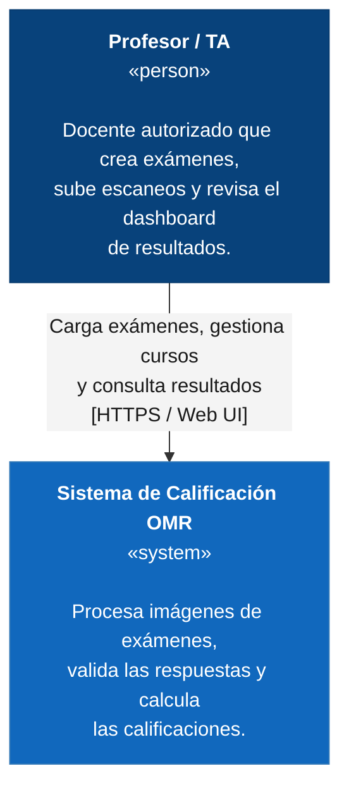

# C4 - Sistema de Calificación OMR

## Nivel 1: Contexto del Sistema

El diagrama de contexto representa el **Sistema de Calificación OMR como una caja negra**, mostrando sus usuarios y los sistemas externos con los que interactúa.

### Diagrama de Contexto

### Elementos del contexto

| Elemento | Descripción |
|---|---|
| **Profesor / TA** | Docente autorizado que crea exámenes, sube los escaneos y revisa los resultados generados por el sistema. |
| **Sistema de Calificación OMR** | Sistema encargado de procesar los exámenes, validar las respuestas y generar las calificaciones. |

### Relaciones principales

- **Profesor / TA → Sistema de Calificación OMR:** carga los exámenes, gestiona los cursos y consulta los resultados mediante la interfaz web.

> Nota: la base de datos no se dibuja en este nivel. Es interna al sistema (la operamos y despliegamos nosotros mismos, no tiene vida propia fuera del proyecto), así que aparece como contenedor en el Nivel 2, no como sistema externo aquí. Si el sistema sí va a integrar con un sistema académico institucional, se agrega aquí como sistema externo real, con su propio nodo en el diagrama.

---

## Nivel 2: Contenedores

> Pendiente de desarrollar.

## Nivel 3: Componentes

> Pendiente de desarrollar.

## Nivel 4: Código

> Opcional
