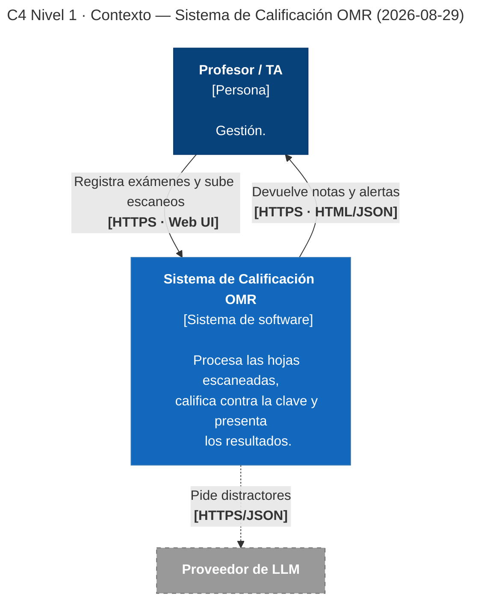
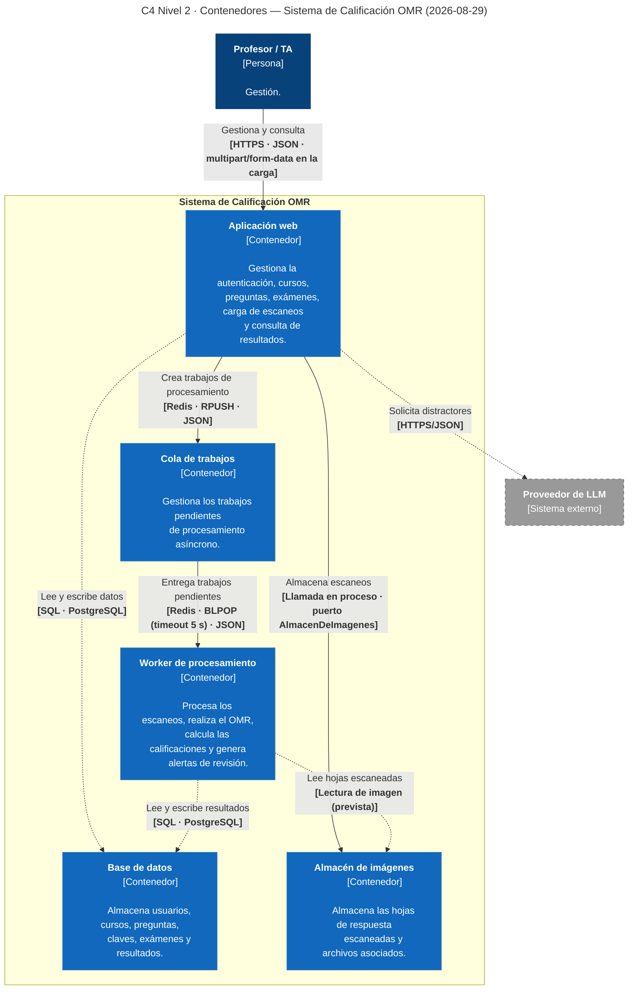
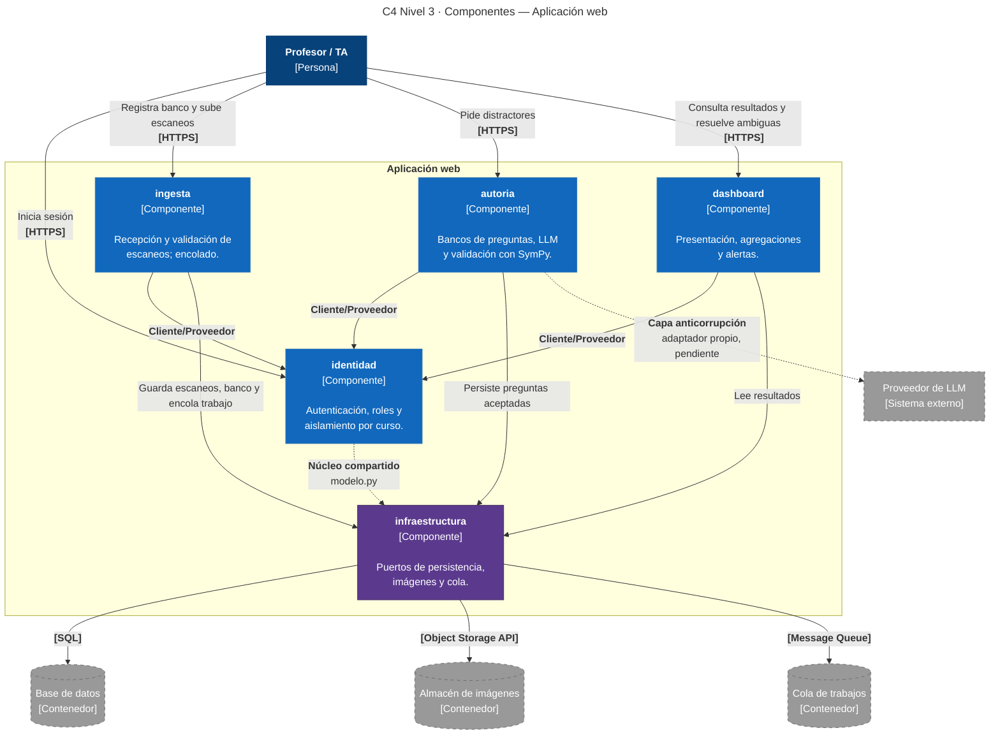
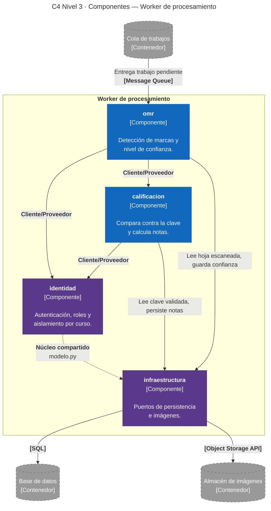

# Diagramas C4 — Sistema de Calificación OMR

Este documento es la **fuente única de los diagramas C4** del proyecto. Los diagramas se
escriben como código (Mermaid) para que se revisen en el pull request junto al resto de los
cambios y no se desincronicen en silencio.

| | |
|---|---|
| **Sistema** | Sistema de Calificación OMR |
| **Última actualización** | 2026-08-30 |
| **Niveles completos** | Nivel 1 (Contexto) y Nivel 2 (Contenedores) |
| **Notación** | C4 model — [c4model.com](https://c4model.com) · Renderizado con Mermaid `flowchart` |
| **Documentos relacionados** | [`../arc42/arc42-template-ES.md`](../arc42/arc42-template-ES.md) · [`../adr/`](../adr/) · [`../aspectos.md`](../aspectos.md) |

---

## Nivel 1 · Diagrama de Contexto del Sistema

**Tipo de diagrama:** C4 Nivel 1 — Contexto del Sistema
**Ámbito:** Sistema de Calificación OMR
**Fecha:** 2026-08-29
**Audiencia:** cualquier persona, técnica o no

El diagrama representa el Sistema de Calificación OMR **como una caja negra**, junto a sus
usuarios y a los sistemas externos con los que interactúa. No muestra nada de su estructura
interna: eso corresponde al Nivel 2.

### Leyenda

| Símbolo | Significado |
|---|---|
| Caja azul oscuro | **Persona.** Usuario humano del sistema. |
| Caja azul | **Sistema en alcance.** El sistema que estamos diseñando. |
| Caja gris con borde punteado | **Sistema externo.** Fuera de nuestro control; lo consumimos pero no lo construimos. |
| Flecha continua | Relación confirmada. La etiqueta indica **propósito** y, en negrita, **tecnología**. |
| Flecha punteada | Relación **prevista pero no confirmada**, sujeta a una decisión pendiente. |

### Elementos del contexto

| Elemento | Tipo | Descripción |
|---|---|---|
| **Profesor / TA** | Persona | Docente autorizado que registra los bancos de preguntas y la clave, sube los escaneos de las hojas de respuesta, resuelve las marcas ambiguas y consulta los resultados. Es el **único** usuario humano del sistema (restricción RNF-05). |
| **Sistema de Calificación OMR** | Sistema en alcance | Recibe el banco de preguntas y la clave que registra el profesor, procesa las hojas escaneadas mediante reconocimiento óptico de marcas, calcula las calificaciones y las presenta en un dashboard interactivo. |
| **Proveedor de LLM** | Sistema externo *(opcional y pendiente)* | Servicio de modelo de lenguaje que el profesor puede invocar en la **fase de autoría** para que le proponga distractores diagnósticos (RF-11). No participa en la calificación, y el sistema opera completo sin invocarlo nunca. Su salida nunca se acepta sola: el profesor decide qué acepta y habilita el examen (RF-07). |

### Relaciones

| # | Origen → Destino | Propósito | Tecnología |
|---|---|---|---|
| 1 | Profesor / TA → Sistema | Registra el banco de preguntas y la clave, habilita el examen, sube las hojas escaneadas, gestiona sus cursos y resuelve las marcas ambiguas. | HTTPS · Web UI |
| 2 | Sistema → Profesor / TA | Presenta notas, estadísticas por pregunta y alertas de revisión manual. | HTTPS · HTML/JSON |
| 3 | Sistema → Proveedor de LLM *(opcional, pendiente)* | Solicita distractores diagnósticos para una pregunta, a petición del profesor. | HTTPS/JSON, por confirmar |

---

### Notas de modelado

Estas notas explican **por qué** ciertos elementos aparecen o no aparecen, que es donde se
concentran los errores más comunes de un diagrama de Nivel 1.

**Por qué la base de datos no está aquí.** Es interna al sistema: la operamos y desplegamos
nosotros, no tiene vida propia fuera del proyecto y nadie más la consume. Aparecerá como
contenedor en el Nivel 2, no como sistema externo en el Nivel 1.

**Por qué la hoja de respuestas física no está aquí.** Un documento en papel no es ni una
persona ni un sistema de software: es el **artefacto de entrada** que el docente digitaliza y
carga. Quien se comunica con el sistema es el docente; la hoja escaneada es el *contenido* de
esa comunicación, y por eso viaja en la etiqueta de la flecha 1, no en un nodo propio. El
escáner tampoco aparece: es una herramienta ofimática ajena al sistema, cuya salida el docente
sube manualmente.

**Por qué el estudiante no está aquí.** El estudiante rellena la hoja, pero no interactúa con
el sistema ni tiene cuenta en él (RNF-05). Es un stakeholder afectado —está registrado como
tal en la sección 1.3 del [arc42](../arc42/arc42-template-ES.md)— pero no un actor del diagrama de contexto.

**Por qué el proveedor de LLM aparece punteado.** Por dos razones, no una. La primera: su uso
es **opcional** (RF-11), así que la relación existe pero no se recorre en todos los casos. La
segunda: el equipo aún no ha decidido cómo se consume el modelo (riesgo R-02 del arc42). Esa
segunda decisión cambia el diagrama:

- **Si se consume una API alojada** (Google AI Studio, Groq, GitHub Models u otra), el nodo se
  confirma como sistema externo, la flecha 3 pasa a continua y hay que documentar sus modos de
  fallo.
- **Si se aloja un modelo local**, el nodo **desaparece** de este nivel y el modelo pasa a ser
  un contenedor del Nivel 2.

El nodo no lleva esas dos condiciones escritas en su etiqueta. Un elemento de Nivel 1 se rotula
con su tipo —«Sistema externo»— y nada más; que el uso sea opcional y el proveedor esté sin
decidir lo comunican el trazo discontinuo, la leyenda y esta nota, y el Nivel 3 lo detallará
cuando se dibuje. Cargar la caja de calificativos la vuelve ilegible sin agregar información
que no esté ya en el documento.

Se dibuja en lugar de omitirlo porque el sistema sí ofrece esa capacidad, aunque no dependa de
ella: omitirlo daría a entender que la función no existe. Desde [ADR-0005](../adr/0005-acotar-el-llm-a-la-generacion-de-distractores-diagnosticos.md)
el LLM ya no es un componente obligatorio de RNF-01, sino una capacidad de apoyo, y el trazo
discontinuo es justamente lo que comunica esa diferencia.

**Por qué las etiquetas de las flechas son cortas.** Cada una nombra el propósito en unas pocas
palabras y la tecnología entre corchetes, que es lo que pide la notación. La descripción completa
de cada relación —incluida la revisión de marcas ambiguas, que la flecha 1 no alcanza a
nombrar— está en la tabla de relaciones de arriba. El diagrama se lee de un vistazo; la tabla se
lee cuando hace falta el detalle.

**Ausencia deliberada de otros sistemas externos.** No hay integración con el sistema académico
institucional ni con ningún servicio de autenticación externo: la autenticación es propia del
sistema (RF-09). Los actores y sistemas externos de este diagrama se corresponden uno a uno con
los socios de comunicación de la sección 3.1 del arc42.

**Qué no cruza la frontera hacia el LLM.** Por RNF-13, la flecha 3 transporta únicamente
especificaciones de preguntas matemáticas: ningún nombre, calificación ni hoja escaneada sale
hacia el proveedor externo. Es una restricción legal con forma de decisión de diseño, y este
diagrama es donde se hace visible. Si en el futuro se integrara la publicación automática de notas, ese sistema
académico entraría aquí como sistema externo con su propia flecha etiquetada.

---
## Nivel 2 · Diagrama de Contenedores
Tipo de diagrama: C4 Nivel 2 — Contenedores
Ámbito: Sistema de Calificación OMR
Fecha: 2026-08-29
Audiencia: equipo de desarrollo y personas con conocimiento técnico

El diagrama representa la estructura interna del Sistema de Calificación OMR mediante sus principales contenedores. A diferencia del Nivel 1, donde el Sistema de Calificación OMR se representa como una caja negra, este nivel muestra las unidades principales que componen el sistema y las relaciones entre ellas.

El diseño está condicionado por ADR-0002, que establece un procesamiento asíncrono. La aplicación web recibe las operaciones del profesor y coordina el procesamiento mediante una cola de trabajos. El procesamiento de las hojas escaneadas, el reconocimiento óptico de marcas y el cálculo de las calificaciones se ejecutan en un worker independiente.

Los contenedores previstos son: aplicación web, worker de procesamiento, cola de trabajos, base de datos y almacén de imágenes.

Leyenda

| Símbolo | Significado |
|---|---|
| Caja azul oscuro | Persona. Usuario humano del sistema. |
| Caja azul | Contenedor. Unidad principal de software o infraestructura que forma parte del sistema. |
| Caja gris con borde punteado | Sistema externo. Fuera de nuestro control; lo consumimos pero no lo construimos. |
| Flecha continua | Relación confirmada. La etiqueta indica propósito y, en negrita, tecnología. |
| Flecha punteada | Relación prevista pero no confirmada, sujeta a una decisión pendiente, o prevista y todavía no construida. |

Elementos del Nivel 2

| Elemento | Tipo | Descripción |
|---|---|---|
| Aplicación web | Contenedor | Interfaz principal del Sistema de Calificación OMR para el profesor. Gestiona la autenticación, los cursos, los bancos de preguntas, los exámenes, la carga de hojas escaneadas y la consulta de resultados. También inicia los trabajos de procesamiento y, opcionalmente, solicita distractores al proveedor de LLM. |
| Worker de procesamiento | Contenedor | Ejecuta de forma asíncrona el procesamiento de las hojas escaneadas. Realiza el reconocimiento óptico de marcas (OMR), calcula las calificaciones y genera alertas para los casos que requieren revisión manual. |
| Cola de trabajos | Contenedor | Mantiene los trabajos de procesamiento pendientes y permite desacoplar la aplicación web del procesamiento OMR. |
| Base de datos | Contenedor | Almacena la información estructurada del Sistema de Calificación OMR, incluyendo usuarios, cursos, preguntas, claves de respuesta, exámenes y resultados de las calificaciones. |
| Almacén de imágenes | Contenedor | Conserva las hojas de respuesta escaneadas y los archivos necesarios para su procesamiento. |
| Proveedor de LLM | Sistema externo (opcional y pendiente) | Servicio externo utilizado durante la fase de autoría para proponer distractores diagnósticos. No participa en el procesamiento OMR ni en el cálculo de las calificaciones. |

Relaciones

| # | Origen → Destino | Propósito | Tecnología | Estado |
|---|---|---|---|---|
| 1 | Profesor / TA → Aplicación web | Gestiona cursos, bancos de preguntas, exámenes, escaneos y consulta resultados. | HTTPS · frontend Flutter compilado a web · respuestas en JSON; la carga de hojas viaja como multipart/form-data. Esta interfaz está descrita campo por campo en ../contrato/openapi.json | construido |
| 2 | Aplicación web → Base de datos | Consulta y persiste la información estructurada del Sistema de Calificación OMR. | SQL sobre PostgreSQL | previsto. Hoy el contenedor se levanta, pero no tiene esquema y ningún componente lo consulta. |
| 3 | Aplicación web → Almacén de imágenes | Almacena las hojas de respuesta escaneadas. | Llamada en proceso al puerto AlmacenDeImagenes (no es una API de objetos). El adaptador actual escribe los bytes en un volumen local y es provisional: depende del ADR del riesgo R-06. | construido |
| 4 | Aplicación web → Cola de trabajos | Crea los trabajos que deben ser procesados de forma asíncrona. | Redis · comando RPUSH sobre una lista · JSON con la forma {"id": ..., "payload": {...}} | construido |
| 5 | Cola de trabajos → Worker de procesamiento | Entrega los trabajos pendientes para su procesamiento. | Redis · comando BLPOP, bloqueante con timeout de 5 segundos · el mismo JSON | construido |
| 6 | Worker de procesamiento → Base de datos | Consulta información necesaria y persiste las calificaciones y resultados del procesamiento. | SQL sobre PostgreSQL | previsto. Hoy el contenedor se levanta, pero no tiene esquema y ningún componente lo consulta. |
| 7 | Worker de procesamiento → Almacén de imágenes | Recupera las hojas escaneadas que debe procesar. | Lectura de la imagen desde el worker (prevista) | previsto. Depende del aspecto A-02. Hoy el worker solo registra el trabajo en su log y ahí se detiene. |
| 8 | Aplicación web → Proveedor de LLM (opcional, pendiente) | Solicita distractores diagnósticos para una pregunta durante la autoría. | HTTPS/JSON | previsto. Depende de la decisión sobre el proveedor (riesgo R-02). |

Notas de modelado

Estas notas explican por qué se han separado los diferentes contenedores y cómo se relacionan con las decisiones arquitectónicas establecidas para el Sistema de Calificación OMR.

Por qué la aplicación web y el worker están separados. El procesamiento de las hojas de respuesta puede requerir operaciones de reconocimiento de imágenes y cálculo que no deben bloquear la interacción del profesor. Por esta razón, la aplicación web recibe la solicitud y delega el procesamiento al worker mediante la cola de trabajos, siguiendo la decisión establecida en ADR-0002.

Por qué existe una cola de trabajos. La cola permite implementar el procesamiento asíncrono. Cuando el profesor carga las hojas escaneadas, la aplicación web crea un trabajo y lo coloca en la cola. El worker toma posteriormente ese trabajo. Hoy el worker solo lo registra en su log; el procesamiento de la hoja está previsto y todavía no está construido. De esta manera, la aplicación web puede continuar atendiendo otras solicitudes mientras se procesa el examen.

Por qué el almacén de imágenes está separado de la base de datos. Las hojas de respuesta escaneadas son archivos binarios y no forman parte de la información estructurada del Sistema de Calificación OMR. Por ello, se almacenan en un contenedor de almacenamiento independiente. La base de datos está prevista para conservar la información estructurada y las referencias necesarias para relacionar cada archivo con su examen correspondiente.

Por qué la base de datos aparece como contenedor. La base de datos forma parte de la infraestructura necesaria para operar el Sistema de Calificación OMR y está prevista para ser utilizada directamente por los contenedores de la aplicación web y del worker. Hoy el contenedor se levanta, pero no tiene esquema y ningún componente lo consulta. En el Nivel 1 permanece oculta porque es una parte interna del sistema; en este nivel se muestra para explicar cómo se persistirá la información.

Por qué el profesor interactúa únicamente con la aplicación web. El profesor es el único usuario humano del Sistema de Calificación OMR (RNF-05). No interactúa directamente con la base de datos, la cola, el worker ni el almacén de imágenes. La aplicación web actúa como punto de entrada para sus operaciones.

Por qué el worker accede directamente al almacén de imágenes. El worker necesita recuperar las hojas escaneadas para realizar el procesamiento OMR. La aplicación web se encarga de registrar la carga y almacenar el archivo, mientras que el worker lo recuperará cuando consuma el trabajo correspondiente. Esta relación está prevista y todavía no está construida: hoy el worker solo registra el trabajo en su log.

Por qué el worker escribe en la base de datos. Una vez terminado el procesamiento, el worker debe persistir los resultados de la calificación y la información necesaria para que la aplicación web pueda presentarlos posteriormente al profesor. Esta relación está prevista y todavía no está construida.

Por qué el proveedor de LLM se conecta con la aplicación web. El LLM únicamente participa en la fase de autoría, cuando el profesor solicita propuestas de distractores diagnósticos (RF-11). No participa en el flujo de procesamiento de las hojas ni en el cálculo de las calificaciones. Por ello, la interacción se realiza desde la aplicación web.

Por qué la relación con el proveedor de LLM aparece punteada. Al igual que en el Nivel 1, el uso del LLM es opcional y la decisión sobre cómo consumir el modelo todavía está pendiente. Si se utiliza una API alojada, continuará representándose como un sistema externo. Si se decide alojar un modelo local, el proveedor externo desaparecerá del Nivel 1 y el modelo o servicio correspondiente deberá representarse como un contenedor del Sistema de Calificación OMR.

Qué información se envía al LLM. De acuerdo con RNF-13, la interacción con el proveedor de LLM se limita a especificaciones de preguntas matemáticas necesarias para generar distractores. No deben enviarse nombres de estudiantes, calificaciones ni hojas escaneadas.

Por qué no aparece el sistema académico institucional. Actualmente no existe una integración con el sistema académico institucional. El Sistema de Calificación OMR presenta los resultados directamente al profesor, por lo que no se incorpora un contenedor o sistema externo adicional en este nivel.

Por qué no aparece el estudiante. El estudiante no interactúa directamente con el Sistema de Calificación OMR ni dispone de una cuenta (RNF-05). Su participación consiste en completar la hoja física de respuestas, que posteriormente es escaneada y cargada por el profesor.

Por qué no aparece el escáner. El escáner es una herramienta externa utilizada para digitalizar la hoja física. Su resultado es un archivo que el profesor carga en el Sistema de Calificación OMR, por lo que no constituye un contenedor ni un sistema con el que el Sistema de Calificación OMR mantenga una integración propia.

Procesamiento asíncrono. El flujo principal de procesamiento previsto es el siguiente. Los pasos 1 a 4 están construidos; desde el paso 5, hoy el worker solo consume el trabajo y lo registra en su log, y el resto del flujo está previsto.

El profesor carga las hojas escaneadas mediante la aplicación web.
La aplicación web almacena las hojas en el almacén de imágenes.
La aplicación web crea un trabajo de procesamiento.
La cola conserva el trabajo hasta que un worker pueda procesarlo.
El worker consume el trabajo y recupera las hojas escaneadas.
El worker realiza el reconocimiento óptico de marcas (OMR).
El worker calcula las calificaciones utilizando la clave registrada.
El worker almacena los resultados en la base de datos.
El profesor consulta las notas, estadísticas y alertas mediante la aplicación web.
Cuando corresponde, el profesor resuelve manualmente las marcas ambiguas desde la aplicación web.

## Nivel 3 · Diagrama de Componentes
 
**Tipo de diagrama:** C4 Nivel 3 — Componentes
**Ámbito:** interior de los contenedores Aplicación web y Worker de procesamiento
**Audiencia:** equipo de desarrollo
 
Los componentes son los siete módulos definidos en [ADR-0002](../adr/0002-procesar-calificacion-de-forma-asincrona.md):
`autoria`, `ingesta`, `omr`, `calificacion`, `dashboard`, `identidad` e `infraestructura`. Cada
uno ya existía como parte de alguno de los dos contenedores del Nivel 2; aquí se muestra cómo se
reparten entre ellos y cómo se llaman entre sí.
 
> **Aviso de alcance.** Este nivel describe la arquitectura **planeada**: hoy el repositorio
> todavía no tiene código (`backend/` existe con las carpetas de los siete módulos más
> `herramientas`, pero sin implementación). El reparto entre contenedores y las relaciones de
> abajo salen del brief de Evidencia S6 y de los ADR, no de un `git grep` sobre código real.
> Cuando el código exista, hay que confirmar cada flecha contra los `__init__.py` (líneas
> `Importa:`) y corregir lo que no coincida. El módulo `herramientas` no aparece aquí porque
> todavía no se sabe qué responsabilidad tiene.
 
### Reparto de módulos por contenedor
 
| Contenedor | Módulos | Por qué |
|---|---|---|
| Aplicación web | `identidad`, `ingesta`, `autoria`, `dashboard`, `infraestructura` | Sus requisitos (RF-01, RF-05, RF-06, RF-07, RF-09) son interacciones síncronas del profesor. |
| Worker de procesamiento | `identidad`, `omr`, `calificacion`, `infraestructura` | Sus requisitos (RF-02, RF-03, RF-04, RF-08) son el procesamiento asíncrono definido en ADR-0002. |
 
`identidad` e `infraestructura` aparecen en los dos contenedores: no están duplicados, es el
mismo código compartido, según ya quedó establecido como núcleo compartido en el mapa de
contextos (`08-conceptos-transversales.md`). `identidad` aparece en el worker porque, según el
recorrido del código citado en Evidencia S6, los cinco módulos de dominio —incluidos `omr` y
`calificacion`— son clientes de `identidad`, probablemente para no filtrar datos entre cursos al
persistir resultados (RNF de seguridad).
 
**Supuesto a confirmar:** el recálculo tras revisión manual (RF-08) se modela aquí como un nuevo
trabajo que la Aplicación web encola, y que el Worker vuelve a procesar — no como una llamada
síncrona de `dashboard` a `calificacion`. Esto mantiene una sola vía de procesamiento (la
asíncrona de ADR-0002) en vez de abrir una segunda. Si el equipo decidió otra cosa, esta parte
cambia.
 

 

 
### Leyenda
 
| Símbolo | Significado |
|---|---|
| Caja azul oscuro | **Persona.** Usuario humano. |
| Caja azul | **Componente de dominio.** Uno de los siete módulos de ADR-0002. |
| Caja morada | **Componente de soporte.** `identidad` e `infraestructura`, compartidos por ambos contenedores. |
| Cilindro / caja gris punteada | **Elemento del Nivel 2** (contenedor o sistema externo), mostrado aquí solo como destino de una llamada. |
| Flecha continua | Llamada directa (import / invocación de función dentro del mismo proceso), salvo donde se indica tecnología de red. |
| Flecha punteada | Núcleo compartido o capa anticorrupción, según la etiqueta. |
 
### Elementos del Nivel 3
 
| Componente | Contenedor | Responsabilidad | Requisitos |
|---|---|---|---|
| `identidad` | Web y Worker | Autenticación, roles y aislamiento de datos por curso. | RF-09 |
| `ingesta` | Web | Recepción y validación de archivos escaneados, individuales o en lote; encolado. | RF-01 |
| `autoria` | Web | Bancos de preguntas, generación con LLM y validación simbólica con SymPy. | RF-06, RF-07 |
| `dashboard` | Web | Presentación, agregaciones por curso/examen/pregunta y alertas. | RF-05 |
| `omr` | Worker | Detección de marcas y cálculo del nivel de confianza; clasificación de ambigüedad. | RF-02, RF-03 |
| `calificacion` | Worker | Comparación contra la clave validada y cálculo de notas; recálculo tras revisión manual. | RF-04, RF-08 |
| `infraestructura` | Web y Worker | Persistencia, almacenamiento de imágenes y adaptador de cola. | Transversal |
 
### Relaciones
 
| # | Origen → Destino | Tipo | Tecnología |
|---|---|---|---|
| 1 | `ingesta` / `autoria` / `dashboard` → `identidad` | Cliente/Proveedor | Llamada directa (mismo proceso) |
| 2 | `omr` / `calificacion` → `identidad` | Cliente/Proveedor | Llamada directa (mismo proceso) |
| 3 | `omr` → `calificacion` | Cliente/Proveedor | Llamada directa (mismo proceso) |
| 4 | `identidad` ↔ `infraestructura` | Núcleo compartido | `modelo.py` |
| 5 | `ingesta`, `autoria`, `dashboard`, `omr`, `calificacion` → `infraestructura` | Uso de puertos | Llamada directa (mismo proceso) |
| 6 | `infraestructura` → Base de datos | — | SQL |
| 7 | `infraestructura` → Almacén de imágenes | — | Object Storage API |
| 8 | `infraestructura` → Cola de trabajos | — | Message Queue |
| 9 | `autoria` → Proveedor de LLM | Capa anticorrupción | HTTPS/JSON, por confirmar |
 
### Notas de modelado
 
**Por qué todo el acceso técnico pasa por `infraestructura`.** La tabla de módulos ya lo dice:
`infraestructura` es dueña de "persistencia, almacenamiento de imágenes y adaptador de cola". Si
`ingesta` escribiera directo en la base de datos o en la cola, el diagrama de Nivel 2 (que solo
muestra `Aplicación web → Base de datos`) estaría mintiendo sobre por dónde pasa el dato en
realidad. Aquí se hace explícito que ningún componente de dominio toca el disco, Redis o la
cola directamente — todos pasan por los puertos de `infraestructura`, que es la misma capa
anticorrupción interna mencionada en el mapa de contextos.
 
**Por qué `identidad` no está solo en la Aplicación web.** Es tentador pensar que la
autenticación es puramente cosa del front, pero el recorrido de código citado en Evidencia S6
dice que los cinco módulos de dominio (incluidos los dos que corren en el worker) son clientes
de `identidad`. La lectura más consistente es que el worker también necesita resolver a qué
curso pertenece un trabajo antes de persistir su resultado, para no mezclar datos entre cursos.
 
**Qué no se puede confirmar todavía.** El reparto de `ingesta`/`autoria`/`dashboard` en la web y
`omr`/`calificacion` en el worker sale de leer los requisitos que cada módulo resuelve, no de
inspeccionar `api/` o `worker/` (no compartiste su contenido). Si alguno de los dos tiene lógica
que contradiga este reparto, esta sección se corrige antes de comitear — no después.

## Nivel 4 · Código

> **No se elaborará.** Es opcional según la guía del curso y, cuando se necesite, conviene
> generarlo desde el código en lugar de mantenerlo a mano, porque se desincroniza de inmediato.
