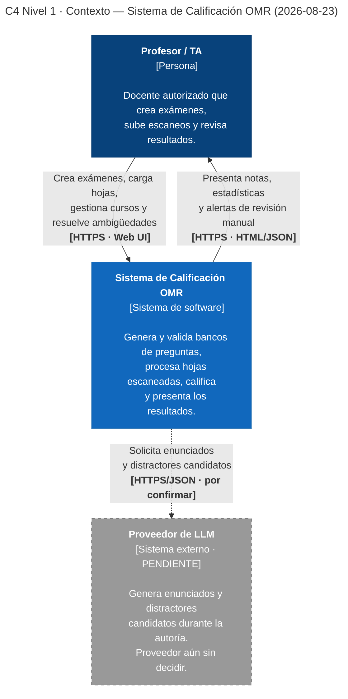

# Diagramas C4 — Sistema de Calificación OMR

Este documento es la **fuente única de los diagramas C4** del proyecto. Los diagramas se
escriben como código (Mermaid) para que se revisen en el pull request junto al resto de los
cambios y no se desincronicen en silencio.

| | |
|---|---|
| **Sistema** | Sistema de Calificación OMR |
| **Última actualización** | 2026-08-23 |
| **Niveles completos** | Nivel 1 (Contexto) |
| **Notación** | C4 model — [c4model.com](https://c4model.com) · Renderizado con Mermaid `flowchart` |
| **Documentos relacionados** | [`../arc42/arc42-template-ES.md`](../arc42/arc42-template-ES.md) · [`../adr/`](../adr/) · [`../aspectos.md`](../aspectos.md) |

---

## Nivel 1 · Diagrama de Contexto del Sistema

**Tipo de diagrama:** C4 Nivel 1 — Contexto del Sistema
**Ámbito:** Sistema de Calificación OMR
**Fecha:** 2026-08-23
**Audiencia:** cualquier persona, técnica o no

El diagrama representa el Sistema de Calificación OMR **como una caja negra**, junto a sus
usuarios y a los sistemas externos con los que interactúa. No muestra nada de su estructura
interna: eso corresponde al Nivel 2.

### Leyenda

| Símbolo | Significado |
|---|---|
| Caja azul oscuro | **Persona.** Usuario humano del sistema. |
| Caja azul | **Sistema en alcance.** El sistema que estamos diseñando. |
| Caja gris con borde punteado | **Sistema externo.** Fuera de nuestro control; lo consumimos pero no lo construimos. |
| Flecha continua | Relación confirmada. La etiqueta indica **propósito** y, en negrita, **tecnología**. |
| Flecha punteada | Relación **prevista pero no confirmada**, sujeta a una decisión pendiente. |

### Elementos del contexto

| Elemento | Tipo | Descripción |
|---|---|---|
| **Profesor / TA** | Persona | Docente autorizado que crea los bancos de preguntas, sube los escaneos de las hojas de respuesta, resuelve las marcas ambiguas y consulta los resultados. Es el **único** usuario humano del sistema (restricción RNF-05). |
| **Sistema de Calificación OMR** | Sistema en alcance | Genera y valida bancos de preguntas de cálculo diferencial, procesa las hojas escaneadas mediante reconocimiento óptico de marcas, calcula las calificaciones y las presenta en un dashboard interactivo. |
| **Proveedor de LLM** | Sistema externo *(pendiente)* | Servicio de modelo de lenguaje usado en la **fase de autoría** para proponer enunciados y distractores. Su salida nunca se acepta directamente: siempre pasa por la validación simbólica con SymPy dentro del sistema (RF-07). |

### Relaciones

| # | Origen → Destino | Propósito | Tecnología |
|---|---|---|---|
| 1 | Profesor / TA → Sistema | Crea exámenes, carga hojas escaneadas, gestiona cursos y resuelve marcas ambiguas. | HTTPS · Web UI |
| 2 | Sistema → Profesor / TA | Presenta notas, estadísticas por pregunta y alertas de revisión manual. | HTTPS · HTML/JSON |
| 3 | Sistema → Proveedor de LLM *(pendiente)* | Solicita la generación de enunciados y distractores candidatos. | HTTPS/JSON, por confirmar |

---

### Notas de modelado

Estas notas explican **por qué** ciertos elementos aparecen o no aparecen, que es donde se
concentran los errores más comunes de un diagrama de Nivel 1.

**Por qué la base de datos no está aquí.** Es interna al sistema: la operamos y desplegamos
nosotros, no tiene vida propia fuera del proyecto y nadie más la consume. Aparecerá como
contenedor en el Nivel 2, no como sistema externo en el Nivel 1.

**Por qué la hoja de respuestas física no está aquí.** Un documento en papel no es ni una
persona ni un sistema de software: es el **artefacto de entrada** que el docente digitaliza y
carga. Quien se comunica con el sistema es el docente; la hoja escaneada es el *contenido* de
esa comunicación, y por eso viaja en la etiqueta de la flecha 1, no en un nodo propio. El
escáner tampoco aparece: es una herramienta ofimática ajena al sistema, cuya salida el docente
sube manualmente.

**Por qué el estudiante no está aquí.** El estudiante rellena la hoja, pero no interactúa con
el sistema ni tiene cuenta en él (RNF-05). Es un stakeholder afectado —está registrado como
tal en la sección 1.3 del [arc42](../arc42/arc42-template-ES.md)— pero no un actor del diagrama de contexto.

**Por qué SymPy no está aquí.** SymPy es una **librería** que se ejecuta dentro del proceso del
sistema, no un servicio con el que el sistema se comunique. Las librerías nunca son sistemas
externos en C4; aparecen, si acaso, como parte de la tecnología de un contenedor en el Nivel 2.
Esta es la diferencia con el proveedor de LLM, que sí es un servicio con frontera de red.

**Por qué el proveedor de LLM aparece punteado.** El equipo aún no ha decidido cómo se consume
el modelo de lenguaje (riesgo R-02 del arc42, y elección de stack RNF-08). La decisión cambia este diagrama:

- **Si se consume una API alojada** (Google AI Studio, Groq, GitHub Models u otra), el nodo se
  confirma como sistema externo, la flecha 3 pasa a continua y hay que documentar sus modos de
  fallo.
- **Si se aloja un modelo local**, el nodo **desaparece** de este nivel y el modelo pasa a ser
  un contenedor del Nivel 2.

Se dibuja punteado en lugar de omitirlo porque el LLM es parte del stack obligatorio (RNF-01):
omitirlo daría a entender que el sistema no lo usa, que sería falso. Se documenta como decisión
abierta, no como hueco.

**Ausencia deliberada de otros sistemas externos.** No hay integración con el sistema académico
institucional ni con ningún servicio de autenticación externo: la autenticación es propia del
sistema (RF-09). Los actores y sistemas externos de este diagrama se corresponden uno a uno con
los socios de comunicación de la sección 3.1 del arc42.

**Qué no cruza la frontera hacia el LLM.** Por RNF-13, la flecha 3 transporta únicamente
especificaciones de preguntas matemáticas: ningún nombre, calificación ni hoja escaneada sale
hacia el proveedor externo. Es una restricción legal con forma de decisión de diseño, y este
diagrama es donde se hace visible. Si en el futuro se integrara la publicación automática de notas, ese sistema
académico entraría aquí como sistema externo con su propia flecha etiquetada.

---

## Nivel 2 · Diagrama de Contenedores

> **Pendiente — semana 4.**
>
> La forma de este diagrama ya está condicionada por
> [ADR-0002](../adr/0002-procesar-calificacion-de-forma-asincrona.md), que fija un despliegue único con
> procesamiento asíncrono. Los contenedores previstos son: **aplicación web**, **worker de
> procesamiento**, **cola de trabajos**, **base de datos** y **almacén de imágenes**.
>
> No se dibuja todavía porque, a partir del segundo corte, los contenedores del Nivel 2 deben
> corresponder con unidades desplegables reales, y el esqueleto del proyecto aún no existe.

## Nivel 3 · Diagrama de Componentes

> **Pendiente — semanas 4 y 6.**
>
> Se dibujará el interior de la **aplicación web** y del **worker de procesamiento**. Los
> componentes serán los siete módulos definidos en ADR-0002: `autoria`, `ingesta`, `omr`,
> `calificacion`, `dashboard`, `identidad` e `infraestructura`. Cada componente de este nivel
> debe existir ya como contenedor o dentro de un contenedor del Nivel 2: no se inventan piezas
> al bajar de nivel.

## Nivel 4 · Código

> **No se elaborará.** Es opcional según la guía del curso y, cuando se necesite, conviene
> generarlo desde el código en lugar de mantenerlo a mano, porque se desincroniza de inmediato.
