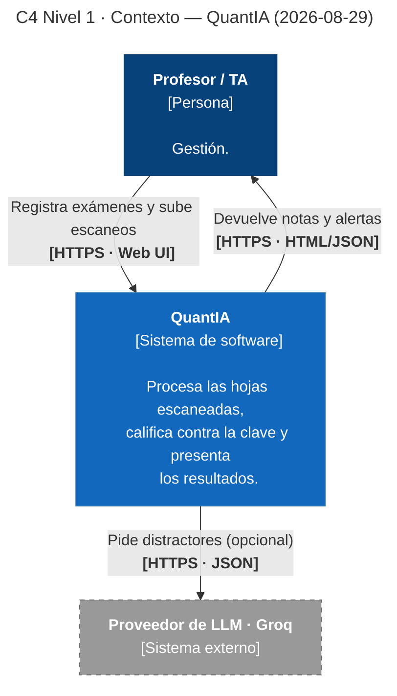
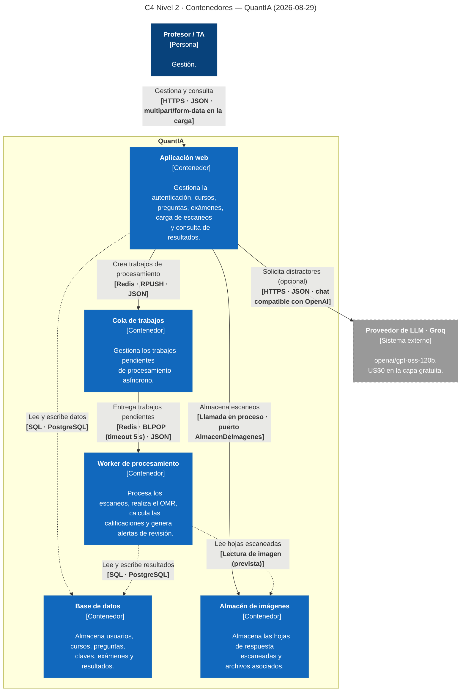
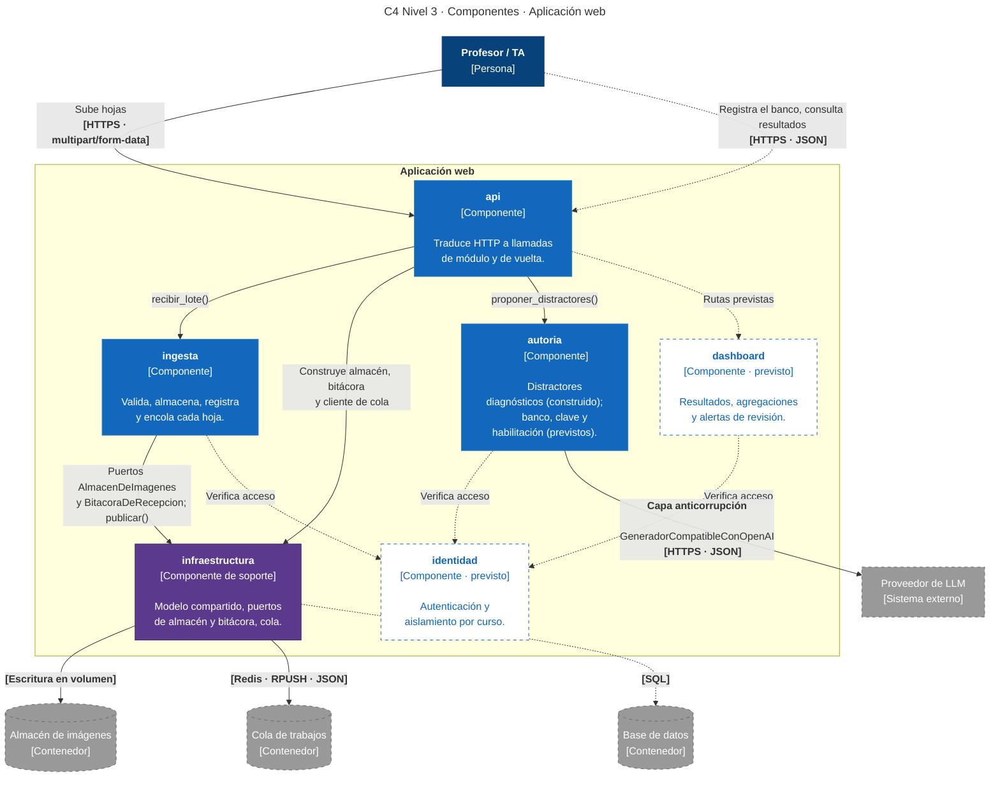
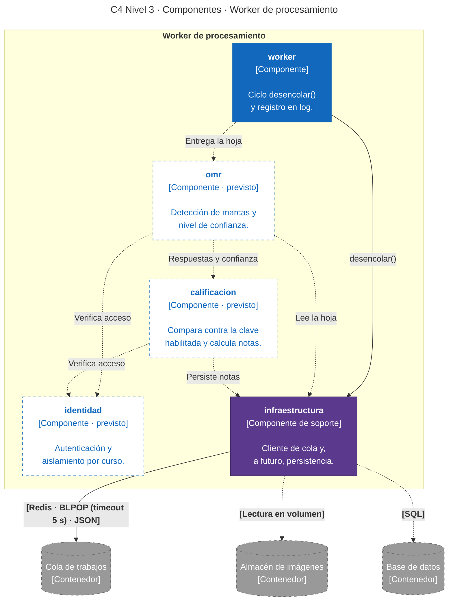

# Diagramas C4 — QuantIA

Este documento es la **fuente única de los diagramas C4** del proyecto. Los diagramas se
escriben como código (Mermaid) para que se revisen en el pull request junto al resto de los
cambios y no se desincronicen en silencio.

| | |
|---|---|
| **Sistema** | QuantIA, sistema de calificación de exámenes de opción múltiple mediante OMR ([ADR-0008](../adr/0008-renombrar-el-sistema-a-quantia.md)) |
| **Última actualización** | 2026-10-04 |
| **Niveles completos** | Nivel 1 (Contexto), Nivel 2 (Contenedores) y Nivel 3 (Componentes) |
| **Notación** | C4 model — [c4model.com](https://c4model.com) · Renderizado con Mermaid `flowchart` |
| **Documentos relacionados** | [`../arc42/arc42-template-ES.md`](../arc42/arc42-template-ES.md) · [`../adr/`](../adr/) · [`../aspectos.md`](../aspectos.md) |
| **Componente generativo (S9)** | Proveedor de LLM: Groq, con `openai/gpt-oss-120b`, sistema externo ([ADR-0013](../adr/0013-consumir-groq-detras-de-un-puerto-y-degradar-sin-bloquear-la-autoria.md)). En el [Nivel 2, relación 8](#relaciones-1): HTTPS · JSON, chat compatible con OpenAI, clave en `LLM_API_KEY`, 20 s de espera sin reintentos y 503 si falla. Costo: US$0 en la capa gratuita, sin tarjeta; US$0,0004 por solicitud al precio de pago ([evaluación](../evidencia/evaluacion-distractores.md)) |

---

## Nivel 1 · Diagrama de Contexto del Sistema

**Tipo de diagrama:** C4 Nivel 1 — Contexto del Sistema
**Ámbito:** QuantIA
**Fecha:** 2026-08-29
**Audiencia:** cualquier persona, técnica o no

El diagrama representa QuantIA **como una caja negra**, junto a sus
usuarios y a los sistemas externos con los que interactúa. No muestra nada de su estructura
interna: eso corresponde al Nivel 2.

```mermaid
---
title: "C4 Nivel 1 · Contexto — QuantIA (2026-08-29)"
---
flowchart TB
    profesor["<b>Profesor / TA</b>
    [Persona]

    Gestión."]

    sistema["<b>QuantIA</b>
    [Sistema de software]

    Procesa las hojas escaneadas,
    califica contra la clave y presenta
    los resultados."]

    llm["<b>Proveedor de LLM · Groq</b>
    [Sistema externo]"]

    profesor -->|"Registra exámenes y sube escaneos
    <b>[HTTPS · Web UI]</b>"| sistema
    sistema -->|"Devuelve notas y alertas
    <b>[HTTPS · HTML/JSON]</b>"| profesor
    sistema -->|"Pide distractores (opcional)
    <b>[HTTPS · JSON]</b>"| llm

    classDef person fill:#08427B,stroke:#073B6F,color:#ffffff
    classDef system fill:#1168BD,stroke:#3379B7,color:#ffffff
    classDef external fill:#999999,stroke:#6B6B6B,color:#ffffff,stroke-dasharray: 5 5

    class profesor person
    class sistema system
    class llm external
```

### Leyenda

| Símbolo | Significado |
|---|---|
| Caja azul oscuro | **Persona.** Usuario humano del sistema. |
| Caja azul | **Sistema en alcance.** El sistema que estamos diseñando. |
| Caja gris con borde punteado | **Sistema externo.** Fuera de nuestro control; lo consumimos pero no lo construimos. |
| Flecha continua | Relación confirmada. La etiqueta indica **propósito** y, en negrita, **tecnología**. |
| Flecha punteada | Relación **prevista pero no confirmada**, sujeta a una decisión pendiente. |

### Elementos del contexto

| Elemento | Tipo | Descripción |
|---|---|---|
| **Profesor / TA** | Persona | Docente autorizado que registra los bancos de preguntas y la clave, sube los escaneos de las hojas de respuesta, resuelve las marcas ambiguas y consulta los resultados. Es el **único** usuario humano del sistema (restricción RNF-05). |
| **QuantIA** | Sistema en alcance | Recibe el banco de preguntas y la clave que registra el profesor, procesa las hojas escaneadas mediante reconocimiento óptico de marcas, calcula las calificaciones y las presenta en un dashboard interactivo. |
| **Proveedor de LLM** | Sistema externo *(opcional)* | Groq, con el modelo `openai/gpt-oss-120b` ([ADR-0013](../adr/0013-consumir-groq-detras-de-un-puerto-y-degradar-sin-bloquear-la-autoria.md)). Servicio de modelo de lenguaje que el profesor puede invocar en la **fase de autoría** para que le proponga distractores diagnósticos (RF-11). No participa en la calificación, y el sistema opera completo sin invocarlo nunca. Su salida nunca se acepta sola: el profesor decide qué acepta y habilita el examen (RF-07). |

### Relaciones

| # | Origen → Destino | Propósito | Tecnología |
|---|---|---|---|
| 1 | Profesor / TA → Sistema | Registra el banco de preguntas y la clave, habilita el examen, sube las hojas escaneadas, gestiona sus cursos y resuelve las marcas ambiguas. | HTTPS · Web UI |
| 2 | Sistema → Profesor / TA | Presenta notas, estadísticas por pregunta y alertas de revisión manual. | HTTPS · HTML/JSON |
| 3 | Sistema → Proveedor de LLM *(opcional)* | Solicita distractores diagnósticos para una pregunta, a petición del profesor. | HTTPS · JSON, con el protocolo de chat compatible con OpenAI ([ADR-0013](../adr/0013-consumir-groq-detras-de-un-puerto-y-degradar-sin-bloquear-la-autoria.md)) |

---

### Notas de modelado

Estas notas explican **por qué** ciertos elementos aparecen o no aparecen, que es donde se
concentran los errores más comunes de un diagrama de Nivel 1.

**Por qué la base de datos no está aquí.** Es interna al sistema: la operamos y desplegamos
nosotros, no tiene vida propia fuera del proyecto y nadie más la consume. Aparecerá como
contenedor en el Nivel 2, no como sistema externo en el Nivel 1.

**Por qué la hoja de respuestas física no está aquí.** Un documento en papel no es ni una
persona ni un sistema de software: es el **artefacto de entrada** que el docente digitaliza y
carga. Quien se comunica con el sistema es el docente; la hoja escaneada es el *contenido* de
esa comunicación, y por eso viaja en la etiqueta de la flecha 1, no en un nodo propio. El
escáner tampoco aparece: es una herramienta ofimática ajena al sistema, cuya salida el docente
sube manualmente.

**Por qué el estudiante no está aquí.** El estudiante rellena la hoja, pero no interactúa con
el sistema ni tiene cuenta en él (RNF-05). Es un stakeholder afectado —está registrado como
tal en la sección 1.3 del [arc42](../arc42/arc42-template-ES.md)— pero no un actor del diagrama de contexto.

**Por qué la flecha hacia el proveedor de LLM ya es continua.** Hasta la S9 iba punteada por
dos razones: su uso es opcional (RF-11) y no estaba decidido cómo se consume el modelo (riesgo
R-02). [ADR-0013](../adr/0013-consumir-groq-detras-de-un-puerto-y-degradar-sin-bloquear-la-autoria.md) cerró la segunda: una API alojada, Groq, llamada desde `autoria` por un
adaptador propio. Con eso el nodo se confirma como sistema externo y la flecha 3 pasa a
continua, como esta misma nota anticipaba. Que el uso siga siendo opcional lo dice la etiqueta
de la flecha, y sus modos de fallo (20 s de espera, sin reintentos, 503 con el motivo) están en
ADR-0013.

Se dibuja en lugar de omitirlo porque el sistema sí ofrece esa capacidad, aunque no dependa de
ella: omitirlo daría a entender que la función no existe. Desde [ADR-0005](../adr/0005-acotar-el-llm-a-la-generacion-de-distractores-diagnosticos.md)
el LLM ya no es un componente obligatorio de RNF-01, sino una capacidad de apoyo, y la palabra
«opcional» en la flecha 3 es lo que comunica esa diferencia.

**Por qué las etiquetas de las flechas son cortas.** Cada una nombra el propósito en unas pocas
palabras y la tecnología entre corchetes, que es lo que pide la notación. La descripción completa
de cada relación —incluida la revisión de marcas ambiguas, que la flecha 1 no alcanza a
nombrar— está en la tabla de relaciones de arriba. El diagrama se lee de un vistazo; la tabla se
lee cuando hace falta el detalle.

**Ausencia deliberada de otros sistemas externos.** No hay integración con el sistema académico
institucional ni con ningún servicio de autenticación externo: la autenticación es propia del
sistema (RF-09). Los actores y sistemas externos de este diagrama se corresponden uno a uno con
los socios de comunicación de la sección 3.1 del arc42.

**Qué no cruza la frontera hacia el LLM.** Por RNF-13, la flecha 3 transporta únicamente
especificaciones de preguntas matemáticas: ningún nombre, calificación ni hoja escaneada sale
hacia el proveedor externo. Es una restricción legal con forma de decisión de diseño, y este
diagrama es donde se hace visible. Si en el futuro se integrara la publicación automática de notas, ese sistema
académico entraría aquí como sistema externo con su propia flecha etiquetada.

---
---

## Nivel 2 · Diagrama de Contenedores

**Tipo de diagrama:** C4 Nivel 2 — Contenedores  
**Ámbito:** QuantIA  
**Fecha:** 2026-08-29  
**Audiencia:** equipo de desarrollo y personas con conocimiento técnico

El diagrama representa la estructura interna de **QuantIA** mediante sus principales contenedores. A diferencia del Nivel 1, donde QuantIA se representa como una caja negra, este nivel muestra las unidades principales que componen el sistema y las relaciones entre ellas.

El diseño está condicionado por [ADR-0002](../adr/0002-procesar-calificacion-de-forma-asincrona.md), que establece un procesamiento asíncrono. La aplicación web recibe las operaciones del profesor y coordina el procesamiento mediante una cola de trabajos. El procesamiento de las hojas escaneadas, el reconocimiento óptico de marcas y el cálculo de las calificaciones se ejecutan en un worker independiente.

Los contenedores son cinco: **aplicación web**, **worker de procesamiento**, **cola de trabajos**, **base de datos** y **almacén de imágenes**. Qué relaciones entre ellos están construidas y cuáles previstas lo dice la columna *Estado* de la tabla de relaciones.

```mermaid
---
title: "C4 Nivel 2 · Contenedores — QuantIA (2026-08-29)"
---
flowchart TB
    profesor["<b>Profesor / TA</b>
    [Persona]

    Gestión."]

    subgraph sistema_omr["<b>QuantIA</b>"]

        web["<b>Aplicación web</b>
        [Contenedor]

        Gestiona la autenticación, cursos,
        preguntas, exámenes, carga de escaneos
        y consulta de resultados."]

        cola["<b>Cola de trabajos</b>
        [Contenedor]

        Gestiona los trabajos pendientes
        de procesamiento asíncrono."]

        worker["<b>Worker de procesamiento</b>
        [Contenedor]

        Procesa los escaneos, realiza el OMR,
        calcula las calificaciones y genera
        alertas de revisión."]

        db["<b>Base de datos</b>
        [Contenedor]

        Almacena usuarios, cursos, preguntas,
        claves, exámenes y resultados."]

        imagenes["<b>Almacén de imágenes</b>
        [Contenedor]

        Almacena las hojas de respuesta
        escaneadas y archivos asociados."]
    end

    llm["<b>Proveedor de LLM · Groq</b>
    [Sistema externo]

    openai/gpt-oss-120b.
    US$0 en la capa gratuita."]

    profesor -->|"Gestiona y consulta
    <b>[HTTPS · JSON · multipart/form-data en la carga]</b>"| web

    web -.->|"Lee y escribe datos
    <b>[SQL · PostgreSQL]</b>"| db

    web -->|"Almacena escaneos
    <b>[Llamada en proceso · puerto AlmacenDeImagenes]</b>"| imagenes

    web -->|"Crea trabajos de procesamiento
    <b>[Redis · RPUSH · JSON]</b>"| cola

    cola -->|"Entrega trabajos pendientes
    <b>[Redis · BLPOP (timeout 5 s) · JSON]</b>"| worker

    worker -.->|"Lee y escribe resultados
    <b>[SQL · PostgreSQL]</b>"| db

    worker -.->|"Lee hojas escaneadas
    <b>[Lectura de imagen (prevista)]</b>"| imagenes

    web -->|"Solicita distractores (opcional)
    <b>[HTTPS · JSON · chat compatible con OpenAI]</b>"| llm

    classDef person fill:#08427B,stroke:#073B6F,color:#ffffff
    classDef container fill:#1168BD,stroke:#3379B7,color:#ffffff
    classDef external fill:#999999,stroke:#6B6B6B,color:#ffffff,stroke-dasharray: 5 5

    class profesor person
    class web,cola,worker,db,imagenes container
    class llm external
```

### Leyenda

| Símbolo | Significado |
|---|---|
| Caja azul oscuro | **Persona.** Usuario humano del sistema. |
| Caja azul | **Contenedor.** Unidad principal de software o infraestructura que forma parte del sistema. |
| Caja gris con borde punteado | **Sistema externo.** Fuera de nuestro control; lo consumimos pero no lo construimos. |
| Flecha continua | Relación **construida**. La etiqueta indica **propósito** y, en negrita, **protocolo y formato**. |
| Flecha punteada | Relación **prevista**: o bien sujeta a una decisión pendiente, o bien decidida pero todavía no construida. La columna *Estado* de la tabla de Relaciones dice cuál de las dos y de qué depende. |

### Elementos del Nivel 2

| Elemento | Tipo | Descripción |
|---|---|---|
| **Aplicación web** | Contenedor | Interfaz principal de QuantIA para el profesor. Gestiona la autenticación, los cursos, los bancos de preguntas, los exámenes, la carga de hojas escaneadas y la consulta de resultados. También inicia los trabajos de procesamiento y, opcionalmente, solicita distractores al proveedor de LLM. |
| **Worker de procesamiento** | Contenedor | Ejecuta de forma asíncrona el procesamiento de las hojas escaneadas. Realiza el reconocimiento óptico de marcas (OMR), calcula las calificaciones y genera alertas para los casos que requieren revisión manual. |
| **Cola de trabajos** | Contenedor | Mantiene los trabajos de procesamiento pendientes y permite desacoplar la aplicación web del procesamiento OMR. |
| **Base de datos** | Contenedor | Almacena la información estructurada de QuantIA, incluyendo usuarios, cursos, preguntas, claves de respuesta, exámenes y resultados de las calificaciones. |
| **Almacén de imágenes** | Contenedor | Conserva las hojas de respuesta escaneadas y los archivos necesarios para su procesamiento. |
| **Proveedor de LLM** | Sistema externo *(opcional)* | Groq, con el modelo `openai/gpt-oss-120b` ([ADR-0013](../adr/0013-consumir-groq-detras-de-un-puerto-y-degradar-sin-bloquear-la-autoria.md)). Servicio externo utilizado durante la fase de autoría para proponer distractores diagnósticos. No participa en el procesamiento OMR ni en el cálculo de las calificaciones. **Costo:** US$0 en la capa gratuita, sin tarjeta; US$0,0004 por solicitud al precio de pago ([evaluación](../evidencia/evaluacion-distractores.md)). |

### Relaciones

| # | Origen → Destino | Propósito | Protocolo y formato | Estado |
|---|---|---|---|---|
| 1 | Profesor / TA → Aplicación web | Gestiona cursos, bancos de preguntas, exámenes, escaneos y consulta resultados. | HTTPS · frontend Flutter compilado a web · respuestas en JSON; la carga de hojas viaja como `multipart/form-data`. Descrita campo por campo en [`../contrato/openapi.json`](../contrato/openapi.json). | **Construido** |
| 2 | Aplicación web → Base de datos | Consulta y persiste la información estructurada de QuantIA. | SQL sobre PostgreSQL | **Previsto.** El contenedor se levanta, pero no tiene esquema y ningún componente lo consulta. Depende del ADR que cierre el riesgo R-06. |
| 3 | Aplicación web → Almacén de imágenes | Almacena las hojas de respuesta escaneadas. | Llamada en proceso al puerto `AlmacenDeImagenes`, no una API de objetos. El adaptador actual escribe los bytes en un volumen local. | **Construido**, con adaptador provisional (riesgo R-06). |
| 4 | Aplicación web → Cola de trabajos | Crea los trabajos que deben ser procesados de forma asíncrona. | Redis · `RPUSH` sobre una lista · JSON con la forma `{"id": ..., "payload": {...}}` | **Construido** |
| 5 | Cola de trabajos → Worker de procesamiento | Entrega los trabajos pendientes para su procesamiento. | Redis · `BLPOP`, bloqueante con timeout de 5 s · el mismo JSON | **Construido** |
| 6 | Worker de procesamiento → Base de datos | Consulta información necesaria y persiste las calificaciones y resultados del procesamiento. | SQL sobre PostgreSQL | **Previsto**, por la misma razón que la relación 2. |
| 7 | Worker de procesamiento → Almacén de imágenes | Recupera las hojas escaneadas que debe procesar. | Lectura de la imagen desde el worker | **Previsto.** Depende del aspecto A-02; hoy el worker solo registra el trabajo en su log. |
| 8 | Aplicación web → Proveedor de LLM *(opcional)* | Solicita distractores diagnósticos para una pregunta durante la autoría. | HTTPS · JSON · `POST /chat/completions` compatible con OpenAI; clave en la variable de entorno `LLM_API_KEY`; 20 s de espera, sin reintentos | **Construido** ([ADR-0013](../adr/0013-consumir-groq-detras-de-un-puerto-y-degradar-sin-bloquear-la-autoria.md)). Opcional: sin clave o con el proveedor caído, la ruta `/distractores` responde 503 |

---

### Notas de modelado

Estas notas explican **por qué** se han separado los diferentes contenedores y cómo se relacionan con las decisiones arquitectónicas establecidas para QuantIA.

**Por qué la aplicación web y el worker están separados.** El procesamiento de las hojas de respuesta puede requerir operaciones de reconocimiento de imágenes y cálculo que no deben bloquear la interacción del profesor. Por esta razón, la aplicación web recibe la solicitud y delega el procesamiento al worker mediante la cola de trabajos, siguiendo la decisión establecida en [ADR-0002](../adr/0002-procesar-calificacion-de-forma-asincrona.md).

**Por qué existe una cola de trabajos.** La cola permite implementar el procesamiento asíncrono. Cuando el profesor carga las hojas escaneadas, la aplicación web crea un trabajo y lo coloca en la cola. El worker toma posteriormente ese trabajo. Hoy el worker solo lo registra en su log; el procesamiento de la hoja está previsto y todavía no está construido. De esta manera, la aplicación web puede continuar atendiendo otras solicitudes mientras se procesa el examen.

**Por qué el almacén de imágenes está separado de la base de datos.** Las hojas de respuesta escaneadas son archivos binarios y no forman parte de la información estructurada de QuantIA. Por ello, se almacenan en un contenedor de almacenamiento independiente. La base de datos está prevista para conservar la información estructurada y las referencias necesarias para relacionar cada archivo con su examen correspondiente.

**Por qué la base de datos aparece como contenedor.** La base de datos forma parte de la infraestructura necesaria para operar QuantIA y está prevista para ser utilizada directamente por los contenedores de la aplicación web y del worker. Hoy el contenedor se levanta, pero no tiene esquema y ningún componente lo consulta. En el Nivel 1 permanece oculta porque es una parte interna del sistema; en este nivel se muestra para explicar cómo se persistirá la información.

**Por qué el profesor interactúa únicamente con la aplicación web.** El profesor es el único usuario humano de QuantIA (RNF-05). No interactúa directamente con la base de datos, la cola, el worker ni el almacén de imágenes. La aplicación web actúa como punto de entrada para sus operaciones.

**Por qué el worker accede directamente al almacén de imágenes.** El worker necesita recuperar las hojas escaneadas para realizar el procesamiento OMR. La aplicación web se encarga de registrar la carga y almacenar el archivo, mientras que el worker lo recuperará cuando consuma el trabajo correspondiente. Esta relación está prevista y todavía no está construida: hoy el worker solo registra el trabajo en su log.

**Por qué el worker escribe en la base de datos.** Una vez terminado el procesamiento, el worker debe persistir los resultados de la calificación y la información necesaria para que la aplicación web pueda presentarlos posteriormente al profesor. Esta relación está prevista y todavía no está construida.

**Por qué el proveedor de LLM se conecta con la aplicación web.** El LLM únicamente participa en la fase de autoría, cuando el profesor solicita propuestas de distractores diagnósticos (RF-11). No participa en el flujo de procesamiento de las hojas ni en el cálculo de las calificaciones. Por ello, la interacción se realiza desde la aplicación web.

**Por qué la relación con el proveedor de LLM ya es continua.** [ADR-0013](../adr/0013-consumir-groq-detras-de-un-puerto-y-degradar-sin-bloquear-la-autoria.md) decidió consumir una API alojada (Groq), así que el proveedor sigue siendo un sistema externo y la relación 8 está construida: la aplicación web lo llama desde el adaptador de `autoria`. Sigue siendo opcional (RF-11): sin clave, o con el proveedor caído o lento, la ruta responde 503 y el resto de la aplicación no se entera.

**Qué información se envía al LLM.** De acuerdo con RNF-13, la interacción con el proveedor de LLM se limita a especificaciones de preguntas matemáticas necesarias para generar distractores. No deben enviarse nombres de estudiantes, calificaciones ni hojas escaneadas. Lo verifica [`test_proveedor_llm.py`](../../backend/tests/test_proveedor_llm.py), que compara el cuerpo entero de la solicitud.

**Por qué no aparece el sistema académico institucional.** Actualmente no existe una integración con el sistema académico institucional. QuantIA presenta los resultados directamente al profesor, por lo que no se incorpora un contenedor o sistema externo adicional en este nivel.

**Por qué no aparece el estudiante.** El estudiante no interactúa directamente con QuantIA ni dispone de una cuenta (RNF-05). Su participación consiste en completar la hoja física de respuestas, que posteriormente es escaneada y cargada por el profesor.

**Por qué no aparece el escáner.** El escáner es una herramienta externa utilizada para digitalizar la hoja física. Su resultado es un archivo que el profesor carga en QuantIA, por lo que no constituye un contenedor ni un sistema con el que QuantIA mantenga una integración propia.

**Procesamiento asíncrono.** El flujo principal previsto es el siguiente. **Los pasos 1 a 4 están construidos**; del 5 en adelante, hoy el worker solo consume el trabajo y lo registra en su log, y el resto está previsto.

1. El profesor carga las hojas escaneadas mediante la aplicación web.
2. La aplicación web almacena las hojas en el almacén de imágenes.
3. La aplicación web crea un trabajo de procesamiento.
4. La cola conserva el trabajo hasta que un worker pueda procesarlo.
5. El worker consume el trabajo y recupera las hojas escaneadas.
6. El worker realiza el reconocimiento óptico de marcas (OMR).
7. El worker calcula las calificaciones utilizando la clave registrada.
8. El worker almacena los resultados en la base de datos.
9. El profesor consulta las notas, estadísticas y alertas mediante la aplicación web.
10. Cuando corresponde, el profesor resuelve manualmente las marcas ambiguas desde la aplicación web.

## Nivel 3 · Diagrama de Componentes

**Tipo de diagrama:** C4 Nivel 3 · Componentes
**Ámbito:** interior de los contenedores Aplicación web y Worker de procesamiento
**Fecha:** 2026-09-22
**Audiencia:** equipo de desarrollo

Los componentes son los siete módulos del backend que fija
[ADR-0002](../adr/0002-procesar-calificacion-de-forma-asincrona.md) (`autoria`, `ingesta`, `omr`,
`calificacion`, `dashboard`, `identidad` e `infraestructura`) más los dos puntos de entrada que no
son dominio: `api`, que traduce HTTP a llamadas de módulo, y `worker`, que consume la cola. Este
nivel se dibuja contra el código de hoy, con la misma convención del Nivel 2: flecha continua para
lo construido y punteada para lo previsto. La tabla de elementos dice el estado de cada componente.

Hoy solo el aspecto A-01 tiene código. `autoria`, `omr`, `calificacion`, `dashboard` e `identidad`
existen como paquetes con su docstring (`Responsabilidad:`, `Requisitos:` e `Importa:`) y sin
implementación.

### Reparto de módulos por contenedor

| Contenedor | Componentes | Por qué |
|---|---|---|
| Aplicación web (servicio `api`) | `api`, `ingesta`, `autoria`, `dashboard`, `identidad`, `infraestructura` | Atienden lo que el profesor pide y espera ver responder: la carga de hojas (RF-01), el banco y la habilitación (RF-06, RF-07), los resultados (RF-05) y el acceso (RF-09). |
| Worker de procesamiento (servicio `worker`) | `worker`, `omr`, `calificacion`, `identidad`, `infraestructura` | ADR-0002 decide que un pool de workers ejecuta `omr → calificacion` fuera de la petición HTTP (RF-02, RF-03, RF-04, RF-08). |

`identidad` e `infraestructura` aparecen en los dos contenedores porque los dos procesos corren la
misma imagen y el mismo código de `backend/`: no están duplicados. `infraestructura` es la que los
dos usan hoy. `identidad` aparece en el worker porque `omr` y `calificacion` la declaran en su línea
`Importa:` ([`omr/__init__.py`](../../backend/omr/__init__.py),
[`calificacion/__init__.py`](../../backend/calificacion/__init__.py)), aunque todavía no haya código
que la llame.

```mermaid
---
title: "C4 Nivel 3 · Componentes · Aplicación web"
---
flowchart TB
    profesor["<b>Profesor / TA</b>
    [Persona]"]

    subgraph web["<b>Aplicación web</b>"]
        api["<b>api</b>
        [Componente]

        Traduce HTTP a llamadas
        de módulo y de vuelta."]

        ingesta["<b>ingesta</b>
        [Componente]

        Valida, almacena, registra
        y encola cada hoja."]

        autoria["<b>autoria</b>
        [Componente]

        Distractores diagnósticos (construido);
        banco, clave y habilitación (previstos)."]

        dashboard["<b>dashboard</b>
        [Componente · previsto]

        Resultados, agregaciones
        y alertas de revisión."]

        identidad["<b>identidad</b>
        [Componente · previsto]

        Autenticación y
        aislamiento por curso."]

        infraestructura["<b>infraestructura</b>
        [Componente de soporte]

        Modelo compartido, puertos
        de almacén y bitácora, cola."]
    end

    imagenes[("Almacén de imágenes
    [Contenedor]")]
    cola[("Cola de trabajos
    [Contenedor]")]
    db[("Base de datos
    [Contenedor]")]
    llm["Proveedor de LLM
    [Sistema externo]"]

    profesor -->|"Sube hojas
    <b>[HTTPS · multipart/form-data]</b>"| api
    profesor -.->|"Registra el banco, consulta resultados
    <b>[HTTPS · JSON]</b>"| api

    api -->|"recibir_lote()"| ingesta
    api -->|"Construye almacén, bitácora
    y cliente de cola"| infraestructura
    api -->|"proponer_distractores()"| autoria
    api -.->|"Rutas previstas"| dashboard

    ingesta -->|"Puertos AlmacenDeImagenes
    y BitacoraDeRecepcion; publicar()"| infraestructura
    ingesta -.->|"Verifica acceso"| identidad
    autoria -.->|"Verifica acceso"| identidad
    dashboard -.->|"Verifica acceso"| identidad

    infraestructura -->|"<b>[Escritura en volumen]</b>"| imagenes
    infraestructura -->|"<b>[Redis · RPUSH · JSON]</b>"| cola
    infraestructura -.->|"<b>[SQL]</b>"| db

    autoria -->|"<b>Capa anticorrupción</b>
    GeneradorCompatibleConOpenAI
    <b>[HTTPS · JSON]</b>"| llm

    classDef person fill:#08427B,stroke:#073B6F,color:#ffffff
    classDef component fill:#1168BD,stroke:#3379B7,color:#ffffff
    classDef previsto fill:#ffffff,stroke:#1168BD,color:#1168BD,stroke-dasharray: 5 5
    classDef soporte fill:#5B3A8E,stroke:#42295F,color:#ffffff
    classDef external fill:#999999,stroke:#6B6B6B,color:#ffffff,stroke-dasharray: 5 5

    class profesor person
    class api,ingesta,autoria component
    class dashboard,identidad previsto
    class infraestructura soporte
    class imagenes,cola,db,llm external
```

```mermaid
---
title: "C4 Nivel 3 · Componentes · Worker de procesamiento"
---
flowchart TB
    subgraph worker["<b>Worker de procesamiento</b>"]
        ciclo["<b>worker</b>
        [Componente]

        Ciclo desencolar()
        y registro en log."]

        omr["<b>omr</b>
        [Componente · previsto]

        Detección de marcas y
        nivel de confianza."]

        calificacion["<b>calificacion</b>
        [Componente · previsto]

        Compara contra la clave
        habilitada y calcula notas."]

        identidad2["<b>identidad</b>
        [Componente · previsto]

        Autenticación y
        aislamiento por curso."]

        infraestructura2["<b>infraestructura</b>
        [Componente de soporte]

        Cliente de cola y,
        a futuro, persistencia."]
    end

    cola2[("Cola de trabajos
    [Contenedor]")]
    imagenes2[("Almacén de imágenes
    [Contenedor]")]
    db2[("Base de datos
    [Contenedor]")]

    ciclo -->|"desencolar()"| infraestructura2
    infraestructura2 -->|"<b>[Redis · BLPOP (timeout 5 s) · JSON]</b>"| cola2
    ciclo -.->|"Entrega la hoja"| omr
    omr -.->|"Respuestas y confianza"| calificacion
    omr -.->|"Verifica acceso"| identidad2
    calificacion -.->|"Verifica acceso"| identidad2
    omr -.->|"Lee la hoja"| infraestructura2
    calificacion -.->|"Persiste notas"| infraestructura2
    infraestructura2 -.->|"<b>[Lectura en volumen]</b>"| imagenes2
    infraestructura2 -.->|"<b>[SQL]</b>"| db2

    classDef component fill:#1168BD,stroke:#3379B7,color:#ffffff
    classDef previsto fill:#ffffff,stroke:#1168BD,color:#1168BD,stroke-dasharray: 5 5
    classDef soporte fill:#5B3A8E,stroke:#42295F,color:#ffffff
    classDef external fill:#999999,stroke:#6B6B6B,color:#ffffff,stroke-dasharray: 5 5

    class ciclo component
    class omr,calificacion,identidad2 previsto
    class infraestructura2 soporte
    class cola2,imagenes2,db2 external
```

### Leyenda

| Símbolo | Significado |
|---|---|
| Caja azul oscuro | **Persona.** Usuario humano. |
| Caja azul | **Componente con código hoy.** |
| Caja blanca con borde azul punteado | **Componente previsto.** El paquete existe con su docstring, sin implementación. |
| Caja morada | **Componente de soporte.** `infraestructura`, como en el mapa de contextos de la sección 8.1 del arc42. |
| Cilindro o caja gris | **Elemento del Nivel 2** (contenedor o sistema externo), mostrado solo como destino de una llamada. |
| Flecha continua | Llamada construida, dentro del mismo proceso salvo donde la etiqueta indica protocolo. |
| Flecha punteada | Llamada prevista. |

### Elementos del Nivel 3

| Componente | Contenedor | Responsabilidad | Requisitos | Estado |
|---|---|---|---|---|
| `api` | Web | Entrada HTTP: `GET /health`, `POST /examenes/{examen_id}/hojas` y `POST /distractores`. Construye por petición el almacén, la bitácora y el cliente de cola, y publica el contrato ([`openapi.json`](../contrato/openapi.json)). | RF-01, RF-11 | Construido: [`backend/api/main.py`](../../backend/api/main.py) |
| `ingesta` | Web | Valida extensión y firma de bytes, almacena, acuña el trabajo, lo registra en la bitácora y lo publica ([ADR-0006](../adr/0006-registrar-la-recepcion-en-una-bitacora-antes-de-encolar.md)). | RF-01 | Construido: [`backend/ingesta/recepcion.py`](../../backend/ingesta/recepcion.py) |
| `autoria` | Web | Banco de preguntas y clave, habilitación explícita del examen y, opcionalmente, distractores diagnósticos con apoyo de un LLM ([ADR-0004](../adr/0004-quitar-validacion-simbolica-obligatoria-de-la-clave.md), [ADR-0005](../adr/0005-acotar-el-llm-a-la-generacion-de-distractores-diagnosticos.md), [ADR-0013](../adr/0013-consumir-groq-detras-de-un-puerto-y-degradar-sin-bloquear-la-autoria.md)). | RF-06, RF-07, RF-11 | Construido en parte: los distractores diagnósticos (A-06) en [`backend/autoria/distractores.py`](../../backend/autoria/distractores.py) y [`proveedor_llm.py`](../../backend/autoria/proveedor_llm.py); banco, clave y habilitación previstos (A-04) |
| `dashboard` | Web | Resultados y agregaciones por curso, examen y pregunta; alertas de revisión. | RF-05 | Previsto (A-03) |
| `identidad` | Web y Worker | Autenticación, roles y aislamiento de datos por curso. | RF-09, RF-10 | Previsto (A-05) |
| `worker` | Worker | Consume la cola en un ciclo y registra cada trabajo en su log; es el extremo del recorrido de A-01. | RF-01 | Construido: [`backend/worker/main.py`](../../backend/worker/main.py) |
| `omr` | Worker | Detección de marcas, nivel de confianza y clasificación de ambigüedad. | RF-02, RF-03 | Previsto (A-02) |
| `calificacion` | Worker | Comparación contra la clave habilitada y cálculo de notas; recálculo tras revisión manual. | RF-04, RF-08 | Previsto (A-03) |
| `infraestructura` | Web y Worker | Modelo de datos compartido (`modelo.py`), puertos y adaptadores provisionales del almacén y de la bitácora, y adaptador de la cola sobre Redis. | Transversal | Construido en parte: sin persistencia estructurada (R-06) |

### Relaciones

| # | Origen → Destino | Qué pasa | Tecnología | Estado |
|---|---|---|---|---|
| 1 | Profesor / TA → `api` | Sube las hojas de un examen | HTTPS · `multipart/form-data`; respuesta en JSON | Construido |
| 2 | `api` → `ingesta` | `recibir_lote()`, con el almacén, la bitácora y el cliente de cola ya construidos | Llamada en proceso | Construido |
| 3 | `ingesta` → `infraestructura` | Guarda la imagen por el puerto `AlmacenDeImagenes`, la registra por `BitacoraDeRecepcion`, acuña y publica el trabajo | Llamada en proceso | Construido |
| 4 | `infraestructura` → Almacén de imágenes | Escribe el archivo y la bitácora | Escritura en el volumen `almacen_imagenes` | Construido, con adaptador provisional (R-06) |
| 5 | `infraestructura` → Cola de trabajos | Publica el trabajo | Redis · `RPUSH` · JSON | Construido |
| 6 | `worker` → `infraestructura` → Cola de trabajos | Retira el trabajo más antiguo | Redis · `BLPOP` (timeout 5 s) · JSON | Construido |
| 7 | `worker` → `omr` → `calificacion` | Procesa la hoja y calcula la nota | Llamada en proceso | Previsto (A-02, A-03) |
| 8 | `ingesta`, `autoria`, `dashboard`, `omr`, `calificacion` → `identidad` | Verifican acceso y curso | Llamada en proceso | Previsto (A-05) |
| 9 | `infraestructura` → Base de datos | Persistencia estructurada | SQL sobre PostgreSQL | Previsto: depende del ADR que cierre R-06 |
| 10 | `autoria` → Proveedor de LLM | Pide distractores diagnósticos a pedido del profesor, por el adaptador `GeneradorCompatibleConOpenAI` | HTTPS · JSON, compatible con OpenAI | Construido y opcional ([ADR-0013](../adr/0013-consumir-groq-detras-de-un-puerto-y-degradar-sin-bloquear-la-autoria.md)) |
| 11 | `api` → `autoria` | `proponer_distractores()`, con el generador que `api` construye por petición | Llamada en proceso | Construido |

### Notas de modelado

**Por qué todo el acceso técnico pasa por `infraestructura`.** `ingesta` no conoce el disco ni
Redis: recibe los puertos y el cliente que `api` ya construyó y los usa a través de
`infraestructura`. Es la capa anticorrupción interna de la relación 6 del mapa de contextos
(sección 8.1 del arc42). El almacén es una llamada en proceso a un puerto, no una API de objetos:
el adaptador actual, `AlmacenEnDisco`, escribe en un volumen compartido, y si el ADR de
persistencia (R-06) elige almacenamiento de objetos, lo que cambia es ese adaptador.

**Por qué `api` y `worker` aparecen aunque no sean módulos del dominio.** Son los puntos de
entrada de los dos procesos: sin ellos el diagrama no explica cómo llega una petición al dominio ni
quién consume la cola. No declaran `Importa:` en su docstring y la prueba de fronteras no los
recorre; esa es la violación V-1 de la
[sección 8.3 del arc42](../arc42/arc42-template-ES.md#83-propiedad-de-datos).

**Por qué `herramientas` no aparece.** No es parte del sistema en operación: son las herramientas
versionadas que miden EC-07 y EC-08 y exportan el contrato, y su docstring declara que nada de `backend/`
importa desde ellas.

**Qué no decide este nivel.** Cómo se recalculará una nota tras la revisión manual (RF-08), cuando
`dashboard` (en la aplicación web) y `calificacion` (en el worker) tengan código: como un trabajo
nuevo en la cola o como una llamada directa. Se decide al construir A-03.

## Nivel 4 · Código

> **No se elaborará.** Es opcional según la guía del curso y, cuando se necesite, conviene
> generarlo desde el código en lugar de mantenerlo a mano, porque se desincroniza de inmediato.
